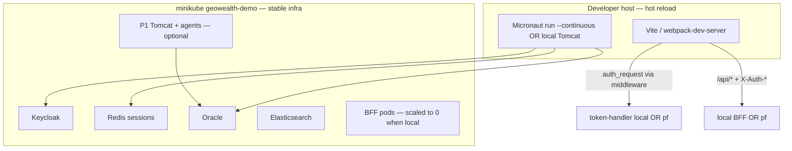

# Development environment plan (K8s hybrid)

**Goal:** one command for FE dev, one for BE dev, with code changes live on the
environment within **≤ 60 seconds**.

**Status:** implemented via `scripts/dev-fe.sh`, `scripts/dev-be.sh`,
`scripts/dev-verify.sh` on top of the existing minikube full stack (`./k8s/up.sh`).

---

## 1. Cluster analysis (current state)

### What runs in `geowealth-demo` (minikube profile `geowealth`)

| Tier | Workloads | Dev pain today |
|------|-----------|----------------|
| Data | `oracle-0`, `elasticsearch-0`, `redis-0`, `kc-postgres-0` | Stable — rarely edited |
| Identity | `keycloak-0`, `kc-ext`, `token-handler` (×2), `user-service` (×2) | Image rebuild ~2–5 min per auth change |
| Domain | `web-billing`, `web-trading`, `bff-billing` (×2), `bff-trading` (×2) | Baked nginx/Vite **preview** — no HMR |
| Legacy P1 | `p1-tomcat` (×2), coordinator + 9 agents | `gradle devClasses` in Docker ~15–30 min rebuild |

### Why the old loop is slow

```
edit source → docker build → minikube load → rollout restart → pod ready
              └─ 2–15 min for Micronaut, 15–30 min for P1 image
```

Port-forwards (`./k8s/portforward.sh`) expose the **production-shaped** pods —
still baked assets, not hot reload.

### GeoWealth (`~/geowealth` → `~/nodejs/geowealth`) prior art

| Track | Existing pattern | Latency |
|-------|------------------|---------|
| P1 React | `npm run dev:local` — webpack-dev-server `:8888` → Tomcat proxy | **1–3 s** HMR |
| P1 Java | `make redeploy` (mac) — `gradle devClasses` + rsync + Tomcat restart | **30–90 s** |
| P1 K8s | Single fat image, no sync | **15–30 min** |

The Linux host had no unified entrypoint; the macOS `Makefile` hardcodes
`/Users/petarnenov/...` paths.

---

## 2. Target architecture — hybrid dev



**Principle:** keep heavy/stateful tiers in K8s; run the component you edit on
the host with watch/HMR.

---

## 3. One-command entrypoints

### Infrastructure (once per boot, ~already up)

```bash
./k8s/up.sh                 # full stack (~20–30 min first time)
./k8s/portforward.sh        # optional baseline forwards (monitoring, DB tools)
```

### Frontend — `./scripts/dev-fe.sh <target>`

| Command | Serves | Change latency |
|---------|--------|----------------|
| `./scripts/dev-fe.sh billing` | `https://billing.geowealth.int:5184` (Vite HMR) | **< 3 s** |
| `./scripts/dev-fe.sh trading` | `https://trading.geowealth.int:5185` (Vite HMR) | **< 3 s** |
| `./scripts/dev-fe.sh p1` | `http://localhost:8888` (webpack HMR → pf P1) | **1–5 s** |

Actions performed automatically:

1. Assert namespace `geowealth-demo` exists.
2. Start required port-forwards (`token-handler:9080`, BFF, Keycloak, P1…).
3. Scale in-cluster `web-*` Deployment to **0** (free host port).
4. Stop conflicting port-forward PIDs.
5. Set `DEV_FORWARD_AUTH=1` — Vite middleware mirrors nginx `auth_request`.

### Backend — `./scripts/dev-be.sh <target>`

| Command | Serves | Change latency |
|---------|--------|----------------|
| `./scripts/dev-be.sh token-handler` | `:9080` | **15–45 s** (Gradle continuous) |
| `./scripts/dev-be.sh bff-billing` | `:8084` | **15–45 s** |
| `./scripts/dev-be.sh bff-trading` | `:8085` | **15–45 s** |
| `./scripts/dev-be.sh p1-tomcat` | local Tomcat `:8080` | **30–60 s** (inotify + devClasses) |

Actions performed automatically:

1. Scale matching K8s Deployment to **0**.
2. Port-forward Redis / Keycloak / P1 as needed.
3. Export env from `k8s/env/urls.dev.env` + cluster Redis secret.
4. `./gradlew run --continuous` (Micronaut) or `gradle -t devClasses` (P1).

**Pairing FE + BE dev**

```bash
# Terminal 1 — auth tier
./scripts/dev-be.sh token-handler

# Terminal 2 — billing FE (uses local :9080)
./scripts/dev-fe.sh billing

# Terminal 3 — optional: billing data BFF locally
./scripts/dev-be.sh bff-billing
```

---

## 4. Verification plan (≤ 60 s metric)

Automated: `./scripts/dev-verify.sh`

| Check | Command | Pass criteria |
|-------|---------|---------------|
| Preflight | `./scripts/dev-verify.sh preflight` | Required ports listening |
| FE loop | `./scripts/dev-verify.sh fe-billing` | Touch `App.tsx` → marker in HTML ≤ 60 s |
| BE loop | `./scripts/dev-verify.sh be-th` | Touch `AuthController.java` → `/health` UP ≤ 60 s |

Manual smoke (after automated pass):

1. Open `https://billing.geowealth.int:5184` — login via P1 broker works.
2. Edit visible UI text — browser updates without full reload.
3. Edit `BillingController` stub row — API response changes after Gradle restart.
4. P1: `npm run dev:local` + pf `:8080` — PlatformOne page loads.

### Verification loop (iterate until green)

```
┌─────────────────────────────────────────┐
│ 1. ./scripts/dev-fe.sh billing          │
│ 2. ./scripts/dev-verify.sh fe-billing   │
│ 3. If FAIL → fix proxy/auth/pf → goto 1 │
└─────────────────────────────────────────┘
┌─────────────────────────────────────────┐
│ 1. ./scripts/dev-be.sh token-handler    │
│ 2. ./scripts/dev-verify.sh be-th        │
│ 3. If FAIL → fix env/gradle → goto 1    │
└─────────────────────────────────────────┘
```

---

## 5. Expected latency budget

| Layer | Tool | Typical | Max (acceptance) |
|-------|------|---------|------------------|
| Domain SPA (billing/trading) | Vite HMR | 0.5–2 s | 60 s |
| P1 React | webpack HMR | 1–5 s | 60 s |
| token-handler / BFF | Gradle `--continuous` | 15–40 s | 60 s |
| P1 Tomcat (local) | devClasses + rsync | 30–55 s | 60 s |
| P1 Tomcat (K8s image) | docker build | 15–30 min | **out of scope** |

---

## 6. Prerequisites checklist

- [ ] `./k8s/up.sh` completed; `kubectl get pods -n geowealth-demo` all Running
- [ ] `/etc/hosts`: `billing.geowealth.int`, `trading.geowealth.int`, `auth.geowealth.int` → `127.0.0.1`
- [ ] mkcert certs in `proxy/certs/*.geowealth.int.{crt,key}`; CA trusted (`mkcert -install`)
- [ ] Node 20+ with `npm install` in domain `web/` dirs (and geowealth react app for P1 FE)
- [ ] Java 17 + Gradle (wrapper in each module)
- [ ] `inotify-tools` recommended (`sudo apt install inotify-tools`) — without it BE watch polls every 2s
- [ ] P1 local BE only: `TOMCAT_HOME` pointing at local Tomcat 9

---

## 7. Known limits / not solved here

| Item | Reason |
|------|--------|
| Akka agent code in K8s | Still needs image rebuild; use local `nfstart_dev` + pf Oracle for agent work |
| Keycloak realm / SPI | No hot reload — `reconcile-realm.sh` or `--reset` |
| First `./gradlew run` | Downloads deps; subsequent continuous loops meet ≤ 60 s |
| `bff-core` change while K8s BFF still running | Scale BFF to 0 or run `dev-be.sh bff-*` locally |

---

## 8. Future improvements (optional)

1. **Tilt / Skaffold** file-sync into web pods for teams that refuse local Vite.
2. **Linux Makefile** for geowealth mirroring macOS `make redeploy` with `$HOME` paths.
3. **dev-be.sh p1-agent** — watch + restart single Akka agent against pf coordinator.
4. **Merge portforward.sh** into `dev-common.sh` single registry to avoid PID conflicts.

---

## 9. Verification results (2026-06-29, this host)

| Check | Result | Latency |
|-------|--------|---------|
| `dev-verify.sh fe-billing` | PASS | **0 s** (Vite serves updated module instantly) |
| `dev-verify.sh be-th` | PASS | **10 s** (bff-core compile + Micronaut restart, polling watch) |

Commands used:

```bash
./scripts/dev-fe.sh billing          # terminal 1
./scripts/dev-be.sh token-handler    # terminal 2
./scripts/dev-verify.sh fe-billing
./scripts/dev-verify.sh be-th
```
