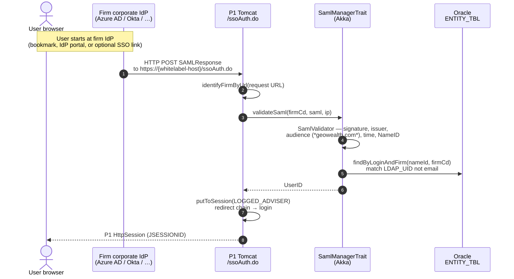
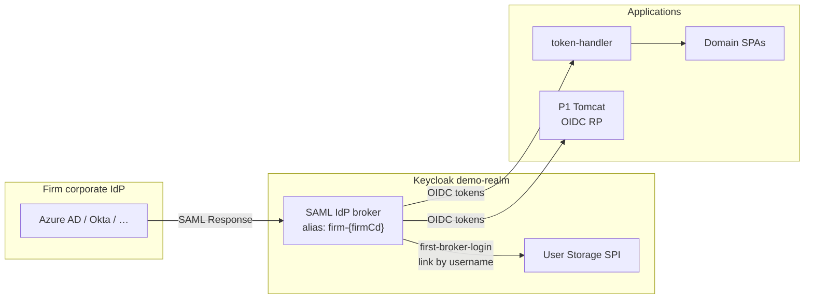

# SAML Third-Party Firm Login — Analysis, Integration Plan & Risk Report

**Date:** 2026-06-30  
**Scope:** How external (third-party) firms authenticate into GeoWealth via SAML in `~/nodejs/geowealth`, and how to integrate that capability into the post–auth-extraction architecture in `keycloak-demo`.  
**Constraint:** Analysis and planning only — no code changes in this pass.

---

## Executive summary

GeoWealth supports **two unrelated SAML directions**:

| Direction | Role of GeoWealth | Status in current stack | Typical consumer |
|---|---|---|---|
| **A. Inbound firm SSO** | SAML **Service Provider (SP)** | **Still live** in geowealth (`/ssoAuth.do`) | Third-party asset managers / RIAs with their own corporate IdP (Azure AD, Okta, …) |
| **B. Outbound P1 → Keycloak** | SAML **Identity Provider (IdP)** | **Retired** in auth extraction (`identityProviders: []`) | Was the keycloak-demo federation hop; replaced by User Storage SPI + OIDC |

This document is about **Direction A** — the product feature firms configure under **Platform One → Integrations → Single Sign-On**.

After auth extraction, **password login** for P1 and domain SPAs flows through **Keycloak OIDC**. **Firm SAML login** still bypasses Keycloak entirely and mints a **P1-only `HttpSession`**. That split is the central architectural gap this plan must close.

**Recommended approach:** Register each firm's external IdP as a **Keycloak SAML broker** (`identityProvider` per firm, provisioned from `FIRM_SSO_TBL`), drive login with **`kc_idp_hint`** derived from whitelabel hostname / `firmCd`, and **retire `/ssoAuth.do`** once parity is proven. Keep P1 as an OIDC RP only; domain apps keep using the existing token-handler path unchanged.

---

## Part 1 — How third-party firm SAML works today (geowealth)

### 1.1 Product model

Each firm can have SSO settings stored in Oracle:

- Table: `FIRM_SSO_TBL` → entity `FirmSSO` / `FirmSSOAbstract`
- Config JSON: `FirmSSOConfig` (entityId, ssoUrl, primary/secondary X.509 certs, optional `roleCapabilityMappings`)
- Enforcement: `FirmSSOEnforcementType` — `off` | `optional` | `mandatory`

Admin UI: **Platform One → Integrations → Single Sign-On** (`SingleSignOn.js`, `singleSignOnServices.js`).

Operations exposed via `SamlManager` → Akka actor `SamlManagerTrait`:

- List SSO-enabled / not-yet-configured firms
- Read / save / delete firm SSO config
- Decode IdP metadata (URL or XML paste)
- `deriveSsoCapabilities` (used for **outbound** KC federation role translation — separate concern)

### 1.2 Runtime login flow (IdP-initiated SP)



**ACS URL firms configure on their IdP:**

```http
https://{whitelabel-host}/ssoAuth.do
```

Example from code comment: `http://demo.geowealth.int:8080/ssoAuth.do`

There is **no published SP metadata endpoint** for firm SSO — onboarding is manual (entity ID, SSO URL, certs from IdP metadata via admin UI).

### 1.3 SAML validation rules (`SamlValidator`)

| Check | Behaviour |
|---|---|
| Format | SAML 2.0 `Response` with exactly one `Assertion` |
| Signature | Assertion **must** be signed; optional response-level signature also verified |
| Issuer | Must match firm's configured `entityId` |
| Certificate | Must match `primaryCertificate` or `secondaryCertificate` from `FirmSSOConfig` |
| NameID | Extracted value → lookup key |
| Audience | Must contain substring `geowealth.com` (case-insensitive) |
| Time | `NotBefore` / `NotOnOrAfter` enforced |

### 1.4 User resolution (critical detail)

After crypto validation, `SamlManagerTrait` resolves the user:

```java
nEntityDAO.findByLoginAndFirm(userEmail, firmCd)
```

Despite the variable name, matching is on **`LDAP_UID` (username)**, not email. Comments in code explicitly warn: *"We are not looking for users by email, only by LDAP_UID"*.

Additional gates (user skipped / login fails):

- Must be an **adviser** (`entity.isAdviser()`)
- Must **not** be `gwAdminFlag`
- Must be active, login not inactivated
- Exactly **one** entity must match (duplicate LDAP_UID → error)

### 1.5 Enforcement modes & UX

| Mode | P1 behaviour |
|---|---|
| `off` | SSO config may exist but is inactive; normal login |
| `optional` | Password/OIDC login available; firm may also use IdP |
| `mandatory` | React app redirects unauthenticated users to `/loggedOut` instead of login form (`App.js` + `isFirmSSORequired`) |

`ssoLoginUrl` on firm DTO = IdP SSO URL from config (`FirmSSOConfig.ssoUrl`) — used for optional redirect to IdP (not wired prominently in React login templates today).

### 1.6 What is *not* this feature

These are **outbound** SAML integrations where P1 **signs** assertions to external SPs — different from firm inbound SSO:

| Integration | Direction | Notes |
|---|---|---|
| FireLight | P1 → SP | Hardcoded role `Agent` |
| 55IP | P1 → SP | No roles in assertion |
| iCapital | P1 → SP | Empty role field (TODO in code) |
| Keycloak `p1` IdP (demo) | P1 → KC broker | **Removed** in auth extraction |

### 1.7 Known bugs / gaps in legacy path

Documented in `keycloak-demo/p1-auth-flow.md` §1.4:

- `SSOAction` only sets `LOGGED_ADVISER`, **not** the full session key set (`LOGGED_USER`, `LOGGED_USER_LOGIN_KEY`, …) that password/OIDC login writes
- Logout activity binding, `BasicAction.getUser()`, and session listener behaviour can be inconsistent for SAML-only sessions

---

## Part 2 — Current keycloak-demo architecture (post auth extraction)

### 2.1 Identity topology

```
Browser
  ├─ billing|trading.geowealth.int → nginx → token-handler → Keycloak OIDC → user-service → Oracle
  ├─ p1.geowealth.int              → P1 /oidc/login.do → Keycloak OIDC → user-service → Oracle
  └─ auth.geowealth.int              → Keycloak login theme (auth-spa) + SPI
```

- `keycloak/realm-export.json`: **`identityProviders: []`** — no SAML brokers
- Authentication: User Storage SPI + SHA1 verify via `user-service`
- Domain apps: forward-auth `/auth/verify` on token-handler; data BFFs are auth-unaware
- P1 password login: `appService.loginPassword` → `/oidc/login.do` (no local password form)

### 2.2 The split-brain problem

| Login path | Keycloak session | P1 HttpSession | Domain SPA (`GWSESSION`) |
|---|---|---|---|
| Password / OIDC (`/oidc/login.do`) | ✅ | ✅ (via `OidcCallbackAction`) | ✅ if user also hits domain app |
| Firm SAML (`/ssoAuth.do`) | ❌ | ⚠️ partial session keys | ❌ |

**Impact:** Firms with **`mandatory` SSO** can still enter P1 via SAML, but **cannot** use billing/trading domain apps that depend on token-handler + Keycloak unless they separately complete an OIDC login. Firm SSO and the new identity tier are **not integrated**.

---

## Part 3 — Integration goals

1. **Single identity plane** — every login path (password, MFA, firm SAML) ends in a Keycloak session with consistent claims (`firmCd`, roles, `personId`, …).
2. **Preserve firm onboarding model** — continue configuring IdPs per firm in P1 admin UI (`FirmSSOConfig`); avoid a parallel manual Keycloak admin workflow.
3. **Domain parity** — SSO-mandatory firms must reach billing/trading SPAs without a second login.
4. **Minimize P1 auth surface** — P1 remains OIDC RP + product session; no duplicate SAML validation long term.
5. **Operational safety** — cert rotation, IdP metadata refresh, and enforcement changes must not require redeploys.

---

## Part 4 — Recommended approach

### 4.1 Target state



**Login initiation:**

1. Browser hits whitelabel host (P1 or domain SPA).
2. Resolver maps host → `firmCd` → Keycloak IdP alias `firm-{firmCd}` (or stable slug).
3. Redirect to Keycloak authorize with `kc_idp_hint=firm-{firmCd}` (and `prompt=login` when enforcement is mandatory).
4. Keycloak brokers SAML to the firm's IdP using certs/entityId from synced config.
5. On success: standard OIDC code flow for P1 (`/oidc/callback`) or token-handler (domain apps).

**Retire:** `/ssoAuth.do` + `SamlValidator` path after migration window.

### 4.2 Why Keycloak broker (not “keep ssoAuth.do”)

| Alternative | Verdict |
|---|---|
| Keep `/ssoAuth.do` + add KC session minting hack | Rejects — duplicates validation, no standard SLO, keeps split sessions |
| New standalone SAML SP microservice | Rejects — third auth runtime to operate |
| Per-firm KC IdP brokers synced from `FIRM_SSO_TBL` | **Accept** — one validation point, domain + P1 share OIDC, matches old `p1` IdP pattern but with N external IdPs |
| Single KC IdP with dynamic config | Rejects — Keycloak does not support runtime IdP switching without alias |

### 4.3 Provisioning: `FirmSSO` → Keycloak Admin API

Add a **sync job or event hook** (in P1 or a sidecar) triggered on `SetFirmSsoConfigMsg` / `DeleteFirmSsoConfigMsg`:

| `FirmSSOConfig` field | Keycloak `identityProvider` field |
|---|---|
| `entityId` | `config.entityId` |
| `primaryCertificate` (+ secondary) | `config.signingCertificate` / metadata |
| `ssoUrl` | SingleSignOnService URL (POST binding preferred) |
| `firmCd` | Alias `firm-{firmCd}`, display name from firm |
| enforcement `off` | Disable or delete IdP |

Use existing `scripts/reconcile-realm.sh` pattern for env-specific URLs; extend or add `scripts/reconcile-firm-idps.sh`.

**First-broker-login:** Reuse `p1-first-broker-login` flow — link federated user to existing SPI user by **username** (`LDAP_UID`), not email (aligns with current `findByLoginAndFirm` semantics). Consider hardening: require `firmCd` attribute mapper + match against brokered user's firm.

### 4.4 Claim / role mapping

Firm IdPs rarely emit GeoWealth capability roles. Default mappers:

| SAML attribute (if present) | KC mapping |
|---|---|
| NameID / `uid` | Username for SPI lookup |
| — | `firmCd` from broker config constant per IdP (not from assertion) |
| Optional IdP group → role | Future: extend `FirmSSOConfig.roleCapabilityMappings` to map **IdP group** → realm roles (today maps **P1 Role.name** → capabilities for outbound only — reuse JSON shape) |

Coarse roles (`client`, `advisor`, `admin`, domain caps) should still come from **user-service** role load at login, not from firm IdP assertions, unless a firm explicitly maps groups.

### 4.5 Hostname / whitelabel routing

Mirror existing `AuthorizationManager.identifyFirmByUrl`:

- P1 whitelabel hosts → `kc_idp_hint` when `ssoRequiredFlag` or user chooses SSO
- Domain SPAs (`billing.geowealth.int`) → token-handler tenant map already keyed by host; add optional **`defaultIdpHint`** per tenant when firm uses external SSO only

For firms that share a host with mixed login: enforcement `optional` shows Keycloak login with "Sign in with your organization" IdP button (KC hosted IdP redirect).

### 4.6 Migration strategy (phased)

#### Phase 0 — Discovery & inventory

- Query prod/stage `FIRM_SSO_TBL` for firms with `enforcement != off`
- Document each IdP vendor, NameID format, cert rotation process, current ACS URL (`/ssoAuth.do`)
- Confirm NameID values match `LDAP_UID` in `ENTITY_TBL`

#### Phase 1 — Fix legacy session parity (short-term, geowealth only)

- Align `SSOAction` session stash with `OidcCallbackAction` / `LoginAction.loginUser` (full key set)
- Reduces production pain while KC migration proceeds
- **Does not** solve domain SPA access

#### Phase 2 — Keycloak broker pilot (one firm, optional enforcement)

- Implement IdP sync for one test firm
- Add `kc_idp_hint` to P1 `/oidc/login.do` when firm SSO enabled
- Parallel run: keep `/ssoAuth.do` with access log compare
- E2E: P1 login + billing/trading `/auth/me` for same user

#### Phase 3 — Mandatory firms & cutover

- Switch enforcement `mandatory` firms to KC-only path
- Update firm IdP ACS URL from `/ssoAuth.do` to Keycloak broker ACS:
  `https://auth.geowealth.int/realms/demo-realm/broker/firm-{firmCd}/endpoint`
- Communicate cert/metadata change window to each firm

#### Phase 4 — Decommission

- Remove `/ssoAuth.do`, `SSOAction`, inbound `ValidateSamlMsg` path (keep outbound FireLight/55IP/iCapital)
- Remove `SamlValidator` audience hack (`geowealth.com` substring) from inbound path
- Update admin UI copy: ACS URL points to Keycloak

#### Phase 5 — Automation & ops

- IdP sync on save + nightly reconcile (drift detection)
- Alert on cert expiry (primary/secondary from config)
- Runbook for firm onboarding / offboarding

---

## Part 5 — Risk analysis

### 5.1 Risk matrix

| ID | Risk | Likelihood | Impact | Mitigation |
|---|---|---|---|---|
| R1 | **Split-brain sessions** (SAML → P1 only, no KC) | **Current** — happening now | **High** — domain apps unreachable for SSO firms | Phase 2 broker migration; do not build on `/ssoAuth.do` |
| R2 | **NameID ≠ LDAP_UID** — IdP sends email, GW expects username | Medium | **High** — login fails after migration | Pre-migration audit; IdP NameID policy; KC mapper to normalize; document in onboarding |
| R3 | **First-broker-login wrong link** (email collision) | Low–Medium | **Critical** — account takeover | Link by username + firmCd; disable trustEmail for broker; review KC duplicate policy |
| R4 | **Many IdPs in one realm** (10–100+ firms) | Medium | Medium — KC admin UI noise, import size | Aliasing convention; automated sync; realm export chunking |
| R5 | **Cert rotation** — firm rotates IdP cert without updating GW | High | **High** — auth outage for firm | Secondary cert field already exists; monitoring; self-service admin UI refresh |
| R6 | **Audience mismatch** — KC broker ACS ≠ `geowealth.com` | Medium | Medium — IdP rejects response | Firms must update IdP audience when moving ACS to KC; provide exact values in UI |
| R7 | **Mandatory SSO UX regression** | Medium | Medium | Keep `/loggedOut` behaviour until KC path proven; feature flag per firm |
| R8 | **Incomplete SSOAction session** | **Current** | Medium — logout/MFA edge bugs | Phase 1 parity fix |
| R9 | **gwAdmin blocked from firm SSO** | Low | Low — intentional | Document; gwAdmin uses password/OIDC path only |
| R10 | **Dual validation logic drift** | Medium during migration | Medium | Time-box parallel run; single validator in KC broker |
| R11 | **`IGNORE_EXISTING` realm import** — IdP sync not in export | High | Medium | Reconcile script idempotency (same as `reconcile-realm.sh`) |
| R12 | **SLO / logout** — firm IdP SLO not wired | Medium | Medium | Phase 5; KC supports SAML SLO per IdP; P1 OIDC RP logout already hits KC |
| R13 | **Multi-host whitelabel** — wrong firm IdP hint | Medium | **High** — wrong tenant | Host → firmCd resolver must match `identifyFirmByUrl`; unit + e2e per host |
| R14 | **Clients/advisers** — SAML rejects non-advisers | Low | Low — by design | Unchanged business rule |

### 5.2 Security considerations

**Strengths of KC broker approach:**

- Centralized signature validation (OpenSAML / Keycloak maintained)
- Consistent token lifetimes and back-channel logout to token-handler
- Removes custom audience substring check in favour of KC SP entity ID

**Weaknesses to address:**

- `SamlValidator` today requires assertion signature but trusts configured certs statically — KC equivalent must enforce same
- No SP-initiated SAML AuthnRequest in legacy flow (IdP-init only) — KC broker supports SP-init via authorize redirect; confirm each firm IdP allows SP-init
- Rate limiting / replay: KC handles `InResponseTo` for SP-init; IdP-init unsolicited responses need KC `allowCreate` + first-broker-login policies reviewed

### 5.3 Operational considerations

- **Onboarding lead time:** Each firm must update IdP ACS + audience — typically 1–2 weeks per firm change control
- **Support:** SSO error page today is generic (`ssoError.jsp`); KC login theme should surface firm-specific support email (branding API already exists for token-handler)
- **Testing:** Reuse geowealth test vectors in `src/test/resources/com/geowealth/agent/saml/validator/` against KC broker in staging

---

## Part 6 — What stays unchanged

- Outbound SAML to FireLight, 55IP, iCapital — separate code paths, unaffected
- `SamlManager.deriveSsoCapabilities` / `roleCapabilityMappings` — only relevant if firm IdP emits role-like attributes; optional future work
- P1 Tier-2/3 authz endpoints (`/saml/idp/p1-authz-*`) — unchanged; token-handler still calls them
- user-service password verification — still used for non-SSO firms and gwAdmin

---

## Part 7 — Open decisions

| # | Question | Recommendation |
|---|---|---|
| 1 | IdP alias scheme: `firm-{firmCd}` vs firm slug | `firm-{firmCd}` — stable, unique; display name for humans |
| 2 | Sync implementation: P1 actor vs K8s CronJob vs sidecar | P1 `SetFirmSsoConfigMsg` hook + nightly reconcile |
| 3 | Optional SSO: IdP button on KC theme vs auto-redirect | Auto-redirect only when `mandatory`; button when `optional` |
| 4 | Keep secondary cert in KC | Yes — map to KC metadata `signingCertificate` rotation pattern |
| 5 | Domain tenant mapping for whitelabel-only firms | Extend `app.tenants.*` with `idpHint` when firm has SSO |

---

## Part 8 — References (source files)

### geowealth — inbound firm SSO

| File | Role |
|---|---|
| `src/main/java/com/geowealth/web/common/SSOAction.java` | ACS endpoint `/ssoAuth.do` |
| `src/main/java/com/geowealth/agent/saml/SamlManagerTrait.java` | Validation + user lookup |
| `src/main/java/com/geowealth/agent/saml/validator/SamlValidator.java` | Crypto / assertion rules |
| `src/main/java/com/geowealth/model/organization/FirmSSOConfig.java` | Per-firm IdP config JSON |
| `WebContent/react/.../SingleSignOn/*` | Admin UI |
| `src/main/resources/struts-tiles.xml:215-219` | Action mapping + redirect to login |

### keycloak-demo — current identity

| File | Role |
|---|---|
| `keycloak/realm-export.json` | Empty `identityProviders` |
| `docs/solution-architect/v2/03-login-flows.md` | OIDC-only login flows |
| `docs/plans/2026-06-26-auth-extraction.md` | Retired P1 SAML IdP |
| `p1-auth-flow.md` | `/ssoAuth.do` session gap analysis |
| `token-handler/src/main/resources/application.yml` | Multi-tenant OIDC front door |

### geowealth — post-extraction P1 login

| File | Role |
|---|---|
| `src/main/java/com/geowealth/neo/oidc/rp/OidcLoginAction.java` | P1 → KC authorize |
| `src/main/java/com/geowealth/neo/oidc/rp/OidcCallbackAction.java` | KC code → P1 session |
| `WebContent/react/app/src/app/_services/appService.js` | `loginPassword` → `/oidc/login.do` |

---

## Appendix A — Firm IdP onboarding checklist (target state)

1. GeoWealth admin enables SSO for firm in Platform One (metadata URL or manual certs).
2. Sync job creates/updates KC IdP `firm-{firmCd}`.
3. Firm IdP admin configures:
   - **ACS / Reply URL:** `https://auth.{env}/realms/demo-realm/broker/firm-{firmCd}/endpoint`
   - **Audience / Entity ID:** Keycloak realm SP entity (provided by sync job output)
   - **NameID:** Must equal user's `LDAP_UID` in GeoWealth for that `firmCd`
4. GeoWealth admin sets enforcement (`optional` / `mandatory`).
5. Test: P1 whitelabel login + one domain integration link.
6. Decommission old ACS `/ssoAuth.do` on firm IdP.

---

*End of document.*
