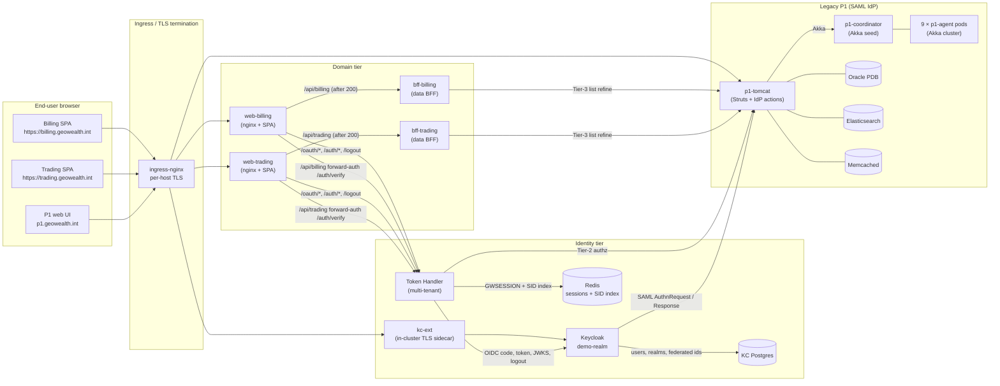
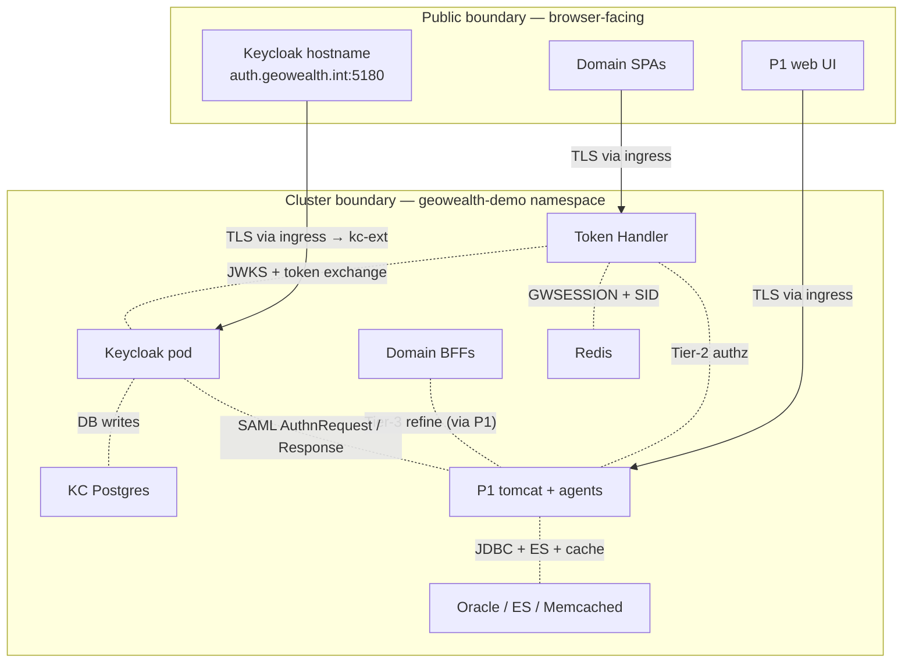

# 01 — Architecture Overview

## High-level container picture

The diagram above is intentionally lossy. The full pod-by-pod inventory is in
[`02-component-inventory.md`](02-component-inventory.md); the
flow-by-flow sequence diagrams are in
[`03-login-flows.md`](03-login-flows.md),
[`04-logout-flows.md`](04-logout-flows.md), and
[`06-communication-diagrams.md`](06-communication-diagrams.md).

## Trust boundaries

Two boundaries matter for review:

1. **Browser to ingress.** Everything outside the cluster terminates TLS at
   `ingress-nginx`. Domain hosts use mkcert-signed certificates in
   development; production is expected to source certificates from the
   organisation's standard CA pipeline.
2. **Pod to pod inside the namespace.** Pod-to-pod traffic is plain HTTP
   today, scoped by Kubernetes Services. The pattern is compatible with a
   future service-mesh / mTLS overlay (Linkerd, Istio, Cilium) without source
   changes — the application code is connection-agnostic.

## Actors and where state lives

The full table is in
[`login-logout-algorithm.md`](../../login-logout-algorithm.md) in the
repo root; the version below highlights what an architect cares about.

| Actor | State held server-side | Browser cookie / storage |
|---|---|---|
| **Browser** | None (no front-end-side token storage) | `GWSESSION` (HttpOnly, Secure, SameSite=Lax) per host; SPA session-state for in-memory UI flags only |
| **Keycloak** | SSO session, federated identity link, per-client client-session, realm data in Postgres | `KEYCLOAK_IDENTITY`, `KEYCLOAK_SESSION` on the `auth.geowealth.int` host |
| **Token Handler** | Server-side session in Redis, holds `access_token`, `refresh_token`, `id_token`, `sid`, last-refresh timestamp; `SidSessionRegistry` map (sid → session-ids) | n/a (the cookie above is its only browser surface) |
| **Domain data BFFs** | None (forward-auth) | n/a |
| **P1 Tomcat** | `LoggedUser`, `LoggedAdviser`, `firmInfo`, `ConversationManager` in `HttpSession`; persistent identity in Oracle | `JSESSIONID` |

The four lifetime knobs that drive how these expire (token lifespan, KC SSO
idle, KC SSO max, Tomcat session timeout) live in
`keycloak/realm-export.json` and the P1 `web.xml`; the mismatch between them is
why the **post-login establish round-trip** (see
[`03-login-flows.md`](03-login-flows.md) §3.3) and the **silent SSO probe**
(§3.5) exist.

## Tenancy model

The platform is multi-tenant in two senses:

1. **Per-domain tenancy.** Each domain (`billing`, `trading`, …) is an
   independent tenant from the Token Handler's perspective. The Token Handler
   resolves which tenant a request belongs to from the original browser host
   (`X-Forwarded-Host`) and looks up the tenant's authorization requirement
   in `app.tenants.<slug>` (see
   `token-handler/src/main/resources/application.yml`). The full per-domain
   tenant model lives in
   [`02-component-inventory.md`](02-component-inventory.md) §2 and
   [`07-security-and-trust-model.md`](07-security-and-trust-model.md) §3.

2. **Per-firm tenancy.** Inside a domain, users belong to a `firmCd` (a
   GeoWealth concept). The `firmCd` arrives at Keycloak from P1 as a SAML
   user attribute, is re-emitted as a top-level OIDC claim by the realm's
   `oidc-usermodel-attribute-mapper` (`firm-cd-claim`), and is then included
   in the `X-Auth-Firm-Cd` forward-auth header. Data BFFs use it to scope
   queries.

## Authorization model — three tiers

| Tier | Where it fires | What it gates | Source |
|---|---|---|---|
| **Tier 1 — coarse roles** | Token Handler (Micronaut Security) | Login / no-login, plus role-name checks (for example `@Secured("admin")`) where present | Realm role mappers in `keycloak/realm-export.json` |
| **Tier 2 — route / object-type permission** | Token Handler `/auth/verify` (called by nginx forward-auth) | Whether the user may *reach* `/api/<domain>` at all on this host | `app.tenants.<slug>` in `token-handler/application.yml`, evaluated by `SubdomainAuthorizer.authorize()` against `P1AuthzClient` |
| **Tier 3 — row-level refine** | Inside each domain BFF, on list endpoints | Which rows of a result set the user may see | `Tier23Gate.refine()` in the domain BFF, calling `P1AuthzClient.refine()` against P1 |

Tier 3 is intentionally co-located with the data (the domain BFF, not the
Token Handler), because it operates on row IDs that only the data layer
knows. The access token reaches the BFF as the `X-Auth-Access-Token` forward
header, so the BFF can authenticate to P1 for the refine call without
holding a session itself.

## Why this shape

The whole-system shape is the answer to one production concern: **a
shared-auth fix must not log users out and must not require rebuilding every
domain's data BFF**. Folding all auth into a separate Token Handler service
that runs in front of every data BFF gets that property cleanly, and is the
industry-standard *Token Handler* pattern (OAuth 2.0 BFF for SPAs, as
specified by the *OAuth 2.0 for Browser-Based Apps* IETF draft).

The same shape also gives:

- A single OIDC client to manage in the realm (`demo-shared-client`) instead
  of one per domain.
- A single place where session, token refresh, and back-channel logout live.
- A clean path for adding a new domain: copy the SPA-and-BFF pair, add one
  tenants entry, add one ingress host, and it is integrated.

This is not unique to this codebase — it mirrors the BFF/Token Handler
guidance in Curity's *Token Handler pattern*, Auth0's *Single Page App BFF*
guide, and the OWASP *OAuth 2.0 BFF* recommendations.
