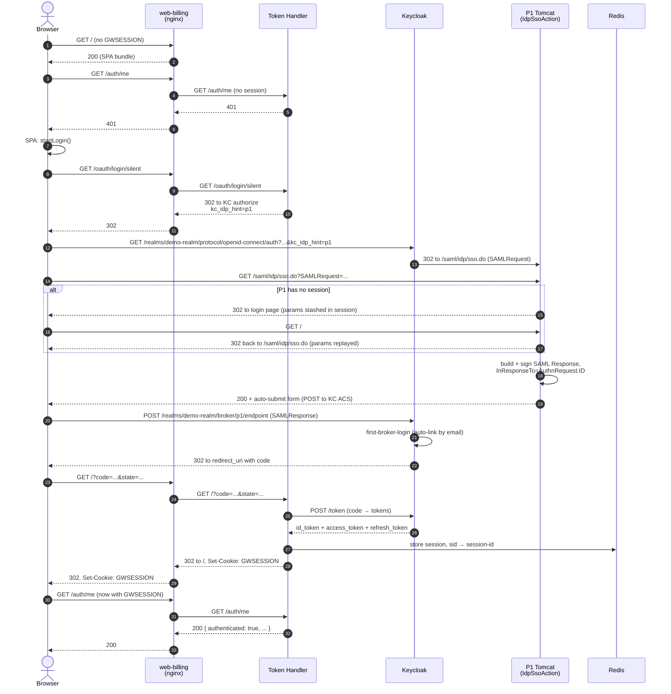
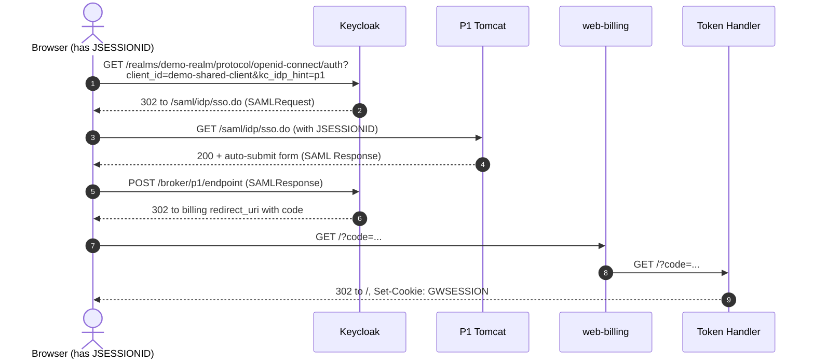
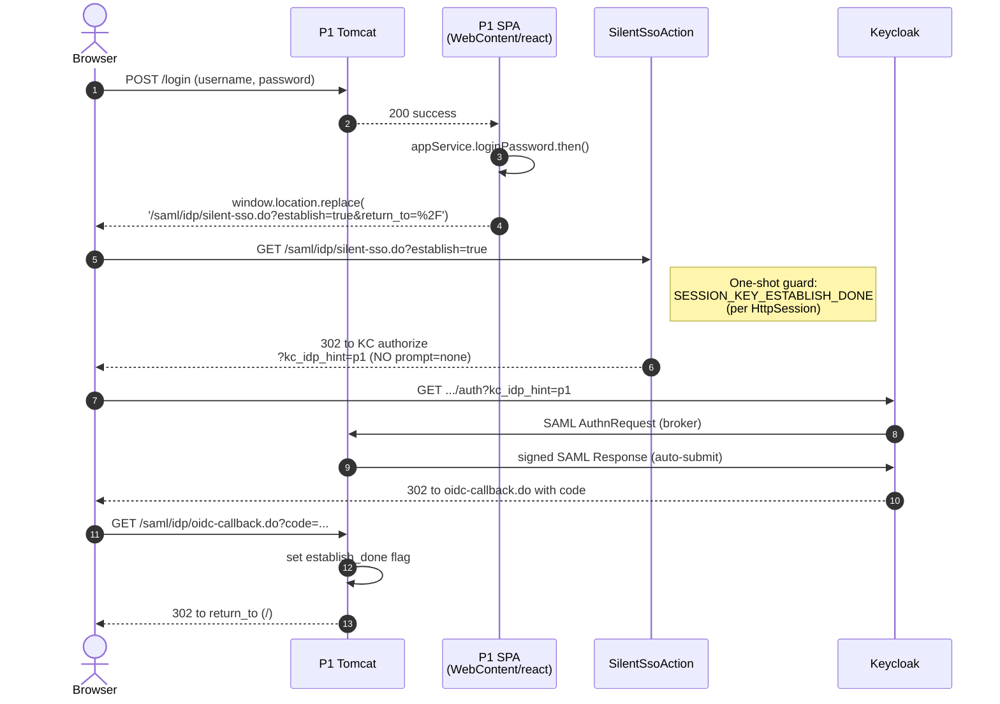
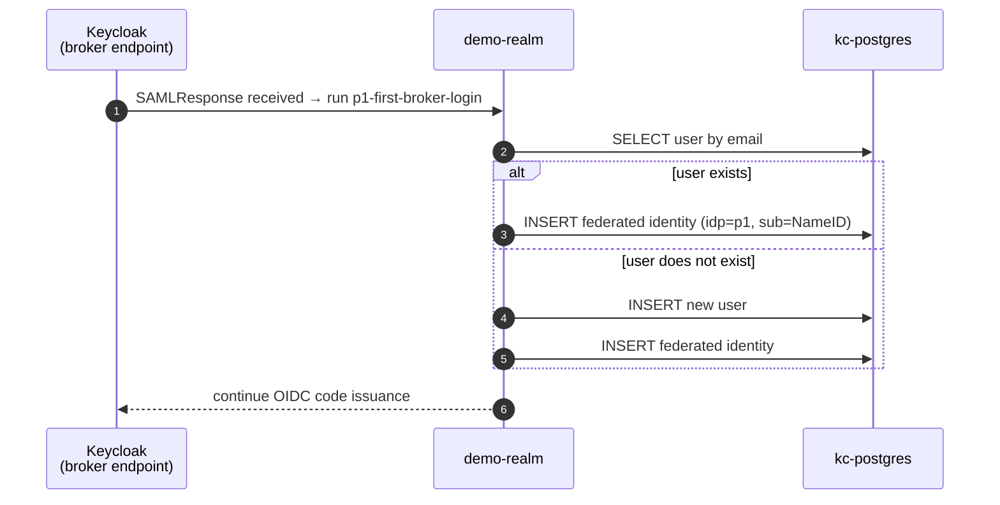
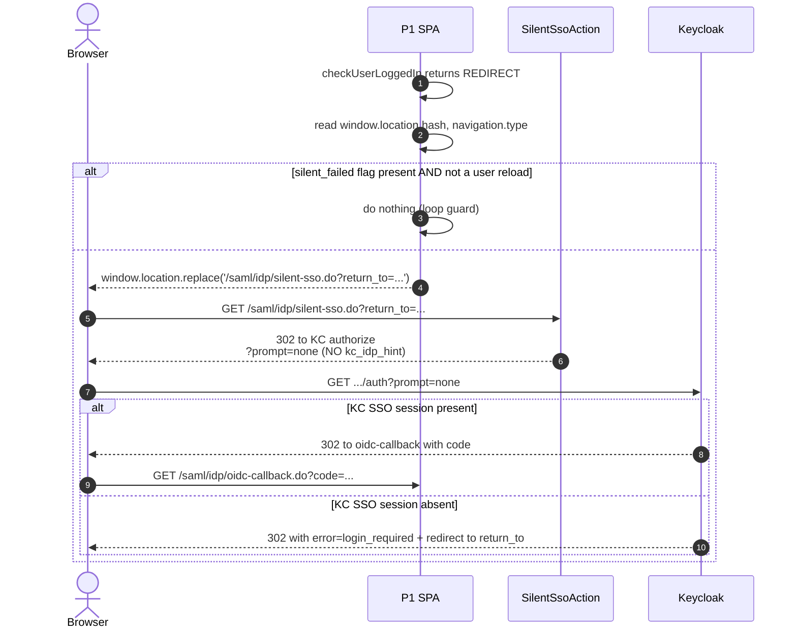
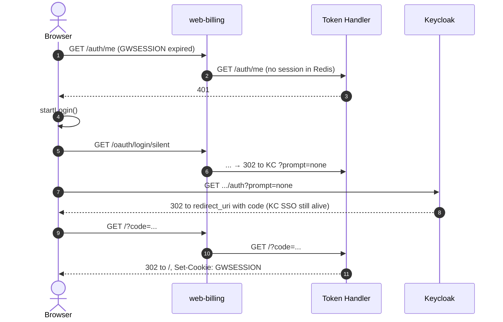
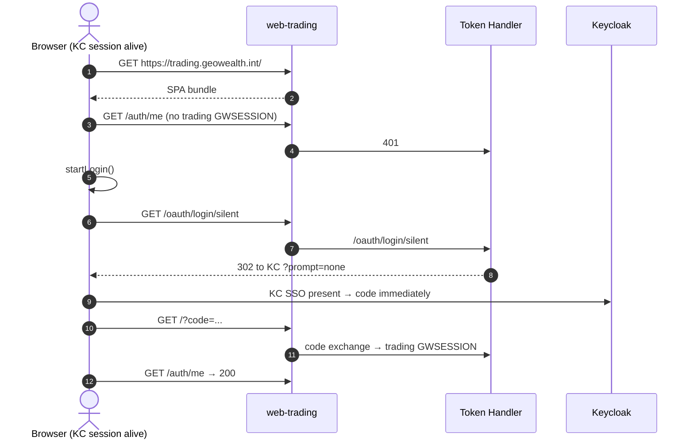
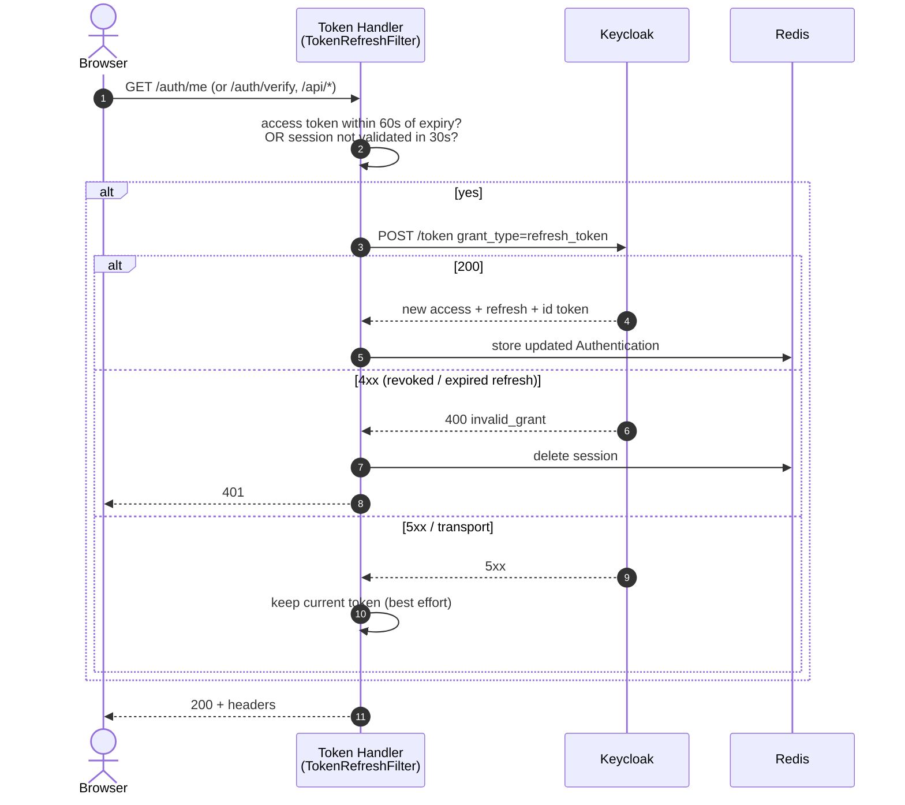

# 03 — Login Flows

This file documents every login path through the platform. Each scenario has
a one-line summary, a sequence diagram, and a code-level walk-through with
file references.

## Cast for every diagram

| Short name | What it represents |
|---|---|
| **Browser** | The user's browser running a domain SPA |
| **Web** | The nginx in the domain web pod (terminates TLS, forward-auth, proxies APIs) |
| **TH** | The Token Handler (multi-tenant). The web pod proxies `/oauth/*`, `/auth/*`, `/logout` to it |
| **KC** | Keycloak `demo-realm` (accessed via `kc-ext` from inside the cluster, directly from the browser via ingress) |
| **P1** | Platform 1 Tomcat (Struts actions, the `IdpSsoAction` and `IdpSloAction` SAML endpoints) |
| **BFF** | The domain data BFF (`bff-billing` or `bff-trading`) |
| **Redis** | The shared session and SID store |

---

## 3.1 SP-initiated login from a domain SPA — cold browser

**Trigger.** User opens `https://billing.geowealth.int` with no cookies.

**Summary.** SPA fetches `/auth/me`, gets 401, redirects to
`/oauth/login/keycloak` (silent variant via `/oauth/login/silent`), which the
Token Handler turns into an OIDC authorize URL with `kc_idp_hint=p1`.
Keycloak skips its own login screen, brokers via SAML to P1, gets a
LoggedUser, builds a signed SAML Response, posts back to Keycloak's broker
endpoint, runs first-broker-login (auto-link by email), issues a code,
redirects to the SPA. Web pod forwards the callback to the Token Handler,
which exchanges the code for tokens, persists them in a Redis session, and
issues `GWSESSION`.



### Code references

| Step | File:Line | Note |
|---|---|---|
| `/oauth/login/silent` entry | `bff-core/src/main/java/demo/bff/core/SilentLoginController.java` | Issues 302 to `/oauth/login/keycloak` carrying a `?silent=1` marker; sets `SILENT_ATTEMPT_COOKIE` |
| Append `kc_idp_hint=p1` (and optional `prompt=none`) | `bff-core/src/main/java/demo/bff/core/IdpHintFilter.java:31,52,65,74` | Filter runs at `ServerFilterPhase.LAST.order()` on `/oauth/login/keycloak` |
| Inbound SAML AuthnRequest at P1 | `geowealth/src/main/java/com/geowealth/neo/saml/idp/IdpSsoAction.java:159–278` | Parses `SAMLRequest`, extracts ID for `InResponseTo`, signs Response, posts to KC ACS |
| Signing credential cache (B5) | `geowealth/src/main/java/com/geowealth/util/opensaml/AbstractSamlAuthenticationResponseBuilder.java:290–318` | mtime-aware reload; survives `/tmp` wipe between rotations |
| First-broker-login (auto-link) | `keycloak/realm-export.json` (auth flow `p1-first-broker-login`) | Profile review disabled, links by email |
| Code-to-token exchange | `bff-core/src/main/java/demo/bff/core/KeycloakAuthenticationMapper.java:45–92` | Builds Micronaut `Authentication` with `roles`, `personId`, `firmCd`, `sid`, `accessToken`, `refreshToken`, `idToken`, `memberships` |
| Session rotation (M4) | `bff-core/src/main/java/demo/bff/core/RotatingSessionLoginHandler.java:22–77` | Pre-auth session destroyed; fresh session id issued (defends session fixation) |
| SID → session registration | `bff-core/src/main/java/demo/bff/core/AuthController.java:150`, `SidSessionRegistry.java:57–72` | Indexed on first `/auth/me` call |

### Why the silent-first detour

`startLogin()` in the SPA calls `/oauth/login/silent` (not the bare
`/oauth/login/keycloak`). On the first cold visit there is no KC SSO session
yet, so the silent attempt will fail and the Token Handler responds via
`AuthController.loginFailed()` → 302 to `/oauth/login/keycloak` (which then
becomes interactive). On a return visit (after the KC session was already
minted by P1 credential login on another tab) the silent path succeeds with
no UI flash. The `SILENT_ATTEMPT_COOKIE` is what lets `loginFailed()`
distinguish "silent attempt failed, escalate to interactive" from a normal
401.

---

## 3.2 IdP-initiated login from the P1 sidebar — warm browser

**Trigger.** User is already logged into P1, clicks a sidebar link such as
*Billing* (registered in
`~/geowealth/.../sidebar/_hooks/useIntegrationLinks.js`).

**Summary.** The sidebar link is exactly the Keycloak authorize URL with
`kc_idp_hint=p1`. Because the user already has a P1 session, the IdP flow
short-circuits: no login screen, P1 builds the SAML Response straight away,
posts back to Keycloak, and the rest is the same as 3.1.



### Note on terminology

This is *SP-initiated SSO from a warm session* — Keycloak is still the SP
sending the AuthnRequest; the user just bypasses the login page because P1
already has a session. True IdP-initiated SAML (an unsolicited Response from
P1) is **not used** because Keycloak's broker endpoint correlates by
`InResponseTo` against an AuthnRequest it issued; an unsolicited Response
fails that correlation.

---

## 3.3 P1 credential login + establish round-trip (Gap 6)

**Trigger.** User logs into P1 directly with username+password (no SSO
sidebar entry). After login, the React app unconditionally redirects to
`/saml/idp/silent-sso.do?establish=true&return_to=%2F`.

**Why.** P1 credential login mints a P1 `HttpSession` but not a Keycloak
session. If the user then clicks a sidebar link to billing, the SAML flow
runs and creates the KC session — but the first sidebar click is interactive
in subtle ways (POSTs auto-submit forms, occasional flash). The establish
round-trip mints the KC session **right after** P1 login so any later
sidebar click is silent.



### Code references

| Step | File:Line | Note |
|---|---|---|
| Post-login redirect | `geowealth/WebContent/react/app/src/app/_services/appService.js:223` | `window.location.replace('/saml/idp/silent-sso.do?establish=true&return_to=%2F')` — unconditional |
| Establish-done guard | `geowealth/src/main/java/com/geowealth/neo/saml/idp/SilentSsoAction.java:66`, `189–195`, `233` | `SESSION_KEY_ESTABLISH_DONE` is stored on the P1 `HttpSession`. Cleared automatically when HttpSession is invalidated (logout, idle). |
| Authorize URL builder | `geowealth/src/main/java/com/geowealth/neo/saml/idp/SilentSsoAction.java:222–230` | `kc_idp_hint=p1` is the establish-mode branch; the probe branch (3.5) sets `prompt=none` instead |
| Loop-prevention rationale | `geowealth/.../appService.js:213–222` (comment) | A previous client-side `sessionStorage.kc_sso_established` guard was removed after a stale flag on a long-lived tab silently suppressed the round-trip across re-logins |

---

## 3.4 First-broker-login — first time a P1 user signs in via SSO

**Trigger.** A user that has never federated through Keycloak before lands
on the broker endpoint with a valid SAML Response.

**Summary.** The realm's auth flow `p1-first-broker-login` runs. Profile
review is disabled. Auto-link-by-email looks up an existing `demo-realm`
user with the matching email; if found, links the federated identity; if
not, creates a fresh user. This happens silently in the user's first SAML
round-trip — there is no UI for it.

The same flow applies to a user whose email at P1 has just changed: the
realm auto-links to the matching `demo-realm` user by the new email.



### What is in the realm export

```json
"identityProviderMappers": [
  { "name": "email-from-saml", "type": "saml-user-attribute-idp-mapper", ... },
  { "name": "first-name-from-saml", ... },
  { "name": "last-name-from-saml", ... },
  { "name": "firm-cd-from-saml", "user.attribute": "firmCd", ... },
  { "name": "personId-from-saml", ... },
  { "name": "memberships-from-saml", ... },
  { "name": "saml-role-billing-admin", "type": "saml-role-idp-mapper", "user.attribute": "billing-admin", ... },
  ... 7 more role mappers ...
]
```

All mappers have `syncMode: FORCE` — every SSO event re-populates the
identity attributes and roles from the SAML assertion, so a role added on
the P1 side flows through on the next login without a manual admin step.

---

## 3.5 Silent SSO probe — recovering from a KC session that died

**Trigger.** User opened a P1 page that calls
`appService.checkUserLoggedIn`. If the API responds with
`responseObjectType === apiConstants.OBJECT_TYPE_REDIRECT`, the SPA fires a
silent-SSO probe via `/saml/idp/silent-sso.do?return_to=...`.

**What this is.** A *no-UI* check of "is there a KC SSO session that I can
silently re-mint a P1 session from?". The probe sets `prompt=none` on the
authorize URL, so KC either returns a code (success) or 302's back with
`error=login_required` (failure).



### Code references

| Step | File:Line | Note |
|---|---|---|
| Probe firing | `geowealth/WebContent/react/app/src/app/_services/appService.js:755–767` | `silentFailed = hash.indexOf('silent_failed=1') !== -1 && !isUserReload` — a genuine F5 / Cmd-R re-arms the probe |
| Probe-vs-establish branch | `geowealth/src/main/java/com/geowealth/neo/saml/idp/SilentSsoAction.java:222–230` | Probe sets `prompt=none`, establish sets `kc_idp_hint=p1` |

### Why the user-reload escape hatch

If the probe failed once (because KC SSO is genuinely gone — the user idled
out KC but not P1), the hash now contains `silent_failed=1`. Without an
escape hatch, the SPA would never try again on that tab. The escape hatch
is *the user manually reloading the page* — `performance.getEntriesByType('navigation')[0].type === 'reload'`
is treated as "the user signalled they want a fresh attempt", which clears
the loop guard for that one navigation.

---

## 3.6 Federated re-login — KC session intact, GWSESSION expired

**Trigger.** User idled the Token Handler session out (Redis TTL) but still
has a valid `KEYCLOAK_IDENTITY` cookie at `auth.geowealth.int`.

**Summary.** SPA fetches `/auth/me`, gets 401, redirects to
`/oauth/login/silent`, which adds `&prompt=none`. KC reuses its SSO session
(no SAML round-trip) and issues a fresh code. No UI flash, no P1 round-trip.



---

## 3.7 In-cluster Kubernetes login — same as compose

Every flow above runs unchanged in Kubernetes. The only differences are:

1. **TLS termination** moves from per-pod nginx (compose) to
   `ingress-nginx-controller` (K8s).
2. **`auth.geowealth.int`** resolves to the `kc-ext` ClusterIP from inside
   the cluster via a `hostAlias` patch in `up.sh`. Without it, the Token
   Handler's OIDC discovery against the public issuer URL would fail with
   `UnknownHostException`.
3. **Forward-auth at the ingress level.** `ingress-app.yaml` (annotation
   `nginx.ingress.kubernetes.io/auth-url`) declares the same forward-auth
   contract that the per-pod nginx does in compose, pointing at
   `http://token-handler.geowealth-demo.svc.cluster.local:8080/auth/verify`.

---

## 3.8 Cross-domain SSO (warm browser, two domains)

**Trigger.** User logs into `billing.geowealth.int` (flow 3.1). User clicks
through to `trading.geowealth.int`.

**Summary.** The `GWSESSION` cookie is host-scoped, so trading has no
cookie. Trading goes through flow 3.6 (federated re-login). Because the KC
SSO session minted during the billing flow is still alive (cookies on
`auth.geowealth.int`), the trading flow succeeds silently with no SAML
round-trip and no UI flash.



This is the *cross-domain SSO* property that distinguishes a proper
brokered-SSO model from a per-app login. One round-trip to P1, N domains.

---

## 3.9 Where the per-host tenancy hooks in

When the Token Handler's `/auth/verify` runs (called by nginx forward-auth
on every `/api/*` call), it resolves which tenant the request belongs to
from `X-Forwarded-Host`:

```java
// bff-core/.../ForwardAuthController.java:57–62
String host = request.getHeaders().get("X-Forwarded-Host");
if (host == null || host.isBlank()) {
    host = request.getHeaders().get(HttpHeaders.HOST);
}
authorizer.authorize(auth, host);
```

`SubdomainAuthorizer.authorize(auth, host)` looks up the matching tenant in
`app.tenants.*` (from `token-handler/application.yml`) — `billing.geowealth.int`
maps to ObjectType 59 (BILLING_CENTER) and `trading.geowealth.int` maps to
ObjectType 5 (TRADE). The Tier-2 P1 authorization runs against that
ObjectType/Permission pair. If denied, the response is 403 and nginx
short-circuits the `/api/*` request before it reaches the data BFF.

---

## 3.10 Token refresh inside an active session

**Trigger.** Any `/auth/*` or `/api/*` request lands at the Token Handler
while the access token is within 60 seconds of expiry, or the session has
not been re-validated against Keycloak in the last 30 seconds.

**Summary.** `TokenRefreshFilter` calls KC's `/token` endpoint with the
stored refresh token, replaces the stored access token, and writes the
session back to Redis.



### Code references

| Step | File:Line | Note |
|---|---|---|
| Filter wiring | `bff-core/.../TokenRefreshFilter.java:53,102` | `@Filter({"/api/**", "/auth/**"})`, order `SECURITY.after()` |
| Skew + validate interval | `TokenRefreshFilter.java:59,68` | `SKEW_SECONDS=60`, `VALIDATE_INTERVAL_SECONDS=30` |
| Concurrent-dedup guard (M3) | `TokenRefreshFilter.java:79,131–144` | `INFLIGHT_GUARD_MILLIS=15_000` prevents thundering-herd refresh on the same session |
| Error policy | `TokenRefreshFilter.java:159–179` | 4xx → clear session + 401; 5xx → keep session and serve current token |

The validate-every-30s loop is what catches **out-of-band P1 SLO** — if P1
killed the SAML session and Keycloak's back-channel logout has not yet
arrived, the next refresh attempt fails 4xx, the Redis session is dropped,
and the SPA re-authenticates cleanly.
