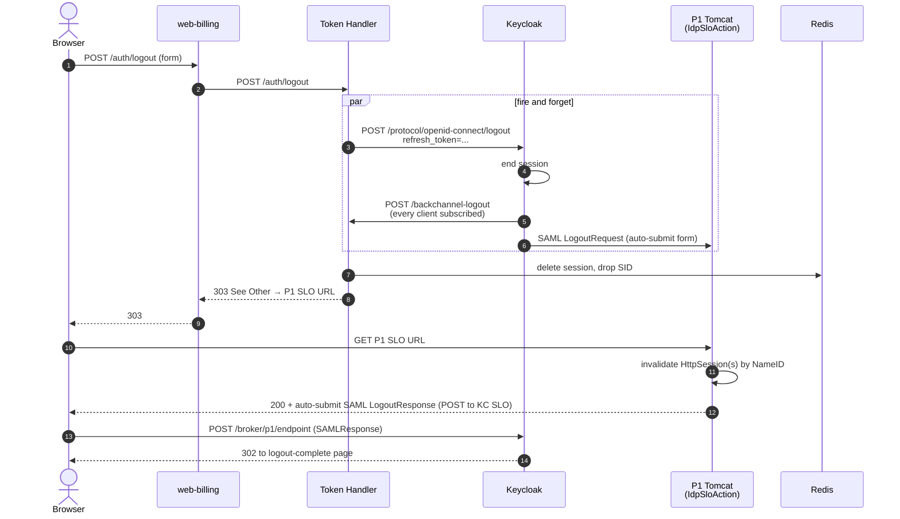
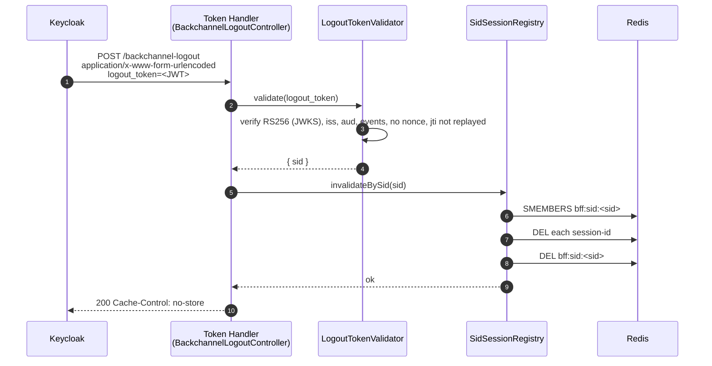
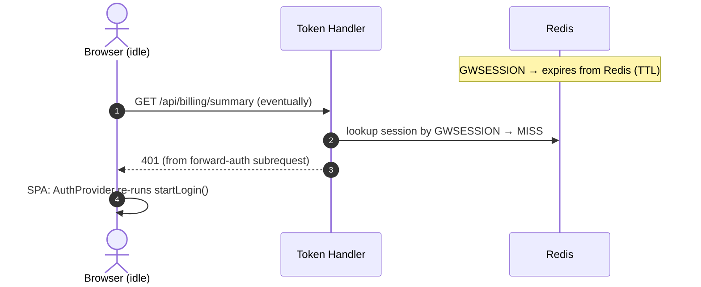
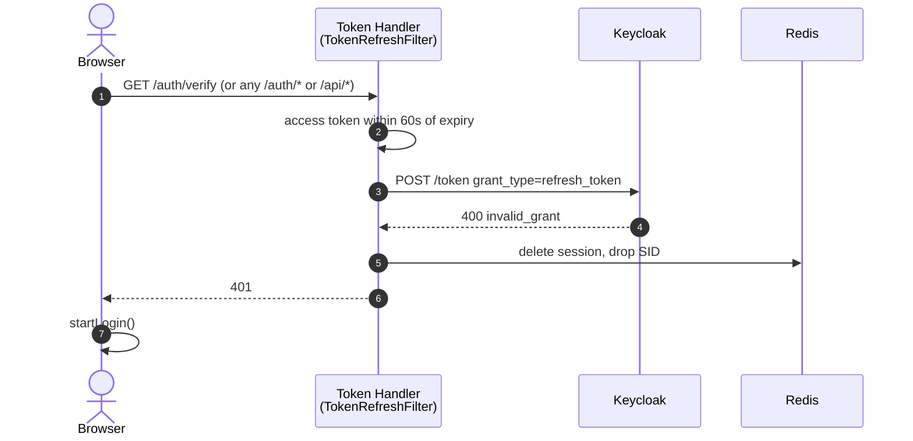
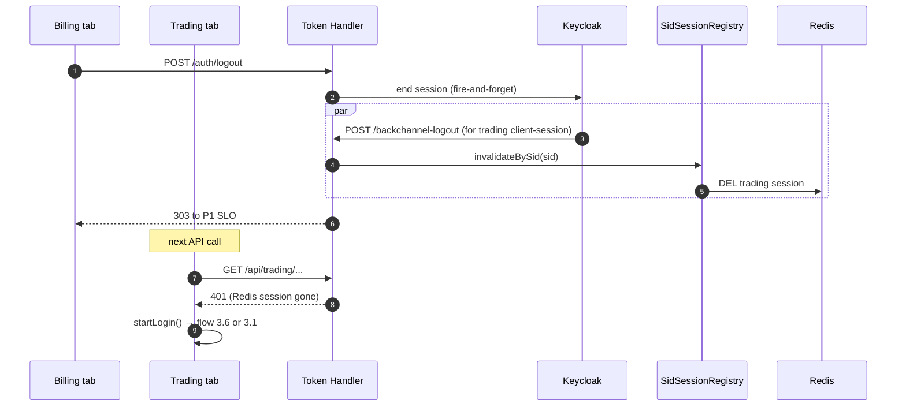
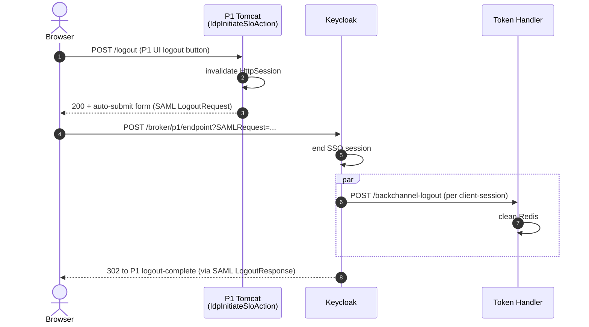

# 04 — Logout / SLO Flows

Single Logout (SLO) is the harder side of brokered SSO. This file documents
every logout path through the platform, the trade-offs each path resolves,
and the code that backs them.

A useful framing: every logout has to invalidate state in at least three
places — the Token Handler's Redis session, the Keycloak SSO session, and
the P1 `HttpSession`. The platform combines two industry-standard mechanisms
to do that:

- **RP-initiated logout** (`POST /auth/logout` from the SPA) drives a
  forward path: Token Handler → Keycloak end-session → KC fans out
  back-channel logouts to every client and to P1.
- **Back-channel logout** (Keycloak → Token Handler `POST
  /backchannel-logout`) handles the reverse case where P1 or another tab
  killed the SSO session first.

Both converge on the same Redis cleanup so the result is the same regardless
of who started the logout.

## Cast (same as 03)

| Short name | What it represents |
|---|---|
| **Browser** | The user's browser running a domain SPA |
| **Web** | The nginx in the domain web pod |
| **TH** | The Token Handler |
| **KC** | Keycloak `demo-realm` |
| **P1** | Platform 1 Tomcat (`IdpSloAction`) |
| **Redis** | Session and SID store |

---

## 4.1 RP-initiated logout — user clicks "log out" in a domain SPA

**Trigger.** User clicks logout in the domain SPA. The SPA fires
`POST /auth/logout` as a form submit (not `fetch`).

**Why form-submit, not fetch.** The Token Handler responds with a `303 See
Other` to the P1 SLO endpoint. A `fetch` would handle the 303 internally
and not navigate the browser. A form-submit makes the browser follow the
303 as a same-origin navigation, which is what triggers the SAML
LogoutRequest at P1.

### Why two cleanup paths in parallel

The Token Handler does **both** the synchronous Redis cleanup and the
fire-and-forget Keycloak end-session. The fire-and-forget half drives
Keycloak's downstream fan-out (back-channel POSTs to every other client,
SAML LogoutRequest to P1). The synchronous half guarantees that even if the
KC end-session times out or the back-channel fan-out fails, the user's
session in *this* Token Handler is gone before the response returns. This
is what makes the endpoint **idempotent**: a double-click, an already-expired
session, or a back-channel race all converge on the same 303.

### Code references

| Step | File:Line | Note |
|---|---|---|
| Logout endpoint shape | `bff-core/.../AuthController.java:289–341` | `@Secured(IS_ANONYMOUS)` + `@Nullable Authentication` — survives an already-cleared session |
| Fire-and-forget KC end-session | `AuthController.java:314,350–369` | Runs on a background executor so the request thread is never blocked waiting on KC's back-channel fan-out |
| Self-directed back-channel deadlock guard | `AuthController.java:305–312` (javadoc) | KC will POST `/backchannel-logout` back to *this* TH, which must not block until the logout request returns |
| Redis session cleanup | `AuthController.java:316–340` | Always clears the local session and drops the SID from the registry before the 303 |
| 303 to P1 SLO | `AuthController.java:340` | URL from env: `APP_P1_INITIATE_SLO_URL` |
| P1 LogoutRequest handler | `geowealth/src/main/java/com/geowealth/neo/saml/idp/IdpSloAction.java:159–311` | Validates inbound LogoutRequest signature (B6), invalidates session(s) by NameID, signs and posts back a LogoutResponse |
| P1 LogoutRequest replay protection (B6) | `IdpSloAction.java:171–181` | `SamlRequestIdCache.rememberOrReject(reqId)` |
| P1 LogoutRequest signature validation (B6) | `IdpSloAction.java:183–230` | Both Redirect-binding (detached) and POST-binding (XMLDSig) when `P1_IDP_KC_SP_CERT` is set; fails closed |
| P1 session walk-and-kill | `IdpSloAction.java:232–287` | Invalidates the request session **and** walks `GeowealthSessionListener.getAllSessions()` killing every session whose `LoggedUser` matches inbound NameID |

### What the user sees

A brief navigation to the P1 SLO endpoint, then a redirect back to a logout
completion page (in P1's React app) or to the public landing page. The
`silent_failed=1` hash fragment is appended on the way back so that if the
SPA is loaded immediately afterward, its `checkUserLoggedIn` does not loop
through a fresh silent-SSO probe (see flow 3.5).

---

## 4.2 Back-channel logout — KC tells Token Handler that a session ended

**Trigger.** Any logout that originates outside this Token Handler — a
different domain's SPA logged out, P1 admin force-logged-out the user, KC's
own admin logout — causes KC to POST a signed `logout_token` to every
client's `backchannel.logout.url`.

### Code references

| Step | File:Line | Note |
|---|---|---|
| Endpoint | `bff-core/.../BackchannelLogoutController.java:37–57` | `@Secured(IS_ANONYMOUS)` (unauthenticated by design — the JWT is the auth), `@ExecuteOn(TaskExecutors.BLOCKING)` |
| Validation rules | `bff-core/.../LogoutTokenValidator.java:96–125` | iss match, aud match, `events` carries `http://schemas.openid.net/event/backchannel-logout`, **no `nonce`** (presence = ID-token replay), RS256 against JWKS |
| JWKS fetch timeout | `LogoutTokenValidator.java:74` | 3 s, so a cold fetch never holds up the request |
| JWKS pre-warm | `LogoutTokenValidator.java:88–92` | Best-effort cache load on init |
| Replay defence | `LogoutTokenValidator.java:43–55,117–119` | Bounded LRU on `jti` |
| Two-key SID model | `bff-core/.../SidSessionRegistry.java:28–35` | `bff:sid:<sid>` (SET of session-ids), `bff:sess:<sessionId>` (reverse pointer) |
| TTL | `SidSessionRegistry.java:46` | 12 h on both keys |
| Invalidate by SID | `SidSessionRegistry.java:74–106` | Reads the SET, deletes each session-id and each reverse pointer, then deletes the SET |

### Why the SID indirection

The OIDC `sid` claim is **stable** across token refreshes but the
server-side **session-id** rotates (session fixation defence — see flow
3.1's `RotatingSessionLoginHandler`). A KC back-channel POST arrives with
the `sid` it minted at login, not whichever rotating session-id is current
now. The Redis `bff:sid:<sid>` SET tracks every session-id that has ever
belonged to this `sid`, so the invalidate step kills the current session no
matter how many times it has been rotated.

---

## 4.3 Idle timeout — the session dies silently

**Trigger.** No human action. The Redis session TTL expires (12 h baseline,
shorter in practice once token refresh fails 4xx).

**Summary.** Token Handler's session is gone. Next API call gets a 401 from
`/auth/verify` (returned by the `@Secured(IS_AUTHENTICATED)` rule). The SPA's
`AuthProvider` catches the 401 from `/auth/me` (or the next API call) and
calls `startLogin()` (flow 3.1 or 3.6 depending on KC SSO state).

There is no proactive notification. The SPA discovers the dead session
when it makes its next API call. This is the same recovery code path as
flow 3.6 (federated re-login).

---

## 4.4 Token refresh fails — the session is administratively killed

**Trigger.** The user was force-logged-out at Keycloak (admin clicked
"Logout all sessions") but the Token Handler still has a cached refresh
token in Redis. The TokenRefreshFilter's next attempt to call
`POST /token` returns `400 invalid_grant`.

**Summary.** TokenRefreshFilter deletes the Redis session and returns 401.
The SPA recovers same as 4.3.

This path is also what catches **out-of-band P1 SLO** that did not have a
matching KC back-channel logout. The 30 s validate interval (`VALIDATE_INTERVAL_SECONDS`)
ensures the refresh is attempted often enough that a P1-side logout
propagates within seconds, not minutes.

### Code reference

`bff-core/.../TokenRefreshFilter.java:159–179` (4xx → clear session + 401;
5xx → keep session and serve current token).

---

## 4.5 Double-click and concurrent logout requests

**Trigger.** User double-clicks the logout button. Two `POST /auth/logout`
requests arrive, possibly to two Token Handler replicas.

**Summary.** Both requests succeed. The second one finds an already-cleared
session and an already-revoked refresh token, both of which are non-fatal:

- The fire-and-forget KC end-session call is best-effort; the second call
  receives 400 from KC, which is logged and ignored.
- The Redis session delete is idempotent (delete-on-already-deleted is a
  no-op).
- The 303 to P1 SLO is returned to both requests; the browser follows the
  second redirect and then sees the SLO completion page.

### Code reference

`bff-core/.../AuthController.java:289–296` — the `@Nullable Authentication`
plus the documented idempotency contract is the explicit acknowledgement of
this scenario.

---

## 4.6 Multi-tab, multi-domain logout

**Trigger.** User is logged into `billing` and `trading` in two tabs. User
clicks logout in the billing tab.

**Summary.** Billing's RP-initiated logout (4.1) drives:

1. The trading session to die via KC back-channel logout (4.2). Trading's
   `GWSESSION` is a different cookie under the same name, but it is bound
   to a different Redis session — `BackchannelLogoutController` finds both
   in `bff:sid:<sid>` and invalidates both.
2. The P1 session to die via the SAML LogoutRequest. `IdpSloAction` walks
   every `HttpSession` registered to that NameID and invalidates all of
   them, so any P1 tab the user has open also goes to "logged out".

When the user next switches to the trading tab and the SPA makes its next
API call, the trading flow follows 4.3 (silent recovery via flow 3.6, or
escalation to interactive login if KC SSO is also gone).

---

## 4.7 P1-initiated logout — user logs out of P1 directly

**Trigger.** User clicks logout in P1's own UI.

**Summary.** P1 invalidates its `HttpSession`, then drives an IdP-initiated
SAML LogoutRequest to Keycloak via `IdpInitiateSloAction`. Keycloak ends
its SSO session and fans out back-channel POSTs (same code path as KC-side
end-session in 4.1). The Token Handler receives the back-channel POST and
cleans up Redis. Any open SPA tabs see 401 on their next API call (same as
4.3).

### Code reference

`geowealth/src/main/java/com/geowealth/neo/saml/idp/IdpInitiateSloAction.java`
— the IdP-side initiator. Note: this action also appends
`?silent_failed=1` to its post-logout redirect target so that the React
SPA's silent-SSO probe (3.5) does not race with a session that is in the
middle of being cleaned up.

---

## 4.8 Browser closed without logout

**Trigger.** User closes every tab without clicking logout.

**Summary.** Nothing happens at the server side immediately. The `GWSESSION`
cookie was already HttpOnly and Secure; closing the browser drops the
session cookie if the browser was configured that way (default for many
profiles). The Redis session keeps its TTL and is eventually evicted; the
KC SSO session lives to `ssoSessionIdleTimeout` and then dies on KC's side.
When the user re-opens the browser, the flow that fires depends on what is
still alive:

| KC SSO alive? | Redis session alive? | Next flow |
|---|---|---|
| Yes | Yes | Just resumes — `/auth/me` returns 200 |
| Yes | No | Flow 3.6 (federated re-login, silent) |
| No | Yes | Token refresh fails 4xx → flow 4.4 → flow 3.1 |
| No | No | Flow 3.1 (cold SP-init) |

---

## 4.9 SAML LogoutRequest signature — defence against forged requests

The B6 hardening in `IdpSloAction` enforces signature validation on every
inbound LogoutRequest when `P1_IDP_KC_SP_CERT` is set:

- **Redirect binding** uses the SAML detached URL signature (`Signature` +
  `SigAlg` query parameters). `IdpSloAction.verifyRedirectSignature()`
  reconstructs the signed string per the OASIS Redirect binding rules and
  verifies it against the configured Keycloak SP certificate.
- **POST binding** uses an XMLDSig embedded in the LogoutRequest XML.
  `SignatureValidator.validate()` from OpenSAML handles the check.

If validation fails, the request returns `403` with a `SECURITY_EVENT:
SAML_LOGOUT_SIG_REJECT` audit line. Replay defence (`SamlRequestIdCache`)
fires before signature check; a re-sent request is rejected with `409` and a
`SAML_REPLAY_REJECT` audit line.

In development the SP cert is not configured and unsigned LogoutRequests are
accepted; this is documented in the existing project notes as a known
"dev-only" relaxation that must be tightened before production rollout.

---

## 4.10 What is intentionally not done

- **No front-channel SLO via iframes.** The P1 IdP plain auto-submits the
  LogoutResponse and does not run a multi-frame SLO. Browser support is
  inconsistent (Safari ITP blocks third-party cookies in iframes),
  back-channel logout is the supported replacement, and Keycloak handles
  any third-party-iframe SLO at the realm level if the realm ever needed
  it.
- **No SAML SLO from the Token Handler.** The Token Handler is an OIDC RP,
  not a SAML party. Its logout fan-out path is the OIDC `end_session_endpoint`
  + KC back-channel logout chain. SAML-side cleanup happens at Keycloak,
  not at the Token Handler.
- **No global logout-event broadcast bus.** The propagation channels are
  the OIDC `sid` (browser → Token Handler via back-channel logout) and the
  SAML NameID (Keycloak → P1 via LogoutRequest, P1 → P1-sessions via
  `GeowealthSessionListener` walk). A third bus would be redundant.
