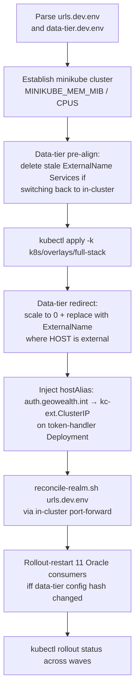

# 05 — Kubernetes Deployment

The Kubernetes layout runs every component documented in
[`02-component-inventory.md`](02-component-inventory.md) inside a single
namespace, `geowealth-demo`. This file explains the topology, the
environment-specific configuration model, the deploy orchestration, and the
ingress / forward-auth wiring that ties it all together.

The local development cluster is `minikube`; the same manifests target any
upstream Kubernetes distribution that has an Ingress controller and a
ClusterIP-style Service mesh.

---

## 1. Repository layout

```
k8s/
├── base/                       # raw manifests (one file per component)
│   ├── namespace.yaml
│   ├── kc-postgres.yaml        # StatefulSet (1) + PVC + Service
│   ├── redis.yaml              # StatefulSet (1) + PVC + Service
│   ├── oracle.yaml             # StatefulSet (1) + PVC + Service (data tier)
│   ├── elasticsearch.yaml      # StatefulSet (1) + PVC + Service
│   ├── memcached.yaml          # Deployment + Service
│   ├── keycloak.yaml           # StatefulSet (1) + Service (in-cluster :8080)
│   ├── token-handler.yaml      # Deployment + Service + HPA (2-12)
│   ├── token-handler-config.yaml  # ConfigMap (tenants) + Secret (OIDC client secret)
│   ├── web.yaml                # web-billing + web-trading Deployments + Services
│   ├── bff-billing.yaml        # Deployment + Service
│   ├── bff-trading.yaml        # Deployment + Service
│   ├── data-bff-config.yaml    # ConfigMap mounted by both BFFs
│   ├── p1.yaml                 # p1-tomcat StatefulSet + p1-coordinator StatefulSet + 9 agent Deployments
│   ├── ingress.yaml            # per-domain Ingress with external-auth (legacy shape)
│   ├── ingress-app.yaml        # newer Ingress with nginx auth-url annotation
│   └── kustomization.yaml
├── overlays/
│   ├── dev/                    # auth-tier only (no P1, no data tier)
│   ├── full-stack/             # everything in base
│   └── minikube-auth-tier/     # minikube-specific tweaks (host aliases, ingress)
├── env/
│   ├── urls.dev.env            # browser-facing and in-cluster URLs (one per env)
│   ├── urls.qa.env
│   ├── urls.prod.env
│   ├── data-tier.dev.env       # ORACLE / ES / MEMCACHED host overrides
│   ├── data-tier.qa.env
│   └── data-tier.prod.env
├── images/                     # local image build helpers
├── up.sh                       # one-shot deploy orchestrator
├── README-multitenant-k8s-plan.md
├── README-pods.md              # the verbatim pod inventory
├── README-scale.md
└── README-ubuntu-bringup.md
```

---

## 2. Environment-specific URLs — `k8s/env/urls.<env>.env`

Every URL or port that differs between dev, QA, and prod lives in exactly
one file: `k8s/env/urls.<env>.env`. Two consumers read it; nothing else
should ever reach into another source for environment URLs.

### Consumers

1. **The Token Handler and data BFFs**, via an `app-urls` ConfigMap. The
   overlay's kustomization generates this ConfigMap from the env file. The
   Token Handler pod's env is configured with
   `valueFrom: configMapKeyRef: name=app-urls key=KEYCLOAK_ISSUER`
   (and similar for other keys), with `value: null` to drop the base-level
   literal that compose uses.
2. **The Keycloak realm**, via `scripts/reconcile-realm.sh <env-file>`. The
   script PATCHes the live realm via the admin API: the `p1` SAML IdP
   `singleSignOnService` / `singleLogoutService` URLs, and every active
   client's `redirectUris` / `webOrigins` / `post.logout.redirect.uris` /
   `backchannel.logout.url`. The script is idempotent and run by `up.sh`
   after bring-up.

### Why both

`--import-realm` is `IGNORE_EXISTING`, so it only seeds an empty
Postgres. To apply realm config edits on a running cluster, the only
non-destructive option is admin-API PATCH — that is exactly what
`reconcile-realm.sh` does. Without this, swapping `urls.dev.env` would
update the Token Handler's pod env on next rollout but the realm would still
hold the old URLs, and the SAML round-trip would silently 302 to the wrong
host.

### Keys in the dev file (excerpt)

```
# Browser-facing KC issuer (redirects + iss claim)
KEYCLOAK_ISSUER=https://auth.geowealth.int:5180/realms/demo-realm

# In-cluster JWKS endpoint (server-side OIDC discovery)
KEYCLOAK_AUTH_SERVER_URL=http://keycloak:8080/realms/demo-realm

# In-cluster P1 (Token Handler → P1 for Tier-2 authz; never browser-facing)
P1_AUTHZ_URL=http://p1-tomcat:8080

# Browser-facing P1 SLO endpoint the /auth/logout 303 sends the user to
APP_P1_INITIATE_SLO_URL=http://localhost:8080/saml/idp/initiate-slo.do

# Realm reconciliation block
KC_ADMIN_BASE=https://auth.geowealth.int:5180
KC_REALM=demo-realm
P1_BROWSER_BASE=http://localhost:8080
P1_INCLUSTER_BASE=http://p1-tomcat:8080
SPA_HOSTS=https://billing.geowealth.int:5184 https://trading.geowealth.int:5185 ...
TH_BACKCHANNEL_URL=http://token-handler:8080/backchannel-logout
```

The split-horizon design — separate keys for the **browser-facing** URL
(`KEYCLOAK_ISSUER`, `APP_P1_INITIATE_SLO_URL`, `SPA_HOSTS`) and the
**in-cluster** URL (`KEYCLOAK_AUTH_SERVER_URL`, `P1_AUTHZ_URL`,
`TH_BACKCHANNEL_URL`) — is what lets the same image run unchanged in every
environment. The browser sees the external hostname; the Token Handler
talks to the in-cluster Service directly.

---

## 3. Data-tier endpoints — `k8s/env/data-tier.<env>.env`

A separate env file controls **where each in-cluster consumer reaches
Oracle, Elasticsearch, and Memcached**. Three modes per data-tier service:

| Mode | `*_HOST` setting | What `up.sh` does |
|---|---|---|
| In-cluster default | Equals the Service name (`oracle`, `elasticsearch`, `memcached`) | Leaves the kustomize-applied ClusterIP Service + StatefulSet/Deployment alone |
| External | Resolves elsewhere (`192.168.1.42`, `dev-elastic.geowealth.com`) | Scales the in-cluster workload to 0, deletes the freshly applied ClusterIP Service, re-applies it as `type: ExternalName, externalName: <HOST>` |

Consumers always use the bare Service name (`oracle:1521`,
`elasticsearch:9200`, `memcached:11211`). Only what that name resolves to in
cluster DNS changes between modes.

### Important constraints

- **External services are assumed populated.** No seeding job runs against
  an external Oracle or Elasticsearch. The seeded image's
  `restore-oradata.sh` is skipped because the in-cluster Oracle is scaled to
  0.
- **Oracle JDBC coordinates beyond `_HOST`.** A real external Oracle
  usually uses a different `SERVICE_NAME` (PDB) and password than the baked
  image. `ORACLE_PDB` and `ORACLE_USER` come from this file;
  `ORACLE_PASSWORD` is a credential and **never** lives in the env file —
  provide it on the shell to `up.sh`:

  ```bash
  ORACLE_PASSWORD='real-pw' ./k8s/up.sh
  ```

  If unset, no `oracle-creds` Secret is applied and P1's entrypoint falls
  back to its baked default (`gp123`), which will not authenticate against
  most external instances.
- **Agent heap when swapping to a real DB.** `p1-devcommonagents`
  pre-loads the entire `COST_BASIS_ACCOUNT_TBL` at boot via
  `CrntCostBasisLoader`. The 1.5 GB heap that fits the baked PDB OOMs
  against a real table — `k8s/base/p1.yaml` therefore sets `-Xmx4G` with
  `limits.memory: 5Gi`. The OOM signature is always `<X>Loader.<init>` in
  the boot path; user-facing symptom is a blank `localhost:8080` because
  the agent's Manager actor (`AuthorizationManager`) never joins the Akka
  cluster.
- **Consumer auto-restart on data-tier change.** `envFrom` ConfigMaps and
  Secrets do **not** trigger pod restarts when their values change. `up.sh`
  hashes `cm/oracle-config` + `secret/oracle-creds` + the `oracle` Service
  before and after the apply; if anything changed AND the consumer
  workloads pre-existed, it `kubectl rollout restart`s the eleven Oracle-
  consuming P1 workloads. Fresh installs and pure no-op re-runs both skip
  the restart.

### TCP port note

`ExternalName` Services do **not** remap ports. The external host must
listen on the same port the in-cluster Service exposed (1521, 9200, 11211).
If it cannot, NAT or port-forward on the external side, or run a small
in-cluster TCP proxy.

---

## 4. Deploy orchestration — `k8s/up.sh`

`up.sh` is a single shell entry point that runs the full bring-up
end-to-end. It is idempotent and safe to re-run after any drift.

### Phases



### Phase explanations

1. **Data-tier pre-align.** `Service.spec.type` is immutable. A previous
   run that redirected to `ExternalName` would block the next
   `kubectl apply` from re-creating an in-cluster ClusterIP Service. `up.sh`
   deletes the stale Service first so the apply can succeed.
2. **`kustomize apply` of `overlays/full-stack`.** The overlay layers
   minikube-specific tweaks on top of `base/` and bakes the
   `app-urls` ConfigMap from `urls.dev.env`.
3. **Data-tier redirect.** Walks each `_HOST` from `data-tier.dev.env`; if
   external, scales the in-cluster workload to 0 and re-applies the Service
   as `type: ExternalName, externalName: <HOST>`. If in-cluster, leaves it
   alone.
4. **hostAlias injection.** Adds `auth.geowealth.int → kc-ext.ClusterIP`
   to the Token Handler Deployment spec at runtime so OIDC discovery
   resolves in-cluster. The `kc-ext` ClusterIP is only known at deploy
   time, so this is a runtime patch, not a static manifest value.
5. **Realm reconciliation.** Spawns a short-lived in-cluster port-forward
   to Keycloak's admin API and runs `scripts/reconcile-realm.sh
   k8s/env/urls.dev.env` against it. PATCHes the IdP URLs and every
   active client's `redirectUris` / `webOrigins` / `post.logout.redirect.uris`
   / `backchannel.logout.url`.
6. **Conditional consumer restart.** If `data-tier.dev.env` changed
   anything, rollout-restart all Oracle consumers so they read the new
   env. Otherwise skip.
7. **Rollout-status wait.** Waits for each wave of workloads to be Ready,
   so re-running `up.sh` ends in a known-good cluster.

---

## 5. The `kc-ext` issuer trick

The Token Handler does OIDC discovery against the **public** issuer URL
(`https://auth.geowealth.int:5180/realms/demo-realm`). That URL must be
reachable from inside the cluster, with a TLS certificate the JVM trusts,
or `iss` matching fails in JWT validation.

Solution:

- **`kc-ext`** is a 16 Mi nginx pod serving the mkcert-signed wildcard cert
  for `*.geowealth.int`, reverse-proxying to `keycloak:8080`.
- **`up.sh`** adds a `hostAliases` entry on the Token Handler Deployment
  mapping `auth.geowealth.int` to the `kc-ext` ClusterIP. CoreDNS would
  not resolve `auth.geowealth.int` otherwise.
- The Token Handler then does OIDC discovery against
  `https://auth.geowealth.int:5180/realms/demo-realm/.well-known/openid-configuration`
  and the response carries the same issuer URL the browser sees.

A future production deployment with a real CA-signed cert can drop `kc-ext`
and route `auth.geowealth.int` straight through the ingress controller.
The flow stays the same.

---

## 6. Ingress and forward-auth

Two Ingress objects are in scope:

### `ingress.yaml` — per-domain hosts (older shape)

Defines one `Ingress` per host (`billing-api`, `trading-api`,
`billing-auth`, `trading-auth`). The API Ingress uses the nginx
`external-auth` annotation pointing at the Token Handler.

### `ingress-app.yaml` — consolidated Ingress (newer shape)

Routes:

| Host | Path | Backend | Auth annotation |
|---|---|---|---|
| `billing.geowealth.int` | `/api/billing/*` | `bff-billing:8080` | `nginx.ingress.kubernetes.io/auth-url: http://token-handler.geowealth-demo.svc.cluster.local:8080/auth/verify` |
| `billing.geowealth.int` | `/*` | `web-billing:5184` | (SPA bundle and `/oauth/*` / `/auth/*` reverse-proxy) |
| `trading.geowealth.int` | same shape | `bff-trading:8080` / `web-trading:5185` | same |
| `auth.geowealth.int` | `/*` | `kc-ext:5180` → `keycloak:8080` | n/a |
| P1 hosts | `/*` | `p1-tomcat:8080` | n/a |

The `auth-url` annotation tells `ingress-nginx` to issue a subrequest to
the Token Handler's `/auth/verify` before letting traffic reach the data
BFF. On `200`, ingress copies the `X-Auth-*` response headers onto the
upstream request, strips the session cookie, and proxies on. On `401` or
`403`, the subrequest's status is returned to the SPA.

This is exactly the same contract the web pods enforce in compose; in K8s
the contract lives one tier higher (at the cluster edge).

---

## 7. NetworkPolicy and pod-to-pod scope

Today the namespace has no `NetworkPolicy` objects. That is acceptable for
a development cluster but is a deliberate gap for production. The intended
shape is two policies:

| Direction | From | To | Purpose |
|---|---|---|---|
| Ingress | `ingress-nginx-controller` | `web-*`, `kc-ext`, `p1-tomcat` | Restrict edge to the three browser-facing destinations |
| In-cluster | `token-handler` | `keycloak`, `redis`, `p1-tomcat` | Restrict the Token Handler to the three back-ends it actually needs |
| In-cluster | `bff-*` | `p1-tomcat` | Restrict the data BFFs to P1 for Tier-3 refine only |
| In-cluster | `web-*` | `token-handler`, `bff-*` (same domain) | The forward-auth subrequest plus the data BFF only |

These are policy-as-code add-ons; no application code changes.

---

## 8. Storage classes and PVCs

The minikube overlay uses the built-in `storage-provisioner` add-on, which
provisions `hostPath` PVs on the minikube VM's local disk. PVCs in scope:

| Workload | PVC | Storage class |
|---|---|---|
| `oracle-0` | `oracle-data` | `standard` (hostPath) |
| `elasticsearch-0` | `es-data` | `standard` |
| `kc-postgres-0` | `kc-pg-data` | `standard` |
| `redis-0` | `redis-data` | `standard` |
| `p1-coordinator-0` | `p1-coordinator-data` | `standard` |
| `p1-tomcat-0` | `p1-tomcat-data` | `standard` |

A production deployment substitutes a real CSI driver (EBS, GCE PD, Azure
Disk, …). Manifests do not hard-code the storage class; the overlay drives
it.

---

## 9. Scaling

The platform has one horizontal scaling axis worth highlighting and several
that are intentionally not horizontally scaled today.

### Horizontally scaled

| Workload | Scaling | Bounds |
|---|---|---|
| `token-handler` | HPA on CPU | min 2, max 12 |

The Token Handler scales horizontally because Redis owns session state.
Any replica can serve any session, so adding replicas is purely a capacity
decision.

### Not horizontally scaled today

| Workload | Why |
|---|---|
| `keycloak-0` | Stateful (sessions stored in cluster cache); horizontal scale is supported in production but requires Infinispan tuning |
| `kc-postgres-0` | Single-writer; production uses a managed Postgres |
| `redis-0` | Single-writer; production uses Redis Cluster or AWS Elasticache |
| `p1-tomcat-0` | In-memory `HttpSession`; production uses MSM/memcached for session replication |
| `p1-coordinator-0` | Akka seed must have a stable address |
| `p1-agent-*` | Akka cluster — adding members rebalances the cluster on its own; each agent owns a fixed Manager set |
| Data BFFs | Stateless; nothing prevents horizontal scale, just not configured today |

A production sizing plan lives in
[`k8s/README-scale.md`](../../k8s/README-scale.md); the Solution-Architect
discussion in this document focuses on the design, not the numbers.

---

## 10. Observability hooks

What is and is not wired up today:

- **Liveness / readiness probes.** Token Handler has both (`/healthz`),
  Keycloak has KC's built-in `/health/live` and `/health/ready`. Domain
  BFFs have a minimal readiness probe.
- **Metrics.** Micronaut Management is bundled in the Token Handler image;
  `/prometheus` is exposed. Scraping is up to the operator (no Prometheus
  Operator manifest in this repo).
- **Logging.** Stdout / stderr, captured by the cluster's log driver.
  Production is expected to ship to the standard org log aggregator.
- **Audit.** The SAML actions (`IdpSsoAction`, `IdpSloAction`) emit
  `SECURITY_EVENT:` log lines for issue/replay/signature-reject events; the
  Token Handler does not yet emit a parallel auth-event audit stream — see
  [`07-security-and-trust-model.md`](07-security-and-trust-model.md) §10
  for the gap.

---

## 11. Adding a new domain in Kubernetes

The compose recipe in `CLAUDE.md` (under *Adding a new domain*) is
sufficient for the per-domain pair; the Kubernetes-specific extra steps
are:

1. Add the new host to `SPA_HOSTS` in `k8s/env/urls.<env>.env`.
2. Add the new host as a key on `demo-shared-client`'s `redirectUris`,
   `webOrigins`, and `post.logout.redirect.uris` in
   `keycloak/realm-export.json` (so a fresh install picks it up). Then
   either re-run `up.sh` (which runs `reconcile-realm.sh`), or patch the
   live realm by hand on an existing cluster.
3. Add an `app.tenants.<slug>` entry to `token-handler/application.yml`
   with the new host and the new ObjectType/Permission codes.
4. Add new Deployment + Service definitions for `web-<name>` and
   `bff-<name>` in `k8s/base/`. The cleanest pattern today is `k apply -f
   k8s/base/web-<name>.yaml` and append a kustomization entry; a future
   refactor could move to a Helm chart with a `domain` value.
5. Add an Ingress host for `<name>.geowealth.int` in
   `k8s/base/ingress-app.yaml` (one rule for `/api/<name>/*` with the
   forward-auth annotation, one rule for `/*`).
6. Rebuild + redeploy the Token Handler so it picks up the new
   `app.tenants.<slug>` entry.

No new OIDC client is needed. No new SAML mapper is needed. The new domain
inherits every existing role mapper from the realm.
