# 06 — Communication Diagrams

This file collects the diagrams referenced from other documents in one
place, plus a few that did not fit cleanly inside the flow descriptions.
Confluence renders Mermaid inline; if a target space does not, the
text-source versions below can be rendered with any Mermaid CLI.

The diagrams follow a loose C4-style hierarchy:

- **Level 1 — System context.** Who interacts with the platform.
- **Level 2 — Containers.** Which processes are involved.
- **Level 3 — Component interactions.** Specific runtime flows.

---

## 1. Level 1 — System context

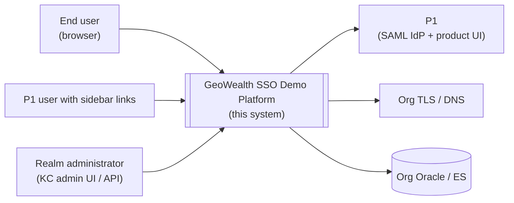

External actors:

| Actor | Why it matters here |
|---|---|
| End user (browser) | Carries `GWSESSION` per host; the only place untrusted input enters the system |
| P1 user with sidebar links | Same browser; pre-authenticated at P1, drives SP-init SSO via sidebar deep links |
| Realm administrator | Operates Keycloak through its admin UI or the admin API; touched by `scripts/reconcile-realm.sh` during deploy |

External systems:

| System | Boundary it crosses |
|---|---|
| P1 (SAML IdP) | The federation. Owned by the same organisation but is a separate runtime |
| Org TLS / DNS | Owns the wildcard cert for `*.geowealth.int` in production and the DNS records the demo hosts hang off |
| Org Oracle / Elasticsearch | The real customer-data store. The demo points its in-cluster names at it via `data-tier.<env>.env` |

---

## 2. Level 2 — Containers (runtime)

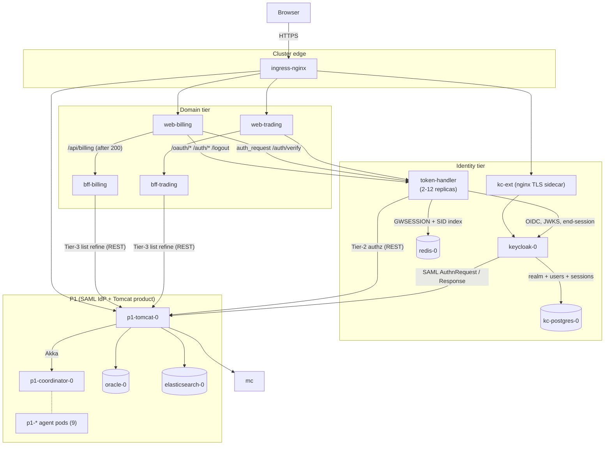

---

## 3. SP-initiated SSO — sequence (canonical)

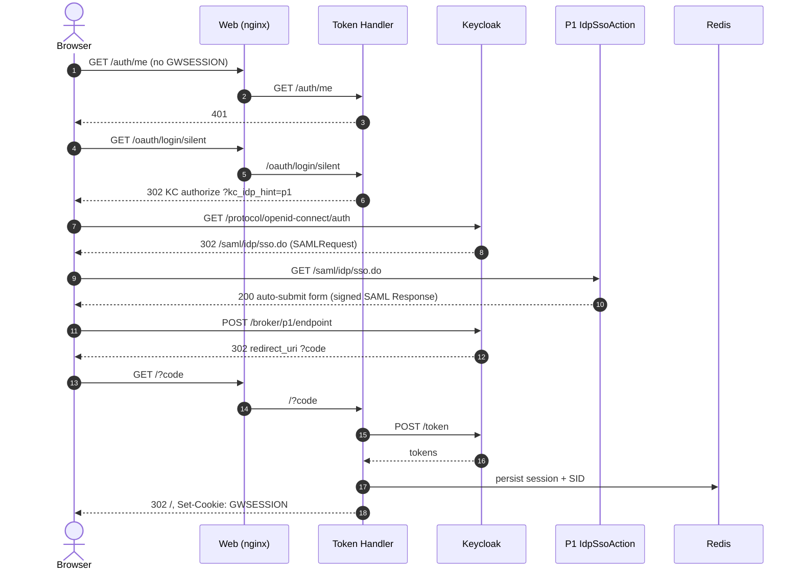

The same diagram, with the lookups and storage emphasised:

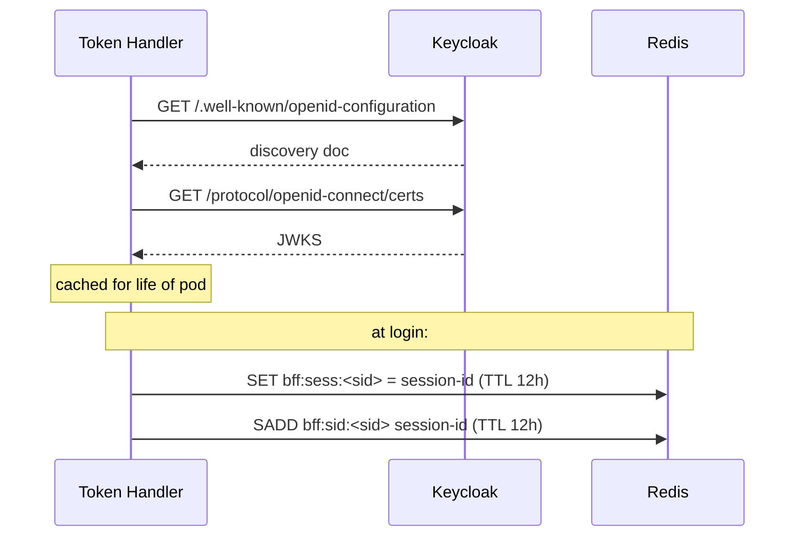

---

## 4. Forward-auth — request-level interaction

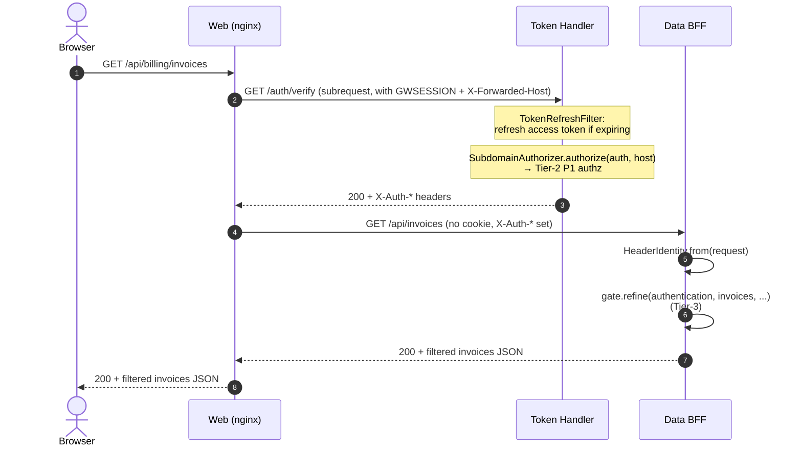

Note the difference between Tier-2 and Tier-3:

| Tier | Where it runs | Subject | Cost |
|---|---|---|---|
| Tier-2 | Token Handler `/auth/verify` | "Can this user reach `/api/billing` on this host?" | One P1 call per cache-miss (60 s TTL) |
| Tier-3 | Data BFF row-list endpoint | "Which IDs in this list may this user see?" | One P1 call per list response |

---

## 5. RP-initiated logout — sequence

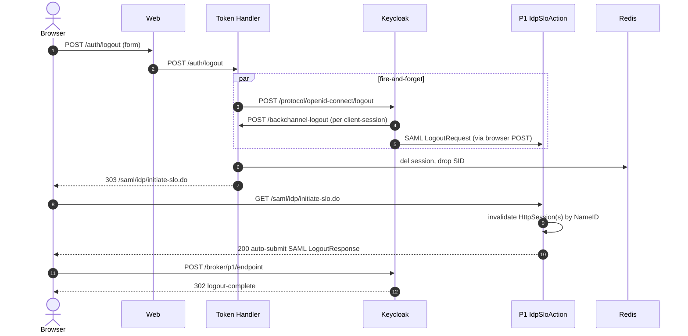

---

## 6. Back-channel logout — sequence (KC → TH)

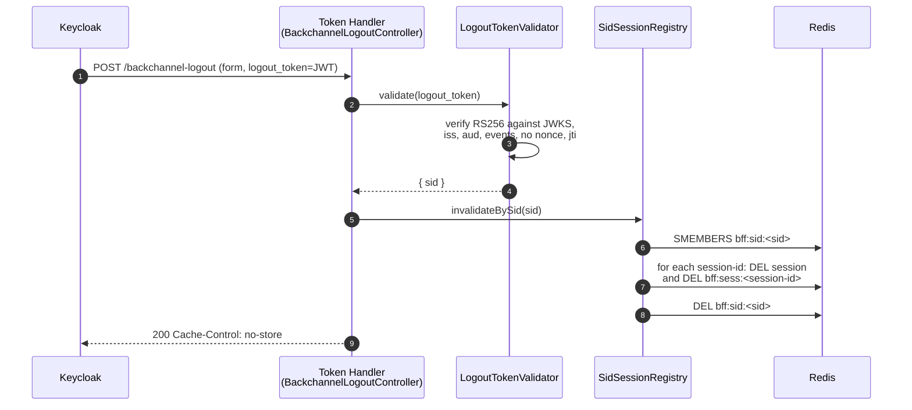

---

## 7. Token refresh — sequence

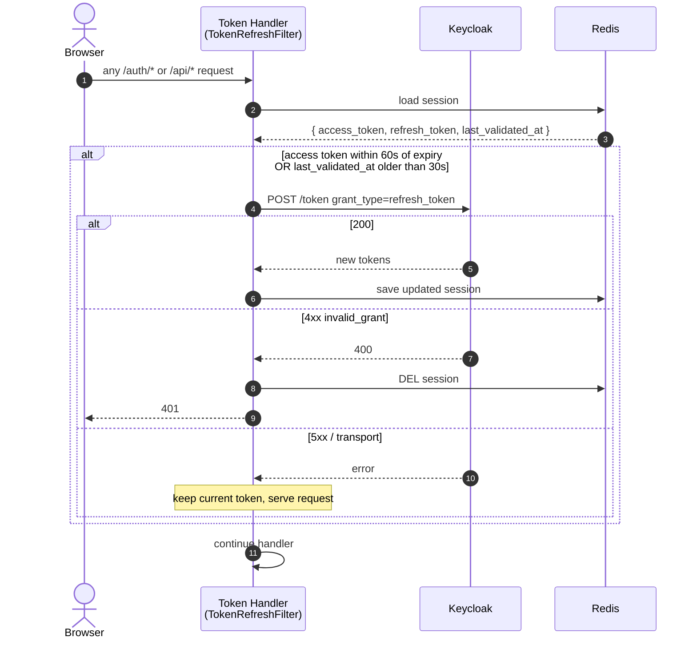

The 30 s `VALIDATE_INTERVAL_SECONDS` is the headline number an architect
should remember — it is the upper bound on how long a P1-side SLO that
fails to back-channel through Keycloak takes to surface as a 401 to the
SPA.

---

## 8. Sidebar deep-link (warm browser, IdP-side state alive)

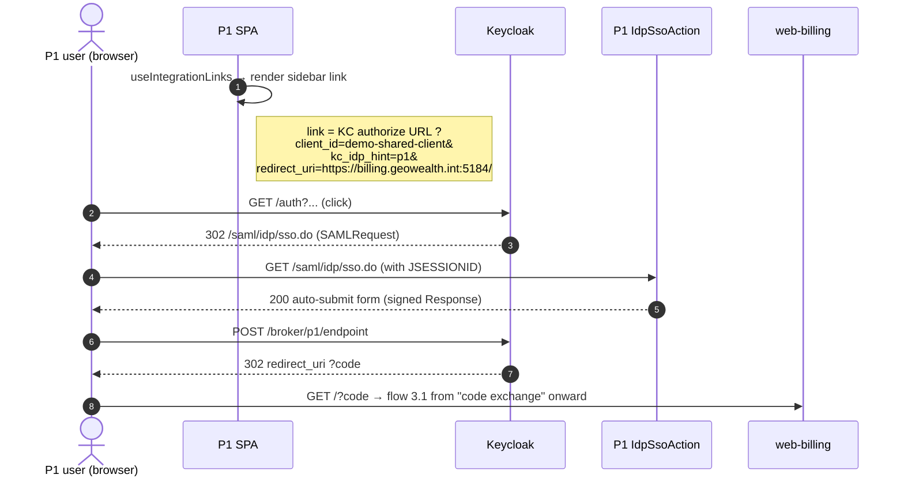

The interesting piece here is what the sidebar link **does not contain**:
no SPA-side state, no token, no session ID — it is a pure deep-link to
Keycloak's authorize endpoint with the `kc_idp_hint` set. The
`useIntegrationLinks` source lives in
`~/geowealth/WebContent/react/app/src/pages/PlatformOne/sidebar/_hooks/useIntegrationLinks.js`
(outside this repo).

---

## 9. K8s ingress + auth-request

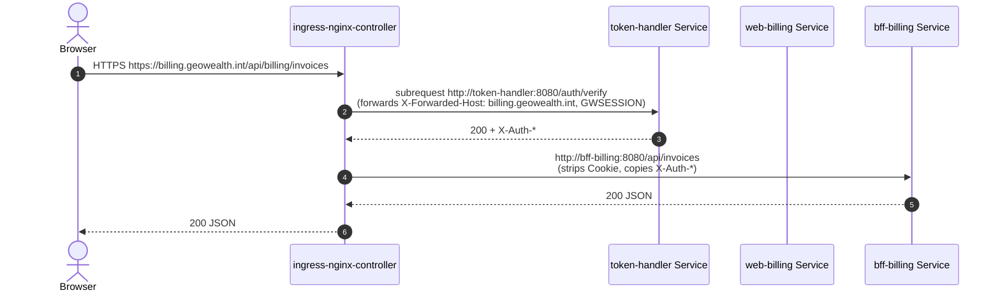

In compose, the same contract is enforced one layer lower (inside each
`web-*` pod's nginx). In Kubernetes, the cluster-edge controller does it
once for every host.

---

## 10. P1 Akka cluster topology

The Akka cluster diagram below is conceptual; runtime membership depends
on which agents are scheduled. Every agent points its `seed-nodes` at
`akka://DevPetar@p1-coordinator-0.p1-coordinator:4007`, joins on boot,
and announces the Managers it provides. Tomcat sends `ask` messages to
named Managers; the cluster routes them to the actor on the agent that
owns the Manager.

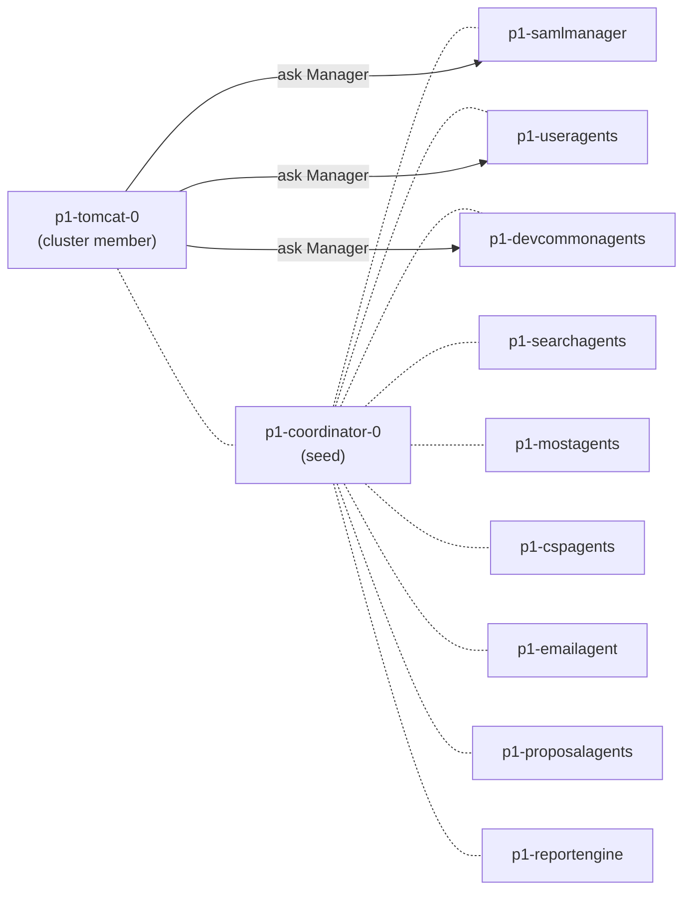

The two **load-bearing** agents for SSO are `p1-samlmanager` (signs the
SAML responses and validates inbound LogoutRequests) and
`p1-devcommonagents` (hosts `AuthorizationManager`, used by Tier-2 and
Tier-3 P1 authz calls).

---

## 11. Failure scenarios summarised

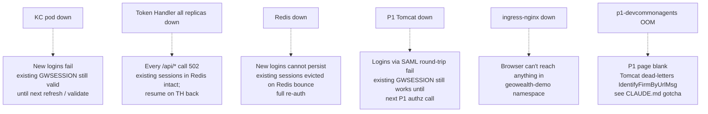

The recovery for every one of these is automatic once the failing pod is
back, because the persistent state is in Postgres, Redis, and Oracle —
not in any of the pods that failed.
