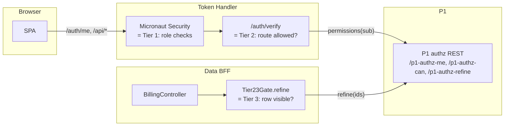

# 07 — Security and Trust Model

This file documents the security properties of the platform: what is
trusted, what is verified, where keys live, what classes of attack the
design defends against today, and what is left for production hardening.

## 1. Threat model summary

The platform is a brokered-SSO substrate; the threat model is the standard
SSO/SLO list with the extra constraints of a multi-tenant Token Handler:

| Threat | Defence in this design | Source |
|---|---|---|
| Session hijacking via stolen cookie | Cookies are HttpOnly, Secure, SameSite=Lax, host-scoped. Server-side session in Redis, not a JWT in localStorage. | `token-handler/application.yml` session block |
| Session fixation | Pre-auth session destroyed on login, fresh session id minted | `RotatingSessionLoginHandler.java:22–77` |
| Cross-site request forgery | `/auth/logout` is `POST`, `Content-Type` constrained, no GET log-out | `AuthController.java:277–296` |
| Replay of OIDC back-channel logout | Bounded LRU on `jti` | `LogoutTokenValidator.java:43–55,117–119` |
| Replay of SAML LogoutRequest | `SamlRequestIdCache.rememberOrReject` | `IdpSloAction.java:171–181` |
| Forged SAML AuthnRequest | KC validates `InResponseTo` against an in-flight request it issued; unsolicited Responses fail correlation | KC built-in |
| Forged SAML LogoutRequest | Detached or XMLDSig signature validated against KC SP certificate (B6) | `IdpSloAction.java:183–230` |
| Refresh-token theft → infinite session | KC `ssoSessionMaxLifespan` (10 h) is a hard ceiling; refresh fails 4xx after KC SSO ends; out-of-band P1 SLO surfaces via 30 s validate interval | `realm-export.json`, `TokenRefreshFilter.java` |
| Issuer mismatch in JWT | OIDC discovery cached and `iss` verified per request | `KeycloakAuthenticationMapper.java`, JWKS path |
| Token in URL / referrer leak | Tokens never leave the Token Handler; the browser only carries the session cookie | architecture choice — Token Handler pattern |
| Cross-tenant data exposure | Per-host Tier-2 authz at `/auth/verify`; Tier-3 row refine inside the data BFF using the same access token | `SubdomainAuthorizer.java`, `Tier23Gate.java` |
| Untrusted realm config drift | `--import-realm` is `IGNORE_EXISTING`; live realm is reconciled idempotently from `urls.<env>.env` | `scripts/reconcile-realm.sh` |

---

## 2. Cookie inventory

| Cookie | Issued by | Scope | Flags | Lifespan |
|---|---|---|---|---|
| `GWSESSION` | Token Handler | Host (e.g. `billing.geowealth.int`), no `Domain` attribute | HttpOnly, Secure, SameSite=Lax | Session-id rotation on login; Redis TTL 12 h |
| `KEYCLOAK_IDENTITY` | Keycloak | `auth.geowealth.int` | HttpOnly, Secure, SameSite | KC SSO max-lifespan (10 h) |
| `KEYCLOAK_SESSION` | Keycloak | `auth.geowealth.int` | HttpOnly, Secure, SameSite | Same |
| `JSESSIONID` | P1 Tomcat | P1 hosts | HttpOnly | Tomcat `session-timeout` (7 h dev) |
| `SILENT_ATTEMPT_COOKIE` | Token Handler | Host | HttpOnly, Secure, SameSite=Lax | Cleared on next interactive login |

The host scoping of `GWSESSION` is what makes the multi-tenant Token
Handler safe: the browser never sends a billing cookie to trading, so a
trading-side compromise cannot expose billing's session.

---

## 3. Authorization model — Tier 1, Tier 2, Tier 3

The three-tier model is what makes the design scalable across new domains
without each adding bespoke server-side logic. The relationship between
the tiers and where each evaluates is summarised below.



### Tier 1 — coarse roles

Lives in the realm. Roles `client`, `advisor`, `admin`, plus per-domain
`billing-admin` / `billing-viewer` / `trading-trader` / `trading-viewer`.
Realm role mappers (SAML role IdP mappers, all `syncMode=FORCE`) populate
these from the P1 `roles` SAML attribute. The Token Handler enforces them
via `@Secured("…")` where present and via the bare
`@Secured(IS_AUTHENTICATED)` rule everywhere else.

### Tier 2 — route / object-type permission

Lives in the Token Handler's `/auth/verify`, which the nginx forward-auth
calls before every `/api/*`. The per-host requirement is configured under
`app.tenants.<slug>` in `token-handler/application.yml`:

```yaml
app:
  tenants:
    billing:
      host: billing.geowealth.int
      type: resource
      object-type: 59   # BILLING_CENTER
      permission: 5     # EXECUTE
    trading:
      host: trading.geowealth.int
      type: resource
      object-type: 5    # TRADE
      permission: 5     # EXECUTE
```

`SubdomainAuthorizer.authorize(auth, host)` looks up the tenant by host,
then calls `Tier23Gate.require(auth, objectType, permission)` which asks
P1 via `P1AuthzClient.hasPermission(...)`. Results are cached per `sub`
for `app.authz.cache-ttl-millis` (60 s default). Failure throws 403 and
nginx returns 403 to the SPA.

### Tier 3 — row-level refine

Lives **inside each data BFF**, intentionally not in the Token Handler,
because Tier 3 operates on row IDs that only the data layer knows. The
domain controller calls `gate.refine(auth, items, idOf, objectType,
permission)`, which calls `P1AuthzClient.refine(authHeader, objectType,
permission, ids)`. The `authHeader` is the access token forwarded from
the Token Handler via the `X-Auth-Access-Token` header, so the data BFF
authenticates to P1 without holding a session itself.

If `AUTHZ_FINE_ENABLED=false`, every Tier-2 and Tier-3 check is a no-op
(used in low-stakes demo environments where role mapping suffices). The
default in `application.yml` is `false`; the K8s overlay sets it to
`true`.

---

## 4. Cryptography and key material

### 4.1 SAML signing key (P1 side)

| Property | Value |
|---|---|
| Path | `${P1_IDP_KEYSTORE_PATH}` (dev: `/tmp/p1-idp-dev.p12`) |
| Format | PKCS#12 |
| Algorithm | RSA 2048 |
| Password env var | `P1_IDP_KEYSTORE_PASSWORD` |
| Alias env var | `P1_IDP_KEYSTORE_ENTITY` |
| Cache | mtime-aware, in-process `ConcurrentHashMap` (B5) |

The mtime cache means:

- A keystore rotation is hot. Replace the file in place, P1 detects the
  mtime change on the next signature and reloads.
- A `/tmp` wipe (macOS reboot) does **not** break signing mid-run, because
  the credential is already in memory and the cache logic explicitly
  treats `lastModified() == 0` as "file gone, keep cached credential".
- A `/tmp` wipe **before the first signature** still 500s; recovery is one
  script (`scripts/sso-dev-keystore.sh` on the demo repo) that regenerates
  the keystore and rotates the cert in the live realm via admin API in one
  go.

### 4.2 Keycloak's SAML SP cert (used by P1 for inbound LogoutRequest validation)

| Property | Value |
|---|---|
| Env var | `P1_IDP_KC_SP_CERT` (base64-encoded X.509) |
| Used in | `IdpSloAction` signature verification (B6) |
| Default | Unset → unsigned LogoutRequests are accepted (dev relaxation) |

A production deployment must set this to KC's `demo-realm` SAML SP cert.
The realm exposes its SAML metadata at
`/realms/demo-realm/protocol/saml/descriptor`; the signing cert is the
first `<dsig:X509Certificate>` element.

### 4.3 Keycloak's signing key for OIDC

Standard Keycloak key store, managed entirely by Keycloak. The realm
contains a default RSA key for OIDC signing; rotation is a Keycloak admin
operation. The Token Handler does **not** pin a key — it fetches JWKS and
caches with a TTL. A key rotation at KC propagates within seconds.

### 4.4 mkcert root CA (development)

The dev cluster trusts an mkcert-generated CA so that browser-facing
hostnames (`auth.geowealth.int`, `billing.geowealth.int`, …) can use
locally-signed certs and the Token Handler's JVM can verify them in
discovery. The Dockerfile imports `/certs/mkcert-rootCA.pem` into the JVM
truststore at build time when present. Production replaces this with the
org CA bundle baked into the base image or mounted via Secret.

---

## 5. Trust boundaries

| Boundary | Inside | Outside | Crossing mechanism |
|---|---|---|---|
| **Public TLS** | The `geowealth-demo` namespace | Browser | TLS at ingress-nginx; per-host certificate |
| **Realm trust** | Keycloak `demo-realm` | P1 SAML IdP | SAML signature on Responses (P1 → KC), SAML signature on LogoutRequests (KC → P1) |
| **Tier-2 authz** | Token Handler | P1 authz REST | Bearer access token forwarded; P1 verifies via its own auth filter |
| **Tier-3 authz** | Data BFF | P1 authz REST | Same bearer flow |
| **Pod-to-pod** | Workloads in the namespace | Other workloads | Plain HTTP today; future mTLS via service mesh |

The forward-auth pattern means a compromised data BFF cannot impersonate
the Token Handler — the Token Handler's session cookie never reaches the
data BFF. A compromised data BFF can only act with the user's access
token for the duration of the current request (it does not persist).

---

## 6. The "shared OIDC client" choice

A single client (`demo-shared-client`) is registered for every domain.
The alternative would be one client per domain. The trade-off:

| Single shared client | One client per domain |
|---|---|
| One Token Handler can serve every domain | Each domain needs its own Token Handler instance |
| `webOrigins` / `redirectUris` list every domain host | Each client lists only its own host |
| Adding a domain = config-only (no realm-API call) | Adding a domain = new client + admin API call |
| Compromise of the client secret affects all domains | Compromise is contained per domain |

The compromise-blast-radius point is real but is mitigated by:

- The client secret never leaves the Token Handler pod (mounted via
  Secret, never logged).
- Rotation is an admin-API call on the live realm; no source change, no
  application restart.

This is the same trade-off other multi-tenant Token Handler
implementations resolve the same way (Curity, Auth0 multi-tenant BFFs).

---

## 7. Where firmCd lives in the assertion

`firmCd` is a SAML user attribute, not a role. The chain is:

1. P1 emits `firmCd` as a SAML user attribute in the SAML Response
   (`KeycloakUserAttributes` builder).
2. KC's `firm-cd-from-saml` user-attribute mapper writes it to the user's
   `firmCd` attribute.
3. KC's `firm-cd-claim` user-attribute → OIDC claim mapper on every
   client emits `firmCd` as a top-level JWT claim.
4. The Token Handler's `KeycloakAuthenticationMapper.firmCd` extracts the
   claim into `Authentication.attributes`.
5. `/auth/verify` writes it to `X-Auth-Firm-Cd` and nginx forwards it.
6. The data BFF reads `auth.getAttributes().get("firmCd")` via
   `HeaderIdentity.from(request)` and uses it to scope queries.

Treating `firmCd` as an attribute (not a role) means:

- Adding a new firm does not require an admin-API role POST.
- A user switching firm is one SAML attribute change, not a role grant.
- Per-firm queries can index on `firmCd` directly without role parsing.

---

## 8. Secrets and how they reach pods

| Secret | Source | Mounting |
|---|---|---|
| `oauth.client-secret` for `demo-shared-client` | `k8s/base/token-handler-config.yaml` Secret | `envFrom: secretRef` on the Token Handler Deployment |
| `oracle-creds` (`ORACLE_PASSWORD`) | Shell env on `up.sh` invocation | `envFrom: secretRef` on all eleven P1 workloads (only created if `ORACLE_PASSWORD` set) |
| `p1-saml-keystore` (dev) | `kubectl create secret` from the mkcert-issued PKCS#12 | `volumeMounts` to `/tmp/p1-idp-dev.p12` on `p1-samlmanager` |
| Realm admin password | Keycloak `KEYCLOAK_ADMIN_PASSWORD` env | Set during `kustomize` apply; rotated via Keycloak admin UI |

A production deployment routes all of these through the organisation's
standard secret store (Vault, AWS Secrets Manager, Sealed Secrets, ...);
the Kustomize layering already accepts overlay-injected Secrets without
manifest changes.

---

## 9. Audit and security events

The SAML actions in P1 emit one log line per security-relevant event:

| Event | Source | Line shape |
|---|---|---|
| SAML Response issued | `IdpSsoAction.java:242–250` | `SECURITY_EVENT: SAML_ISSUED user=<uuid> firm=<cd> target=<acs-url> remote=<ip> relayState=<...> forwardedRelayState=<...> roles=<list>` |
| LogoutRequest replay rejected | `IdpSloAction.java:171–181` | `SECURITY_EVENT: SAML_REPLAY_REJECT kind=LogoutRequest reqId=<...> remote=<ip> user=<...>` |
| LogoutRequest signature rejected | `IdpSloAction.java:194,221` | `SECURITY_EVENT: SAML_LOGOUT_SIG_REJECT binding=<redirect|post> remote=<ip> user=<...> reqId=<...> reason=<...>` |
| Unsigned LogoutRequest rejected (when cert configured) | `IdpSloAction.java:225` | `SECURITY_EVENT: SAML_LOGOUT_UNSIGNED remote=<ip> user=<...>` |

These flow to standard log aggregation. The Token Handler does **not**
emit a matching set of `SECURITY_EVENT:` lines today; that is a known gap
(see §10).

---

## 10. Known gaps before production

The repository's own production-readiness audit lives in
`sso-production-readiness-gap-analysis.md` and
`production-risk-report.md` at the keycloak-demo repo root. The
Solution-Architect-relevant subset is:

| Gap | Impact | Where it surfaces |
|---|---|---|
| Token Handler does not emit a parallel `SECURITY_EVENT:` audit stream | Login / logout / back-channel logout activity is only visible via Micronaut access logs | Audit pipeline |
| `P1_IDP_KC_SP_CERT` is unset in dev | Dev IdP accepts unsigned LogoutRequests | Must be set in prod |
| Realm admin password is the bootstrap default | Anyone with admin-API access can mint a federated identity | Rotate before exposure |
| mkcert CA bundled in JVM truststore | Trusts a private CA in addition to the org CA | Replace at build time in prod |
| No `NetworkPolicy` | Lateral movement inside the namespace is unconstrained | Add the four policies in §7 of `05-kubernetes-deployment.md` |
| Single SAML IdP (`p1`) | A KC outage on the broker endpoint blocks all logins | Pair with a second IdP (or a temporary local-account fall-through) for incident-only access |
| Realm `accessTokenLifespan = 300 s` is short for back-end batch | Long-running back-end jobs that piggy-back on a user session need their own client / service account, not a forwarded user token | Surface in service-design docs |

---

## 11. What is intentionally not implemented

Choices that an architect might expect to see and are deliberately absent:

- **Local users in `demo-realm`.** Every login is brokered through P1.
  Direct credential login against `demo-realm` would have to be
  re-enabled and a recovery user provisioned; this is deliberately not
  done because it would create a second class of accounts that is not
  visible to the existing P1 user-management.
- **Direct-grant token issuance.** `DirectAccessGrantsEnabled: false` on
  `demo-shared-client`. No backend or CLI may exchange username/password
  for a token — every token comes through the OIDC code flow.
- **Implicit flow / token-in-fragment.** `ImplicitFlowEnabled: false`.
  Tokens never appear in the URL fragment.
- **JWT in browser storage.** Refresh and access tokens stay in Redis.
  The browser holds only the opaque session cookie.
- **Front-channel SLO via iframes.** Back-channel logout is the supported
  replacement.
