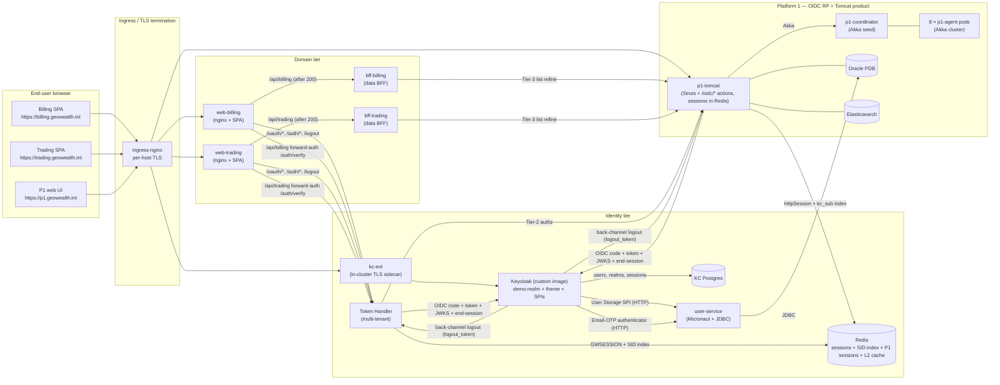
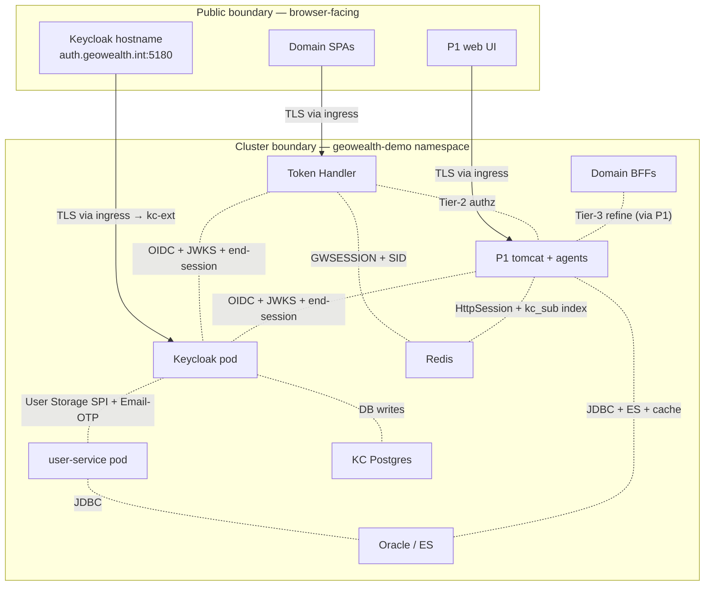

# 01 — Architecture Overview

## High-level container picture

The diagram above is intentionally lossy. The full pod-by-pod inventory is
in [`02-component-inventory.md`](02-component-inventory.md); the
flow-by-flow sequence diagrams are in
[`03-login-flows.md`](03-login-flows.md),
[`04-logout-flows.md`](04-logout-flows.md), and
[`06-communication-diagrams.md`](06-communication-diagrams.md).

## Trust boundaries

Two boundaries matter for review:

1. **Browser to ingress.** Everything outside the cluster terminates TLS at
   `ingress-nginx`. Domain hosts use mkcert-signed certificates in
   development; production is expected to source certificates from the
   organisation's standard CA pipeline.
2. **Pod to pod inside the namespace.** Pod-to-pod traffic is plain HTTP
   today, scoped by Kubernetes Services. The pattern is compatible with a
   future service-mesh / mTLS overlay (Linkerd, Istio, Cilium) without
   source changes — the application code is connection-agnostic. The
   most security-sensitive in-cluster hop is **KC → user-service** (carries
   passwords on the wire); a network policy + mTLS overlay is the production
   tightening listed in [`07-security-and-trust-model.md`](07-security-and-trust-model.md) §10.

## Actors and where state lives

| Actor | State held server-side | Browser cookie / storage |
|---|---|---|
| **Browser** | None (no front-end-side token storage) | `GWSESSION` (HttpOnly, Secure, SameSite=Lax) per host; SPA session-state for in-memory UI flags only |
| **Keycloak** | SSO session, per-client client-session, realm data in Postgres. **No federated identity row** — users are loaded read-through from the SPI on each lookup and cached per `EVICT_DAILY`. | `KEYCLOAK_IDENTITY`, `KEYCLOAK_SESSION` on the `auth.geowealth.int` host |
| **`user-service`** | None. Stateless, every call hits Oracle. | n/a |
| **Token Handler** | Server-side session in Redis, holds `access_token`, `refresh_token`, `id_token`, `sid`, last-refresh timestamp; `SidSessionRegistry` map (sid → session-ids) | n/a (the cookie above is its only browser surface) |
| **Domain data BFFs** | None (forward-auth) | n/a |
| **P1 Tomcat** | `HttpSession` in Redis (Redisson session manager, key prefix `p1-tomcat`); `kc_sub → sessionId` set in Redis (`p1-tomcat:kc_sub:`). Persistent identity in Oracle. | `JSESSIONID` |

Two lifetime knobs drive how these expire:

| Knob | Source | Default |
|---|---|---|
| KC `ssoSessionIdleTimeout` / `ssoSessionMaxLifespan` | `keycloak/realm-export.json` | KC stock (1800 s / 36000 s) |
| BFF session TTL | Redis key TTL in `SidSessionRegistry` + Micronaut session-store | 12 h |
| P1 Tomcat session-timeout | `WebContent/META-INF/context.xml` + web.xml | 7 h dev |
| OIDC access-token lifespan | KC realm, `realm.accessTokenLifespan` | 300 s (5 min) |
| Refresh-token lifespan | KC realm | bounded by SSO max-lifespan |

Two things from v1 are **gone**:

- **No "post-login establish round-trip"** (`silent-sso.do?establish=true`).
  Without SAML brokering, P1 credential login no longer needs to mint a KC
  session after the fact — the KC session is minted *during* the OIDC code
  exchange that P1's `OidcCallbackAction` runs.
- **No silent-SSO probe loop guard** (`silent_failed=1` hash fragment). The
  same code path replaced it: if a P1 page detects no logged-in user, it
  navigates to `/oidc/login.do`, which is just another OIDC RP login.

## Tenancy model

The platform is multi-tenant in two senses, exactly as in v1.

1. **Per-domain tenancy.** Each domain (`billing`, `trading`, …) is an
   independent tenant from the Token Handler's perspective. The Token Handler
   resolves which tenant a request belongs to from the original browser host
   (`X-Forwarded-Host`) and looks up the tenant's authorization requirement
   in `app.tenants.<slug>` (see
   `token-handler/src/main/resources/application.yml`). The full per-domain
   tenant model lives in
   [`02-component-inventory.md`](02-component-inventory.md) §2 and
   [`07-security-and-trust-model.md`](07-security-and-trust-model.md) §3.

2. **Per-firm tenancy.** Inside a domain, users belong to a `firmCd`. The
   `firmCd` is no longer carried by SAML — it is now a top-level OIDC claim
   issued by the realm's `firmCd-claim` protocol mapper on each client. The
   underlying user attribute is populated by the User Storage SPI's
   `UserServiceUser.getAttributes()`, reading from `user-service`'s
   `/users/{id}/attributes` response. The BFFs read
   `auth.getAttributes().get("firmCd")` the same way they did in v1, only
   the upstream source has moved.

## Authorization model — three tiers

| Tier | Where it fires | What it gates | Source |
|---|---|---|---|
| **Tier 1 — coarse roles** | Token Handler (Micronaut Security) | Login / no-login, plus role-name checks where present | Realm roles from `user-service` `/users/{id}/roles` (joining `ENTITY_ROLE_TBL` and `ROLE_TBL`), surfaced as `UserModel.getRealmRoleMappings()` by the SPI |
| **Tier 2 — route / object-type permission** | Token Handler `/auth/verify` | Whether the user may *reach* `/api/<domain>` at all on this host | `app.tenants.<slug>` in `token-handler/application.yml`, evaluated by `SubdomainAuthorizer.authorize()` against `P1AuthzClient` (the P1 authz REST endpoints survive the auth-extraction refactor; they are not OIDC, they are just an HTTPS API P1 exposes to the cluster) |
| **Tier 3 — row-level refine** | Inside each domain BFF, on list endpoints | Which rows of a result set the user may see | `Tier23Gate.refine()` in the domain BFF, calling `P1AuthzClient.refine()` against P1 |

Tier-1 role *vocabulary* changed: with no SAML role mappers in the realm,
realm roles now come **straight from the database** (`ROLE_TBL.NAME` via the
SPI). The Tier-2/Tier-3 semantics did not change.

## Why this shape

The whole-system shape is the answer to two production concerns: **a
shared-auth fix must not log users out** (handled by the Token Handler's
Redis-backed sessions in v1, unchanged here), and **a refactor of the
authentication path must not require touching every domain BFF**. Folding
all OIDC plumbing into the Token Handler (for the demo SPAs) and into a
single `com.geowealth.neo.oidc.rp.*` package (for P1) gets that property
cleanly; the data BFFs and the SPAs stay auth-unaware.

The new shape also gives:

- **A direct IdP — no federation hop.** Login is one HTTP round-trip to
  Keycloak; KC's SPI does the read-through to Oracle on its own.
- **A single primitive for every login UI surface** — the `geowealth` KC
  theme. P1's `LoginTemplate1` rendering still exists for the demo's
  unauthenticated landing page, but every credential entry goes through KC.
- **A standard back-channel logout fan-out.** KC POSTs `logout_token` to
  every client subscribed to the SSO session in one place; both the Token
  Handler and P1 implement the same OIDC back-channel logout contract.
- **A clean path for adding a new domain:** copy the SPA-and-BFF pair, add
  one tenants entry, add one ingress host, register the host on
  `demo-shared-client`. No new IdP wiring, no new SAML mapper, no new role
  vocabulary.

This is not unique to this codebase — it is the standard *OAuth 2.0 BFF /
Token Handler* pattern (Curity, Auth0, OWASP) on the SPA side, and the
standard OIDC RP pattern (Nimbus JOSE+JWT verification, PKCE, back-channel
logout) on the P1 side. Both are documented in the OpenID Connect Core 1.0
and OpenID Connect Back-Channel Logout 1.0 specifications.
