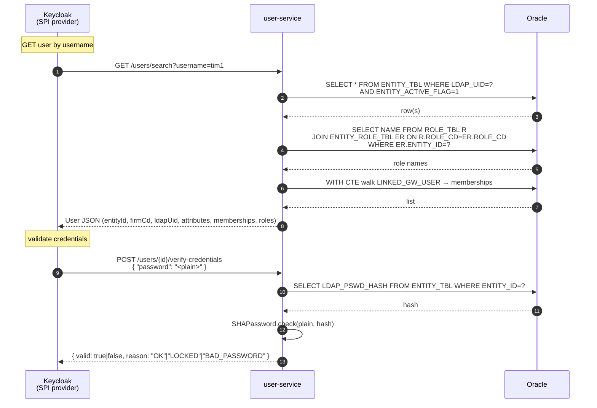

# 02 — Component Inventory

Every pod that runs in the `geowealth-demo` Kubernetes namespace, what it
does, and what it talks to. The set is split into five tiers; the last one
(platform/system) is the Kubernetes control plane and ingress controller,
listed for completeness so `kubectl get pods -A` is readable to someone
seeing the cluster for the first time. A separate `monitoring` namespace
holds the Prometheus/Grafana/Alertmanager stack installed by
`k8s/monitoring.sh` (see §6).

The verbatim engineering note that backs this section is in
[`k8s/README-pods.md`](../../k8s/README-pods.md) at the repo root.

---

## 1. Data tier — stateful backing stores

These exist because P1, Keycloak, the Token Handler, the user-service, and
the data BFFs each need durable state or a cache. All can be redirected to
external hosts via `k8s/env/data-tier.<env>.env` (see
[`05-kubernetes-deployment.md`](05-kubernetes-deployment.md) §3); in-cluster
is the dev default.

| Pod | Kind | Role |
|---|---|---|
| **`oracle-0`** | StatefulSet (1) | Oracle Free PDB baked with the GeoWealth schema + seed (`db/Dockerfile`). Backs all P1 reads/writes **and** the new `user-service` reads against `ENTITY_TBL` / `ENTITY_ROLE_TBL` / `ROLE_TBL`. Neither user-service nor P1 will boot without it. |
| **`elasticsearch-0`** | StatefulSet (1) | Search index for `SearchManager` / `ClientSearchManager`. P1 boots without it, but client-search UI returns empty results. |
| **`kc-postgres-0`** | StatefulSet (1) | Postgres backing Keycloak (realm config, sessions). The federated identity table is **empty** in this design: user-service users are read-through, not persisted. |
| **`redis-0`** | StatefulSet (1) | Now does triple duty: (a) Token Handler session store (`GWSESSION`); (b) Token Handler SID registry for back-channel logout; (c) **P1 Tomcat session store** via Redisson (key prefix `p1-tomcat`) plus the `kc_sub → sessionId` cross-pod index. Memcached is retired — Redis serves the L2 cache too. `maxmemory-policy=noeviction` is set so a memory blow-up does not silently evict sessions. |

---

## 2. Identity tier — auth, SSO, user store

This is the load-bearing change versus v1. Keycloak is now a custom image
that bakes the User Storage SPI provider, the Email-OTP Authenticator
provider, and the `geowealth` login theme; `user-service` is a new pod
that owns the Oracle read path.

| Pod | Kind | Role |
|---|---|---|
| **`keycloak-0`** | StatefulSet (1) | The IdP. Owns the `demo-realm`, all OIDC clients (`demo-shared-client`, `p1-client`, plus the vestigial per-domain clients), the `geowealth` login theme, the new authentication flow with conditional email OTP, and the OIDC token + back-channel-logout fan-out. Now **has no `identityProviders`** — local users only, federated via SPI. Custom image baked by `Dockerfile.keycloak` (4-stage: spa-builder → java-builder → kc-builder → runtime; bakes the theme JAR + two provider JARs in `/opt/keycloak/providers/`). |
| **`kc-ext`** | Deployment (nginx, 1) | TLS-terminating sidecar that gives Keycloak a **browser-facing HTTPS endpoint** at `https://auth.geowealth.int:5180` reachable from inside the cluster. Identical purpose to v1: the issuer KC emits in the `iss` claim is the browser-facing URL — both the Token Handler and P1 do OIDC discovery against that same URL and need an in-cluster HTTPS endpoint to do it. `up.sh` patches a hostAlias mapping `auth.geowealth.int` to this pod's ClusterIP. |
| **`user-service`** | Deployment (2 replicas) | **New in v2.** Stateless Micronaut service. Exposes the HTTP contract consumed by the KC SPI providers: `/users/search`, `/users/{id}`, `/users/{id}/attributes`, `/users/{id}/roles`, `/users/{id}/verify-credentials`, `/users/{id}/mfa-token`, `/users/{id}/mfa-token/verify`. JDBC against Oracle (HikariCP, `maximum-pool-size=10`, `connection-timeout=2s`). Password verification uses the legacy SHA1 algorithm ported 1:1 from P1's `com.netfolio.util.SHAPassword`. The two-replica default is for HA, not for throughput — each replica is small. |
| **`token-handler`** | Deployment (HPA 2–12) | The **multi-tenant Token Handler** — unchanged from v1. One instance fronts every domain. Owns `/oauth/*`, `/auth/me`, `/auth/logout`, `/auth/verify` (forward-auth), `/backchannel-logout`, token refresh, Redis sessions, and per-host Tier-2 authorization. The 303 target of `/auth/logout` is now `http://localhost:8080/oidc/logout.do` (P1's OIDC RP-initiated logout endpoint) instead of the old SAML SLO URL — driven by `APP_P1_INITIATE_SLO_URL` in `k8s/env/urls.<env>.env`. |

### user-service ↔ Keycloak protocol



The protocol is intentionally narrow: KC never writes to user-service in
Phase 1 (Phase 8+ is a follow-up MD on write paths — self-service password
change, admin lockout, etc.). The MFA token path is the one write today and
is scoped to the `MFA_TOKEN` / `MFA_TOKEN_EXPIRATION_DATE` columns only.

### KC SPI providers — what is loaded

Two providers are baked into the custom KC image; both register via
ServiceLoader files under `/META-INF/services/`:

| Provider | Class | Provider ID | Hooked into |
|---|---|---|---|
| User Storage | `com.gw.keycloak.userstorage.UserStorageProviderFactoryImpl` | `user-service-spi` | Realm "User Federation" component; provides `UserLookupProvider`, `UserQueryProvider`, `CredentialInputValidator` |
| Email-OTP Authenticator | `com.gw.keycloak.emailotp.EmailOtpAuthenticatorFactory` | `email-otp-authenticator` | Realm authentication flow `browser-with-email-otp` (conditional: only for federated users with `mfaRequiredFlag=true`) |

Both providers carry a `userServiceUrl` config field (default
`http://user-service:8080`) so they can be repointed from the KC admin UI
without an image rebuild.

### `geowealth` login theme

Packaged as a sub-tree under `/opt/keycloak/themes/geowealth/login/` baked
in by stage 1 of `Dockerfile.keycloak` from the `auth-spa/` Vite+React
project. The theme declares `parent=keycloak` in `theme.properties`, so any
FTL it does not override falls back to the stock Keycloak theme. Today the
theme overrides:

- `login.ftl` — username + password, branded to match P1's `LoginTemplate1`.
- `login-otp.ftl` — 6-digit email-OTP entry, rendered by the
  `email-otp-authenticator` provider.
- `error.ftl`, `login-reset-password.ftl`, `template.ftl` —
  layout and error surfaces.

The federated-IdP block (`socialProviders` loop in stock `login.ftl`) is
intentionally hidden — there are no `identityProviders` registered, so
rendering the empty list would either be a no-op or render an empty
divider. The custom template just omits it.

---

## 3. Domain tier — per-product applications

Unchanged from v1.

| Pod | Kind | Role |
|---|---|---|
| **`web-billing`** | Deployment | nginx serving the built React SPA (`keycloak-demo-billing-web`). The same nginx runs `auth_request` against the Token Handler's `/auth/verify`, then proxies `/api/billing` to `bff-billing`. Listens on `5184` over TLS. |
| **`web-trading`** | Deployment | Same shape on `5185`, image `keycloak-demo-trading-web`, proxies `/api/trading` to `bff-trading`. |
| **`bff-billing`** | Deployment | Micronaut data BFF (`BillingController` + Tier-3 list `refine`). **Auth-unaware:** reads identity from `X-Auth-*` headers injected by the web pod's forward-auth filter. No session, no token refresh, no `@Secured`. |
| **`bff-trading`** | Deployment | Same shape; `TradingController` only. |

### Web pod nginx routes

The contract is identical to v1; quoted here so the doc is self-contained:

| Path | Handling |
|---|---|
| `/api/<domain>/` | `auth_request = /th-verify` → on 200, copy `X-Auth-*` headers, strip `Cookie`, proxy to `bff-<domain>:8080` |
| `= /th-verify` | Internal-only; proxies to `token-handler:8080/auth/verify`; forwards original host as `X-Forwarded-Host`; forwards the user's session cookie |
| `/(oauth|auth)/` and `= /logout` | Proxies to `token-handler:8080` (lets the Token Handler do code-exchange, `/auth/me`, `/auth/logout`) |
| Anything else | `try_files $uri $uri/ /index.html` — React Router takeover |

---

## 4. Platform 1 tier — Tomcat + Akka agents (now an OIDC RP)

P1 is brought into the cluster as a single image (`keycloak-demo-geowealth`)
with role-driven entrypoints (`ROLE`, `AGENT`). The Akka cluster topology
is unchanged: a coordinator seed node, eight Manager-hosting agent pods,
and `p1-tomcat` joining as a client.

**What is new in v2:**

- The SAML IdP code path is **retired**. `IdpSsoAction`, `IdpSloAction`,
  `KeycloakSamlResponseBuilder`, `AbstractSamlAuthenticationResponseBuilder`,
  `IdpKeyStore`, and `SilentSsoAction` are no longer reachable; the
  `struts-saml-idp.xml` registration has only the **authz REST endpoints**
  (`p1-authz-me`, `p1-authz-can`, `p1-authz-refine`) left.
- A new OIDC RP package `com.geowealth.neo.oidc.rp.*` (one Action per
  endpoint) drives the login + logout + back-channel-logout flow; see §4.1.
- `p1-tomcat`'s `HttpSession` is in Redis via Redisson — see §4.2.
- The `p1-samlmanager` Akka agent that used to sign SAML responses is **no
  longer load-bearing for SSO**. It may still host SAML helpers used by
  other GeoWealth code paths; if not, it is a candidate for removal in a
  follow-up.

### 4.1 P1's OIDC RP endpoints

| Endpoint | Action class | Purpose |
|---|---|---|
| `GET /oidc/login.do` | `OidcLoginAction` | Generate `state` + PKCE verifier (stored in Redis via `OidcStateStore`), 302 to KC `/protocol/openid-connect/auth` with `response_type=code`, `client_id=p1-client`, `scope=openid`, `code_challenge=S256`, `redirect_uri` |
| `GET /oidc/callback.do` | `OidcCallbackAction` | Validate `state`, consume PKCE verifier, exchange code at KC `/token`, validate `id_token` signature against KC JWKS (`JwtVerifier`), extract claims, populate Tomcat `HttpSession` (`LOGGED_USER`, `LOGGED_USER_LOGIN_KEY`, `LOGGED_ADVISER`, `FIRM_*`), register `kc_sub` in `P1RedisKcSubIndex`, redirect to `return_to` |
| `GET /oidc/logout.do` | `OidcLogoutAction` | Invalidate `HttpSession` (which deletes the Redisson key); redirect to KC `/protocol/openid-connect/logout` with `id_token_hint` + `post_logout_redirect_uri` |
| `POST /oidc/back-channel-logout.do` | `OidcBackChannelLogoutAction` | Validate KC-signed `logout_token` JWT (issuer + aud=`p1-client` + events + jti); call `GeowealthSessionListener.invalidateByKcSub(sub)` which reads `P1RedisKcSubIndex.invalidate(sub)` to find every Tomcat session bound to that user and delete its Redisson key |
| `GET /oidc/establish.do` | `OidcEstablishAction` | Cross-host bridge: consume a single-use ticket from `OidcBridgeStore` (TTL 30 s) and populate the whitelabel session on a different P1 host than the one that handled the callback |

### 4.2 P1 Tomcat session in Redis

```xml
<!-- WebContent/META-INF/context.xml -->
<Manager className="org.redisson.tomcat.RedissonSessionManager"
         configPath="/tmp/geowealth-config/redisson.yaml"
         readMode="REDIS" updateMode="DEFAULT" keyPrefix="p1-tomcat"/>
```

`k8s/entrypoint.sh` promotes Redisson + Netty + Jackson + Kryo JARs to
`$CATALINA_HOME/lib` (the server classloader) so the `Manager`
implementation is visible to Tomcat's context loader.

The Redis keyspace P1 uses:

| Key pattern | Content | TTL | Written by |
|---|---|---|---|
| `p1-tomcat:redisson:tomcat_session:<sessionId>` | Serialised `HttpSession` attributes | Tomcat `session-timeout` | Redisson |
| `p1-tomcat:kc_sub:<sub>` | `RSet<sessionId>` (one user can have N sessions across replicas) | none (cleaned by `invalidateByKcSub`) | `P1RedisKcSubIndex.add()` on login, `.remove()` on session destruction |

### 4.3 Agent inventory

| Pod | Kind | Role / Managers it provides |
|---|---|---|
| **`p1-coordinator-0`** | StatefulSet | Akka seed node (`akka://DevPetar@p1-coordinator-0.p1-coordinator:4007`). Stable DNS so every other agent + Tomcat can join the cluster. Holds **no** P1 logic. |
| **`p1-reportengine`** | Deployment | Whitelabel report rendering. Needed for the proposal-save flow. |
| **`p1-proposalagents`** | Deployment | Proposal lifecycle (save flow). |
| **`p1-emailagent`** | Deployment | Outbound email send. Now also delivers the KC-side email-OTP messages, since KC's SMTP is wired to the same relay. |
| **`p1-useragents`** | Deployment | `UserManager`, `AccountManager`, `AccountTransactionManager`, `EBrokerManager`, `EBrokerAccountManager`. `UserManager.loadFirm` is the firm-context resolver. |
| **`p1-mostagents`** | Deployment | `mostagents` watchdog role plus `InstrumentManager`. The watchdog backs the "Currently Offline" indicator. |
| **`p1-searchagents`** | Deployment | `SearchManager`, `ClientSearchManager`. |
| **`p1-cspagents`** | Deployment | `InstrumentPerformanceManager`. |
| **`p1-devcommonagents`** | Deployment, 5 Gi limit, 4 G heap | `AuthorizationManager`, `AuthenticationManager` (still used internally for the post-OIDC user lookup), `BillingManager`, `BillingSpecificationManager`, `PortalManager`, `PortletManager`, `DistributedCacheController`. Heaviest agent — `CrntCostBasisLoader` pre-loads `COST_BASIS_ACCOUNT_TBL` at boot. |
| **`p1-tomcat`** | Deployment (HPA 1–5) | The webapp — `react/indexReact.do`, every `*.do` action, plus the new `/oidc/*.do` actions. Sessions in Redis (Redisson) and the cross-pod `kc_sub` index in Redis. Reads URLs from `p1-urls` ConfigMap (generated from `geowealth/k8s/env/urls.<env>.env`). |

### 4.4 Pod-level config rendering (`/home/petar/nodejs/geowealth/k8s/entrypoint.sh`)

Every P1 pod uses the same `entrypoint.sh` to render config templates from
`k8s-config/*.tpl` using `envsubst`. New since v1:

| Env var | Used in template | Purpose |
|---|---|---|
| `KC_ISSUER` | `oidc.properties.tpl` | Browser-facing KC issuer URL the OIDC RP redirects to |
| `KC_SERVER_ISSUER` | `oidc.properties.tpl` | In-cluster issuer for server-side calls (token endpoint, JWKS) |
| `OIDC_CLIENT_ID` | `oidc.properties.tpl` | `p1-client` |
| `OIDC_CLIENT_SECRET` | `oidc.properties.tpl` | Secret for the confidential `p1-client` |
| `OIDC_REDIRECT_URI` | `oidc.properties.tpl` | `https://p1.geowealth.int/oidc/callback.do` |
| `REDIS_HOST` / `REDIS_PORT` | `redisson.yaml.tpl` | Redisson client target |

The old `P1_IDP_KEYSTORE_*` envs and the `/tmp/p1-idp-dev.p12` keystore are
**no longer used** by the SSO path; they may linger in env files until the
post-merge cleanup pass.

---

## 5. Platform / system tier — control plane and ingress

These pods are not part of the demo. They belong to the minikube control
plane and to the `ingress-nginx` add-on.

### `kube-system`

| Pod | Kind | Role |
|---|---|---|
| `kube-apiserver-<node>` | static pod | The Kubernetes API. |
| `etcd-<node>` | static pod | Backing KV store. |
| `kube-controller-manager-<node>` | static pod | Built-in control loops. |
| `kube-scheduler-<node>` | static pod | Pod scheduler. |
| `kube-proxy-<id>` | DaemonSet | iptables / IPVS rules. |
| `coredns-<…>` | Deployment | Cluster DNS. Resolves `oracle`, `redis`, `keycloak`, `user-service`, `p1-tomcat`, and (after the `up.sh` hostAlias patch) `auth.geowealth.int`. |
| `storage-provisioner` | Deployment | hostPath PV provisioner. |

### `ingress-nginx`

| Pod | Kind | Role |
|---|---|---|
| `ingress-nginx-controller-<…>` | Deployment | nginx reverse-proxy that turns `Ingress` resources into nginx server blocks; terminates TLS for every host; implements the `nginx.ingress.kubernetes.io/auth-url` forward-auth annotation. |

---

## 6. Monitoring tier — `monitoring` namespace (new in v2)

Installed by `k8s/monitoring.sh` (helm install of
`prometheus-community/kube-prometheus-stack` with values in
`k8s/monitoring-values.yaml`). Lives in namespace `monitoring`, release
`kps`. Scrapes the demo via `serviceMonitorSelectorNilUsesHelmValues=false`
so any `ServiceMonitor` / `PrometheusRule` resource in any namespace is
picked up.

| Pod | Kind | Role |
|---|---|---|
| `kps-prometheus-…` | StatefulSet | Prometheus, 7-day retention, 10 Gi PV |
| `kps-grafana-…` | Deployment | Grafana UI on port 3000 (port-forwarded by `k8s/portforward.sh`) |
| `kps-alertmanager-…` | StatefulSet | Alert routing, 2 Gi PV |
| `kps-…-node-exporter-…` | DaemonSet | Per-node metrics |
| `kps-kube-state-metrics-…` | Deployment | k8s API → metrics |
| `kps-kube-prometheus-stack-operator-…` | Deployment | The Prometheus Operator itself |

Demo-side rules live in:

- `k8s/base/redis-alerts.yaml` — eleven Redis-specific alerts:
  `RedisDown`, `RedisMemoryHigh`, `RedisMemoryNearMax`, `RedisEvictedKeys`,
  `RedisRejectedConnections`, `RedisTooManyConnections`,
  `RedisLastSaveFailed`, `RedisAOFRewriteStuck`, `RedisReplicationBroken`,
  `RedisSlowCommands`, `RedisHighLatency`. The `RedisEvictedKeys` rule
  fires on **any** eviction because `maxmemory-policy=noeviction` is set —
  an eviction is by definition a bug in the demo configuration.

The monitoring stack is operated by `k8s/portforward.sh` for development
access (Grafana on `:3000`, Prometheus on `:9090`, Alertmanager on `:9093`,
Redis/Postgres exporters on `:9121` and `:9187`).

---

## 7. Why this shape

Decisions an architect is likely to challenge, and the answer:

- **The Token Handler is one Deployment, not one per domain.** Unchanged
  from v1. A shared-auth fix restarts it; sessions in Redis survive.
- **Keycloak is now a custom image, not stock.** It bakes the User Storage
  SPI provider, the Email-OTP Authenticator, and the `geowealth` theme.
  This is the price of moving auth out of P1: KC has to grow two thin SPIs
  and one theme. The cost is one extra image to build; the trade is no
  more SAML in the federation path.
- **user-service is a separate pod, not co-located with KC.** Keycloak does
  not embed an Oracle JDBC pool. user-service is sized independently and
  carries the legacy SHA1 algorithm (and any future bcrypt migration) on
  its own release cadence. The SPI provider is a thin HTTP shim.
- **Domain BFFs are forward-auth / auth-unaware.** Unchanged. They run zero
  security filters, so any auth-layer change leaves them running.
- **`kc-ext` exists purely so the OIDC `iss` claim works in-cluster.**
  Unchanged from v1.
- **`p1-coordinator` is dedicated** rather than co-located with an agent
  because every Akka member needs a stable seed address; making any
  non-StatefulSet pod the seed risks pod-IP churn breaking cluster
  formation.
- **The 8-agent fan-out is not K8s ceremony** — it mirrors the existing
  `nfstart` + `commandspecs/*.spec` layout. Memcached is retired (Redis
  serves the L2 cache), so the agent count dropped from v1's nine by one.
- **`p1-tomcat` is now horizontally scaled.** Phase 7 of the
  auth-extraction plan switched the Deployment from `replicas: 1` to an
  HPA range (1–5). The two prerequisites were (a) sessions in Redis (Phase
  6 — Redisson) and (b) the `kc_sub` index in Redis (`P1RedisKcSubIndex`),
  so a back-channel logout received on one replica invalidates sessions
  living on every other replica.
