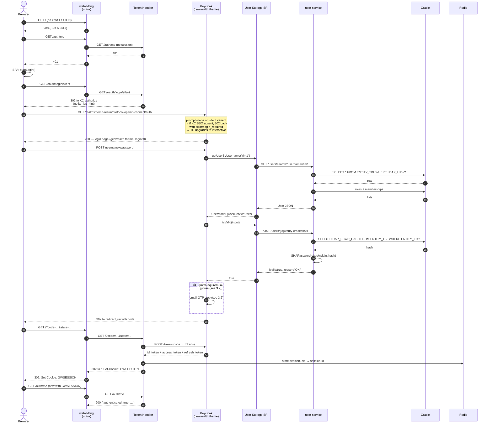
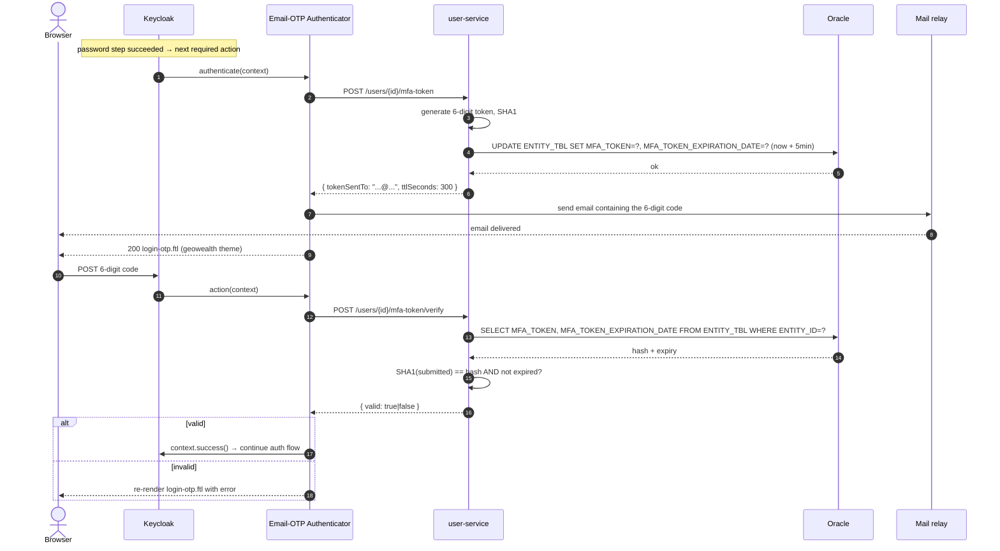
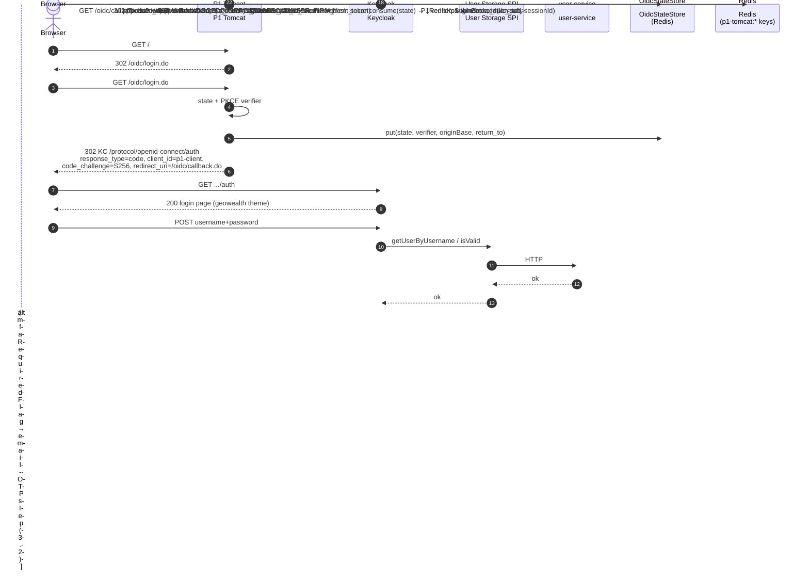
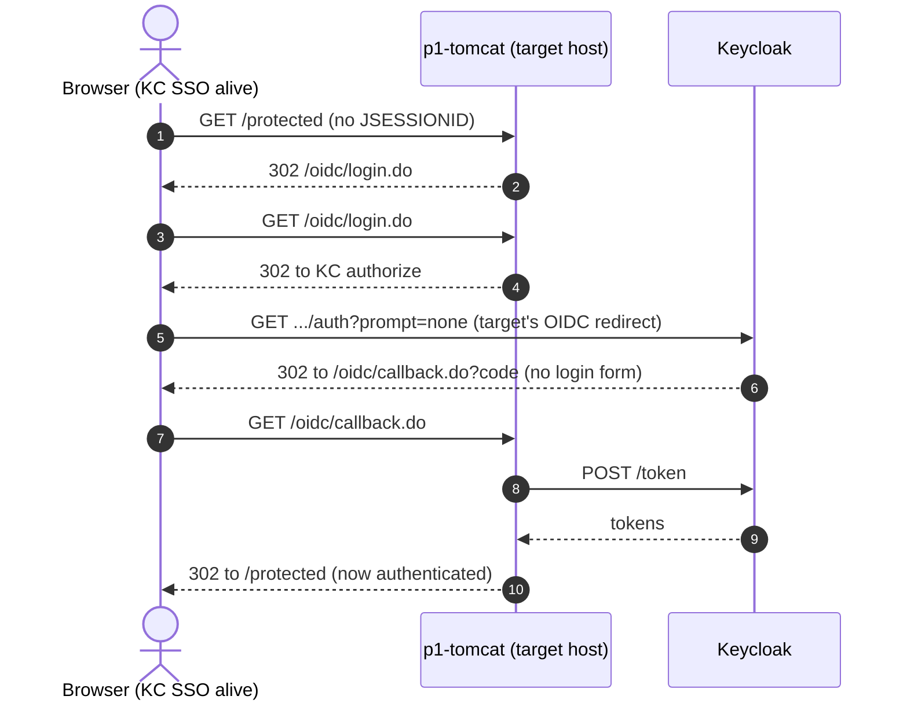
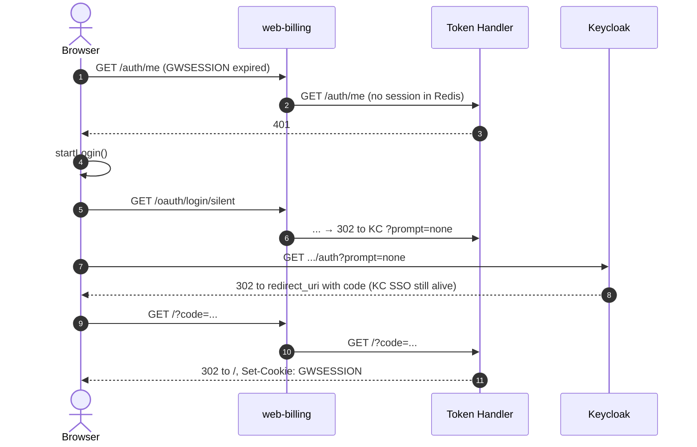
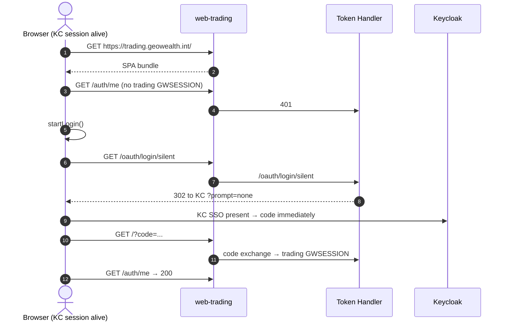
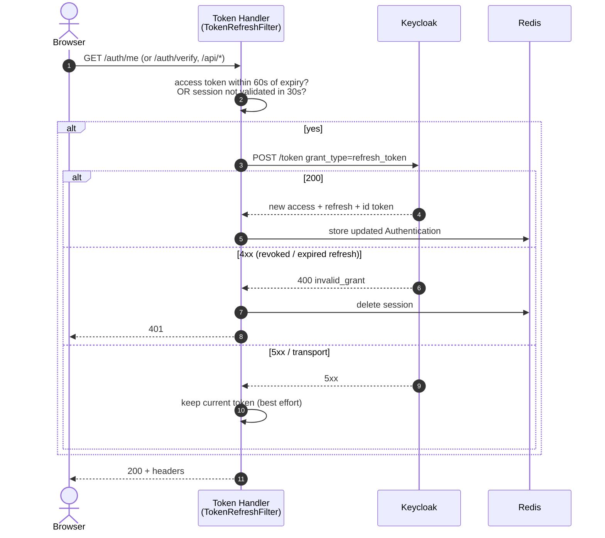

# 03 — Login Flows

This file documents every login path through the platform **after the
auth-extraction refactor**. Each scenario has a one-line summary, a
sequence diagram, and a code-level walk-through with file references.

The biggest shift from v1: every login is a **direct authentication against
Keycloak**. There is no SAML federation hop, no `kc_idp_hint=p1`, no SAML
AuthnRequest/Response. Keycloak renders its own login form (the `geowealth`
theme), delegates `isValid` to the User Storage SPI provider, which calls
`user-service`, which runs the SHA1 password check against
`ENTITY_TBL.LDAP_PSWD_HASH`. If the user has `mfaRequiredFlag=true`, the
new email-OTP Authenticator runs after the password step.

## Cast for every diagram

| Short name | What it represents |
|---|---|
| **Browser** | The user's browser running a domain SPA or the P1 web UI |
| **Web** | The nginx in the domain web pod (terminates TLS, forward-auth, proxies APIs) |
| **TH** | The Token Handler (multi-tenant). The web pod proxies `/oauth/*`, `/auth/*`, `/logout` to it |
| **KC** | Keycloak `demo-realm` (accessed via `kc-ext` from inside the cluster, directly from the browser via ingress) |
| **SPI** | The User Storage SPI provider running inside the Keycloak JVM |
| **OTP** | The Email-OTP Authenticator running inside the Keycloak JVM |
| **US** | The `user-service` pod (Micronaut + JDBC) |
| **Ora** | The Oracle PDB |
| **P1** | Platform 1 Tomcat (now an OIDC RP — `OidcLoginAction`, `OidcCallbackAction`) |
| **BFF** | The domain data BFF (`bff-billing` or `bff-trading`) |
| **Redis** | The shared session and SID store |

---

## 3.1 SP-initiated login from a domain SPA — cold browser

**Trigger.** User opens `https://billing.geowealth.int` with no cookies.

**Summary.** SPA fetches `/auth/me`, gets 401, redirects to
`/oauth/login/keycloak` (silent-first variant via `/oauth/login/silent`).
The Token Handler turns that into an OIDC authorize URL **without
`kc_idp_hint`**: there is no IdP to hint at. Keycloak renders its branded
login form. The user submits username + password; Keycloak's authentication
flow calls the User Storage SPI for the lookup and the credential check;
the SPI provider calls `user-service`. On success, KC mints an OIDC code
and bounces back to the Token Handler.



### Code references

| Step | File:Line | Note |
|---|---|---|
| `/oauth/login/silent` entry | `bff-core/src/main/java/demo/bff/core/SilentLoginController.java` | Issues 302 to `/oauth/login/keycloak` carrying `?silent=1`; sets `SILENT_ATTEMPT_COOKIE`. **No `kc_idp_hint` is appended now.** |
| User lookup | `keycloak-providers/user-storage-spi/src/main/java/com/gw/keycloak/userstorage/UserStorageProviderImpl.java` | `getUserByUsername` → `UserServiceClient.findByUsername` |
| User adapter | `keycloak-providers/user-storage-spi/.../UserServiceUser.java` | Extends `AbstractUserAdapter`; exposes username, email, attributes, realm-role names from the user-service JSON |
| Credential validation | `UserStorageProviderImpl.isValid()` | `UserServiceClient.verifyCredentials(entityId, password)` |
| user-service password check | `user-service/src/main/java/com/gw/userservice/api/UserController.java:107` | `POST /users/{id}/verify-credentials` |
| SHA1 algorithm | `user-service/.../security/SHAPassword.java:40` | Ported 1:1 from `nodejs/geowealth/.../com/netfolio/util/SHAPassword.java`; `{SHA}` and `{SSHA}` prefixes both supported |
| Code-to-token exchange | `bff-core/.../KeycloakAuthenticationMapper.java:45–92` | Builds Micronaut `Authentication` with `roles`, `personId`, `firmCd`, `sid`, `accessToken`, `refreshToken`, `idToken`, `memberships` |
| Session rotation (M4) | `bff-core/.../RotatingSessionLoginHandler.java:22–77` | Pre-auth session destroyed; fresh session id |
| SID → session registration | `bff-core/.../AuthController.java:150`, `SidSessionRegistry.java:57–72` | Indexed on first `/auth/me` call |

### Why no `kc_idp_hint=p1`

The `p1` SAML IdP no longer exists in the realm
(`identityProviders: []` in `keycloak/realm-export.json`). The Token
Handler's `IdpHintFilter` from v1 still lives in `bff-core` but has no
effect — there is no IdP to hint at. The user lands on KC's local login
form directly.

### Why the silent-first detour still exists

`startLogin()` in the SPA still calls `/oauth/login/silent` (not the bare
`/oauth/login/keycloak`). The reason did not change: on a return visit
where KC's SSO cookie (`KEYCLOAK_IDENTITY` on `auth.geowealth.int`) is
still alive, `prompt=none` lets KC return a code without rendering a login
form, and the user lands on the dashboard with zero UI flash. On a true
cold visit, KC responds with `error=login_required`, the Token Handler's
`loginFailed` controller (`bff-core/.../AuthController.java:250–275`)
clears the `SILENT_ATTEMPT_COOKIE` and 303s to `/oauth/login/keycloak`,
which is the interactive variant.

---

## 3.2 Email-OTP step — conditional MFA inside the KC flow

**Trigger.** The User Storage SPI returns a `UserModel` whose attribute
`mfaRequiredFlag` is `"true"`. The realm authentication flow
`browser-with-email-otp` includes the `email-otp-authenticator` step
**conditional** on that attribute, so users without MFA skip it entirely.



### Code references

| Step | File:Line | Note |
|---|---|---|
| Authenticator factory | `keycloak-providers/email-otp-authenticator/.../EmailOtpAuthenticatorFactory.java` | Provider ID `email-otp-authenticator`; config field `userServiceUrl` |
| Authenticator implementation | `keycloak-providers/email-otp-authenticator/.../EmailOtpAuthenticator.java` | `authenticate(context)` issues token, sends email, renders OTP form; `action(context)` validates submission |
| Token issue | `user-service/.../api/UserController.java:122` | `POST /users/{id}/mfa-token` — calls `MfaTokenDao.issueToken` |
| Token verify | `user-service/.../api/UserController.java:137` | `POST /users/{id}/mfa-token/verify` — calls `MfaTokenDao.verifyToken` |
| OTP storage | `user-service/.../dao/MfaTokenDao.java` | Writes SHA1 of the code to `ENTITY_TBL.MFA_TOKEN`, 5-minute expiry |
| OTP FTL | `auth-spa/theme/login/login-otp.ftl` | Branded 6-digit entry form |

### Why a custom authenticator instead of KC's built-in OTP

KC's built-in OTP is TOTP-based; the existing P1 user base authenticates
via 6-digit codes delivered by email and stored in `ENTITY_TBL.MFA_TOKEN`.
A migration to TOTP would require every MFA-using user to re-enrol. The
custom authenticator preserves the existing contract verbatim, including
the SHA1 algorithm in storage (P1's `SHAPassword` ported 1:1), so the
auth-extraction refactor does not force a user-side MFA re-enrolment.

---

## 3.3 P1 login — user lands on the P1 web UI directly

**Trigger.** User opens `https://p1.geowealth.int/` with no `JSESSIONID`,
or P1 catches a request to a protected resource without an authenticated
session.

**Summary.** P1 is now an OIDC Relying Party. It redirects to KC's
authorize endpoint, KC runs the same login flow as 3.1, the code comes
back to P1's `OidcCallbackAction`, P1 exchanges the code for tokens,
validates the `id_token` against KC's JWKS, populates Tomcat's
`HttpSession` (`LOGGED_USER`, `LOGGED_USER_LOGIN_KEY`, `LOGGED_ADVISER`,
`FIRM_*` keys exactly as `LoginAction#loginUser` used to do), registers
the `kc_sub` in `P1RedisKcSubIndex`, and redirects to `return_to`.



### Code references

| Step | File:Line | Note |
|---|---|---|
| RP login entry | `nodejs/geowealth/src/main/java/com/geowealth/neo/oidc/rp/OidcLoginAction.java` | Builds the authorize URL; generates state + PKCE verifier; stores in `OidcStateStore` |
| State store | `nodejs/geowealth/.../oidc/rp/OidcStateStore.java` | Redis-backed (`RBucket`), TTL 10 min |
| Callback handler | `nodejs/geowealth/.../oidc/rp/OidcCallbackAction.java` | Validates state, consumes verifier, calls KC `/token`, validates `id_token`, populates `HttpSession`, registers `kc_sub` |
| Configuration | `nodejs/geowealth/.../oidc/rp/OidcConfig.java` | Reads `KC_ISSUER`, `KC_SERVER_ISSUER`, `OIDC_CLIENT_ID`, `OIDC_CLIENT_SECRET`, `OIDC_REDIRECT_URI`, `OIDC_POST_LOGIN_URL`, `OIDC_POST_LOGOUT_URL` from env |
| JWT verifier | `nodejs/geowealth/.../oidc/rp/JwtVerifier.java` | Nimbus JOSE+JWT; caches KC JWKS; pins `iss`, `aud=p1-client`, `azp`, `nonce` (when present) |
| Struts registration | `nodejs/geowealth/src/main/resources/struts-oidc-rp.xml` | Package `oidcRp` namespace `/oidc`, no `LoginInterceptor` (these are pre-auth actions) |
| `kc_sub` index | `nodejs/geowealth/.../web/listeners/P1RedisKcSubIndex.java:103` | `RSet.add(sessionId)` on `p1-tomcat:kc_sub:<sub>` |
| Index registration on login | `nodejs/geowealth/.../web/listeners/GeowealthSessionListener.java:66` | `indexKcSub(session)` runs in `sessionCreated` after `LOGGED_USER` is populated |

### Why PKCE in a confidential client

PKCE in a confidential client is not strictly required by the spec (the
client secret already authenticates the token exchange), but it costs
nothing and defends against authorization-code injection across mis-routed
callback hops. The Redis-backed `OidcStateStore` is the only way to make
PKCE work across `p1-tomcat` replicas: replica A may receive `/oidc/login`
and stash the verifier; replica B may receive the callback. Without a
shared store, replica B has nothing to compare the code-challenge against.

### Why `OidcEstablishAction` and `OidcBridgeStore`

P1 is browsed on `p1.geowealth.int` but some downstream consumers (the
whitelabel pages) live on other hosts (e.g. firm-specific subdomains). A
post-login page on a different host needs the freshly-minted session
context. `OidcBridgeStore` mints a single-use 30-second ticket on the
callback host; the target host's `OidcEstablishAction` consumes it and
populates its local session. Both stores live in the same Redis the
Tomcat sessions use.

---

## 3.4 Sidebar deep-link from one P1 page to another with a different host

**Trigger.** User clicks a sidebar link from a P1 page on `p1.geowealth.int`
to a whitelabel-firm host like `gwlabs.geowealth.int`.

**Summary.** Cross-host SSO inside the P1 tier. The target host has no
`JSESSIONID`; it 302s to its own `/oidc/login.do`, which generates a fresh
state + verifier and 302s to KC. KC's `KEYCLOAK_IDENTITY` cookie is still
alive on `auth.geowealth.int` (set by the previous login on `p1.geowealth.int`),
so KC's authorize endpoint responds with a code immediately
(`prompt=none`-style silent SSO), no login form is rendered, and the target
P1 host completes its callback. No password is prompted again — this is the
*cross-domain SSO* property of the OIDC flow.



The same property covers the cross-domain SSO across the demo tier and
P1: a user logged in via `https://billing.geowealth.int` already has KC
SSO cookies on `auth.geowealth.int`, so a subsequent visit to
`https://p1.geowealth.int` lands on a `prompt=none` silent SSO and the
user is authenticated to P1 without seeing a login form (same as flow
3.6 below for trading).

---

## 3.5 Federated re-login — KC session intact, GWSESSION expired

**Trigger.** User idled the Token Handler session out (Redis TTL) but
still has a valid `KEYCLOAK_IDENTITY` cookie at `auth.geowealth.int`.

**Summary.** Same as v1: SPA fetches `/auth/me`, gets 401, redirects to
`/oauth/login/silent`, which adds `&prompt=none`. KC reuses its SSO session
(no login form, no SPI lookup, no password) and issues a fresh code. No
UI flash, no user input.



The cost is exactly one OIDC code-to-token exchange — no SPI lookup, no
JDBC. The SPI provider is only hit when the SSO session is fresh.

---

## 3.6 Cross-domain SSO (warm browser, two demo domains)

**Trigger.** User logs into `billing.geowealth.int` (flow 3.1). User
clicks through to `trading.geowealth.int`.

**Summary.** Same shape as v1 — the `GWSESSION` cookie is host-scoped, so
trading has no cookie. Trading goes through flow 3.5 (federated re-login),
KC's SSO cookies are alive on `auth.geowealth.int`, so KC silent-SSO
returns a code immediately with no SPI lookup.



One round-trip to KC (no SPI lookup), N domains. Same payoff as v1.

---

## 3.7 Token refresh inside an active session

**Trigger.** Any `/auth/*` or `/api/*` request lands at the Token Handler
while the access token is within 60 seconds of expiry, or the session has
not been re-validated against Keycloak in the last 30 seconds.

**Summary.** Unchanged from v1: `TokenRefreshFilter` calls KC's `/token`
endpoint with the stored refresh token. On 200 the new tokens replace the
stored ones; on 4xx the Redis session is dropped and the user re-auths;
on 5xx the current token is kept and the request continues.



### Code references

| Step | File:Line | Note |
|---|---|---|
| Filter wiring | `bff-core/.../TokenRefreshFilter.java:53,102` | `@Filter({"/api/**", "/auth/**"})`, order `SECURITY.after()` |
| Skew + validate interval | `TokenRefreshFilter.java:59,68` | `SKEW_SECONDS=60`, `VALIDATE_INTERVAL_SECONDS=30` |
| Concurrent-dedup guard | `TokenRefreshFilter.java:79,131–144` | `INFLIGHT_GUARD_MILLIS=15_000` prevents thundering-herd refresh on the same session |
| Error policy | `TokenRefreshFilter.java:159–179` | 4xx → clear session + 401; 5xx → keep session and serve current token |

The validate-every-30s loop is what catches **an admin force-logout from
KC** — when KC has killed the SSO session, the next refresh attempt fails
4xx, the Redis session is dropped, and the SPA re-authenticates cleanly.
This replaces the v1 path that caught an out-of-band P1 SLO; with P1 no
longer being a SAML IdP, "out-of-band P1 SLO" is just an admin action on
the KC side now.

---

## 3.8 In-cluster Kubernetes login — same as compose

Every flow above runs unchanged in Kubernetes. The only differences are:

1. **TLS termination** moves from per-pod nginx (compose) to
   `ingress-nginx-controller` (K8s).
2. **`auth.geowealth.int`** resolves to the `kc-ext` ClusterIP from inside
   the cluster via a `hostAlias` patch in `up.sh`. Without it, both the
   Token Handler's and P1's OIDC discovery against the public issuer URL
   would fail with `UnknownHostException`.
3. **Forward-auth at the ingress level.** `ingress-app.yaml` (annotation
   `nginx.ingress.kubernetes.io/auth-url`) declares the same forward-auth
   contract that the per-pod nginx does in compose.

---

## 3.9 Where the per-host tenancy hooks in

Unchanged from v1. When the Token Handler's `/auth/verify` runs (called by
nginx forward-auth on every `/api/*` call), it resolves which tenant the
request belongs to from `X-Forwarded-Host`:

```java
// bff-core/.../ForwardAuthController.java
String host = request.getHeaders().get("X-Forwarded-Host");
if (host == null || host.isBlank()) {
    host = request.getHeaders().get(HttpHeaders.HOST);
}
authorizer.authorize(auth, host);
```

`SubdomainAuthorizer.authorize(auth, host)` looks up the matching tenant
in `app.tenants.*` (from `token-handler/application.yml`) —
`billing.geowealth.int` maps to ObjectType 59 (BILLING_CENTER) and
`trading.geowealth.int` maps to ObjectType 5 (TRADE). The Tier-2 P1
authorization runs against that ObjectType/Permission pair. If denied,
the response is 403 and nginx short-circuits the `/api/*` request before
it reaches the data BFF.

---

## 3.10 What disappeared versus v1

Login scenarios that **no longer exist** in v2 (their underlying mechanism
is gone):

- **P1 credential login + establish round-trip (Gap 6).** P1 no longer has
  a separate `loginPassword` path that mints a session via SHA1+JDBC and
  then bounces through `/saml/idp/silent-sso.do?establish=true` to mint
  the KC session. Every P1 credential login now drives through OIDC.
- **Silent SSO probe (`silent-sso.do?return_to=...`).** Same reason — KC
  is the only source of sessions, so there is no "do I have a KC session
  that I can silently re-mint a P1 session from?" question.
- **SP-initiated SAML with `kc_idp_hint=p1`.** No SAML IdP, no hint.
- **First-broker-login (auto-link by email).** No broker, no federated
  identities. KC reads the user fresh from `user-service` on every
  cache miss.

Anything in v1's `03-login-flows.md` referencing those mechanisms is
removed in v2.
