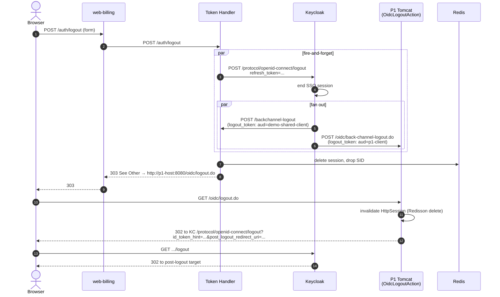
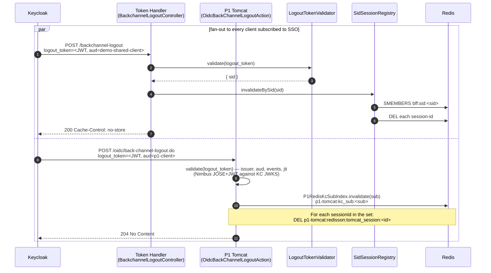
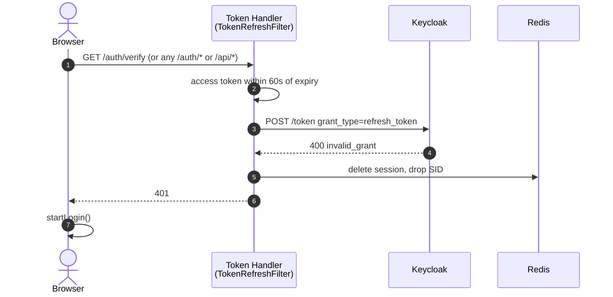
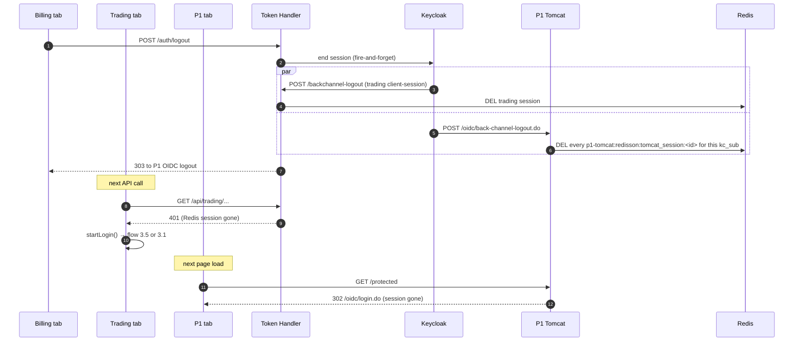
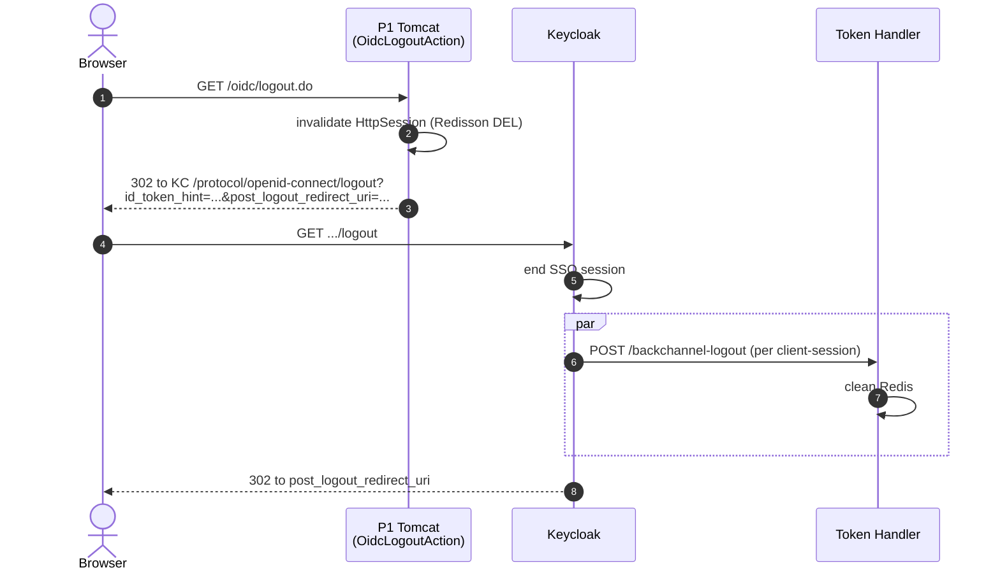

# 04 — Logout / SLO Flows

Single Logout (SLO) used to be the hardest part of the v1 design — SAML
LogoutRequest signing, replay protection, dual-binding signature
validation, the `/tmp/p1-idp-dev.p12` keystore. After the auth-extraction
refactor, **every logout is OIDC**. The platform uses OIDC RP-initiated
logout to end the SSO session, plus OIDC Back-Channel Logout 1.0 to
propagate the end-of-session to every other client.

The framing: every logout has to invalidate state in at least three
places — the Token Handler's Redis session, the Keycloak SSO session, and
the P1 Tomcat session (which is now also in Redis). The platform uses
exactly two industry-standard mechanisms to do that, with no SAML:

- **RP-initiated logout** from either RP (`POST /auth/logout` on the
  Token Handler side, `GET /oidc/logout.do` on the P1 side) drives KC's
  `end_session_endpoint`, which ends the SSO session and POSTs a signed
  `logout_token` to every subscribed client's `backchannel.logout.url`.
- **Back-channel logout** on every subscribed client validates the
  `logout_token` JWT and invalidates the matching server-side session.
  Both `demo-shared-client` (Token Handler) and `p1-client` (P1's
  `OidcBackChannelLogoutAction`) implement this.

Both converge on the same outcome regardless of who started the logout.

## Cast (same as 03)

| Short name | What it represents |
|---|---|
| **Browser** | The user's browser running a domain SPA or the P1 web UI |
| **Web** | The nginx in the domain web pod |
| **TH** | The Token Handler |
| **KC** | Keycloak `demo-realm` |
| **P1** | Platform 1 Tomcat (`OidcLogoutAction`, `OidcBackChannelLogoutAction`) |
| **Redis** | Session and SID store; also the P1 Redisson session keyspace and the `kc_sub` index |

---

## 4.1 RP-initiated logout from a domain SPA — user clicks "log out"

**Trigger.** User clicks logout in the domain SPA. The SPA fires
`POST /auth/logout` as a form submit (not `fetch`).

**Why form-submit, not fetch.** Unchanged from v1: the Token Handler
responds with a `303 See Other` redirect to the P1 OIDC logout URL. A
`fetch` would handle the 303 internally and not navigate the browser. A
form-submit makes the browser follow the 303 as a navigation, which is
what hands control to P1.

### Why two cleanup paths in parallel

Unchanged from v1, just with OIDC instead of SAML on the P1 leg:

The Token Handler does **both** the synchronous Redis cleanup and the
fire-and-forget Keycloak end-session call. The fire-and-forget half drives
Keycloak's downstream fan-out (back-channel POSTs to every other client).
The synchronous half guarantees that even if the KC end-session times out
or the back-channel fan-out fails, the user's session in *this* Token
Handler is gone before the response returns. This is what makes the
endpoint **idempotent**: a double-click, an already-expired session, or a
back-channel race all converge on the same 303.

### The class javadoc is partially stale

The `AuthController.logout` javadoc in `bff-core/.../AuthController.java`
still references "P1 SAML LogoutRequest" because the refactor that
retired SAML did not edit the docstring. The *runtime behaviour* is:

1. POST to KC `end_session_endpoint` with `refresh_token` → KC ends SSO,
   fans out `logout_token` to **every** client subscribed to the
   `backchannel.logout.url` contract (both `demo-shared-client` and
   `p1-client`).
2. Clear local Redis session.
3. 303 to `APP_P1_INITIATE_SLO_URL`, which is now
   `http://localhost:8080/oidc/logout.do` (P1's OIDC RP-initiated logout
   entry point) — see `k8s/env/urls.dev.env`.

The 303 hop still exists so a user clicking sign-out in a domain SPA also
lands on P1's "logged out" page; it is a UX courtesy, not a state-cleanup
necessity (the state cleanup already happens via back-channel before the
303 reaches the browser, since both legs fire in parallel).

### Code references

| Step | File:Line | Note |
|---|---|---|
| Logout endpoint shape | `bff-core/.../AuthController.java:289–347` | `@Secured(IS_ANONYMOUS)` + `@Nullable Authentication` — survives an already-cleared session |
| Fire-and-forget KC end-session | `AuthController.java:307–320,356–375` | Runs on a background executor so the request thread is never blocked waiting on KC's back-channel fan-out |
| Self-directed back-channel deadlock guard | `AuthController.java:305–318` (javadoc) | KC POSTs `/backchannel-logout` back to *this* TH, which must not block until the logout request returns |
| Redis session cleanup | `AuthController.java:322–340` | Always clears the local session and drops the SID before the 303 |
| 303 to P1 OIDC logout | `AuthController.java:345–346` | URL from env: `APP_P1_INITIATE_SLO_URL` (now `/oidc/logout.do`) |
| P1 OIDC logout entry | `nodejs/geowealth/.../oidc/rp/OidcLogoutAction.java` | Invalidates `HttpSession` (Redisson deletes the Redis key), redirects to KC `/protocol/openid-connect/logout` with `id_token_hint` |

---

## 4.2 Back-channel logout — KC tells each client that the SSO ended

**Trigger.** Any RP-initiated logout, an admin force-logout via the KC
admin UI, an idle/max-lifespan timeout of the KC SSO session — anything
that causes Keycloak to end the SSO session — causes KC to POST a signed
`logout_token` JWT to every subscribed client's `backchannel.logout.url`.

### Code references — Token Handler leg (unchanged from v1)

| Step | File:Line | Note |
|---|---|---|
| Endpoint | `bff-core/.../BackchannelLogoutController.java:37–57` | `@Secured(IS_ANONYMOUS)` (unauthenticated by design — the JWT is the auth) |
| Validation rules | `bff-core/.../LogoutTokenValidator.java:96–125` | iss match, aud match, `events` carries `http://schemas.openid.net/event/backchannel-logout`, **no `nonce`** (presence = ID-token replay), RS256 against JWKS |
| JWKS fetch timeout | `LogoutTokenValidator.java:74` | 3 s, so a cold fetch never holds up the request |
| JWKS pre-warm | `LogoutTokenValidator.java:88–92` | Best-effort cache load on init |
| Replay defence | `LogoutTokenValidator.java:43–55,117–119` | Bounded LRU on `jti` |
| Two-key SID model | `bff-core/.../SidSessionRegistry.java:28–35` | `bff:sid:<sid>` (SET of session-ids), `bff:sess:<sessionId>` (reverse pointer) |
| TTL | `SidSessionRegistry.java:46` | 12 h on both keys |

### Code references — P1 leg (new in v2)

| Step | File:Line | Note |
|---|---|---|
| Endpoint | `nodejs/geowealth/.../oidc/rp/OidcBackChannelLogoutAction.java` | Struts action, POST-only, no `LoginInterceptor` |
| `logout_token` validation | `nodejs/geowealth/.../oidc/rp/JwtVerifier.java` | Nimbus JOSE+JWT; pins iss, `aud=p1-client`, `events`, `jti` (bounded LRU replay cache); RS256 against KC JWKS |
| `kc_sub → sessionIds` lookup | `nodejs/geowealth/.../web/listeners/P1RedisKcSubIndex.java:137` | `RSet.readAll()` on `p1-tomcat:kc_sub:`; deletes each `p1-tomcat:redisson:tomcat_session:<id>` |
| Session-listener entry point | `nodejs/geowealth/.../web/listeners/GeowealthSessionListener.java:145` | `invalidateByKcSub(sub)` calls into the index, deletes session keys; idempotent |

### Why the SID indirection inside the Token Handler

Same as v1. The OIDC `sid` claim is **stable** across token refreshes but
the server-side **session-id** rotates (session fixation defence). A KC
back-channel POST arrives with the `sid` it minted at login, not whichever
rotating session-id is current now. The Redis `bff:sid:<sid>` SET tracks
every session-id that has ever belonged to this `sid`, so the invalidate
step kills the current session no matter how many times it has been
rotated.

### Why the `kc_sub` index inside P1

Same idea, different driver. P1's Tomcat session ID does not rotate, but
a user can have **multiple** Tomcat sessions across the horizontally
scaled `p1-tomcat` Deployment (one per pod they were sticky-routed to
before stickiness was dropped, or one per browser tab when the user
opened the app across multiple workspaces). `P1RedisKcSubIndex` is the
`RSet<sessionId>` for one `kc_sub`, so a single `logout_token` POST tears
down every Tomcat session that user has open, in every replica.

---

## 4.3 Idle timeout — the session dies silently

**Trigger.** No human action. The Redis session TTL expires (12 h
baseline on the Token Handler side; the Redisson Tomcat key TTL on the P1
side) or the KC `ssoSessionIdleTimeout` lapses.

**Summary.** Same as v1. Token Handler's session is gone — next API call
gets a 401 from `/auth/verify`. The SPA's `AuthProvider` catches the 401
and calls `startLogin()` (flow 3.1 or 3.5 depending on KC SSO state). The
P1 side has the same shape: a stale `JSESSIONID` is silently treated as
no session, and the next protected request 302s to `/oidc/login.do`.

If the KC SSO session expired first, the back-channel logout fans out to
every client and clears everything before the user's next request.

---

## 4.4 Token refresh fails — the session is administratively killed

**Trigger.** The user was force-logged-out at Keycloak (admin clicked
"Logout all sessions") but the Token Handler still has a cached refresh
token in Redis. The TokenRefreshFilter's next attempt to call
`POST /token` returns `400 invalid_grant`.

**Summary.** Same code path as v1. `TokenRefreshFilter` deletes the Redis
session and returns 401. The SPA recovers via flow 3.1 or 3.5.

The 30 s `VALIDATE_INTERVAL_SECONDS` ensures the refresh attempt
happens often enough that an admin-side KC logout propagates within seconds.

### Code reference

`bff-core/.../TokenRefreshFilter.java:159–179` (4xx → clear session + 401;
5xx → keep session and serve current token).

---

## 4.5 Double-click and concurrent logout requests

**Trigger.** User double-clicks the logout button. Two `POST /auth/logout`
requests arrive, possibly to two Token Handler replicas.

**Summary.** Unchanged. Both requests succeed. The second one finds an
already-cleared session and an already-revoked refresh token, both of
which are non-fatal:

- The fire-and-forget KC end-session call is best-effort; the second call
  receives 400 from KC, which is logged and ignored.
- The Redis session delete is idempotent.
- The 303 to the P1 OIDC logout endpoint is returned to both requests.

### Code reference

`bff-core/.../AuthController.java:289–296` — the `@Nullable Authentication`
plus the documented idempotency contract is the explicit acknowledgement
of this scenario.

---

## 4.6 Multi-tab, multi-domain logout

**Trigger.** User is logged into `billing`, `trading`, and `p1` in three
tabs. User clicks logout in the billing tab.

**Summary.** Billing's RP-initiated logout (4.1) drives:

1. The trading session to die via KC back-channel logout to the
   `demo-shared-client` (the trading session uses the same client, different
   host-scoped cookie; the `bff:sid:<sid>` SET in Redis covers both).
2. The P1 session to die via KC back-channel logout to the `p1-client`.
   `P1RedisKcSubIndex.invalidate(sub)` finds every Tomcat session bound
   to that `kc_sub` across every `p1-tomcat` replica and deletes its
   Redisson key.
3. The 303 sends the user to `/oidc/logout.do`, which lands them on the
   P1 post-logout page.

This is the property that justifies the auth-extraction refactor in the
SLO direction: **one back-channel fan-out, two RP types, every session
gone**. No SAML LogoutRequest, no `silent_failed=1` hash fragment, no
in-iframe race conditions.

---

## 4.7 P1-initiated logout — user logs out of P1 directly

**Trigger.** User clicks logout in P1's own UI.

**Summary.** `OidcLogoutAction` invalidates P1's Tomcat session (which
deletes the Redisson key) and 302s to KC's `/protocol/openid-connect/logout`
with `id_token_hint` and `post_logout_redirect_uri`. KC ends the SSO
session and fans out back-channel POSTs to every other client, exactly
the same way it did when the Token Handler initiated the logout. Any
open SPA tabs see 401 on their next API call (same as 4.3).

### Code reference

`nodejs/geowealth/.../oidc/rp/OidcLogoutAction.java` — the RP-side
initiator. The `id_token_hint` is read from the `HttpSession` (P1 stores
it after the callback). If the `id_token_hint` is missing for any reason
(an expired session), KC falls back to its own logout-confirm page
(`prompt=login` or similar); the demo never relies on that fallback in
practice because the session is invalidated only on the way *out*.

---

## 4.8 Browser closed without logout

**Trigger.** User closes every tab without clicking logout.

**Summary.** Same as v1. Nothing happens at the server side immediately.
The session cookies were already `HttpOnly` and `Secure`. The Redis
sessions keep their TTL and are eventually evicted; the KC SSO session
lives to `ssoSessionIdleTimeout` and then dies on KC's side. When the
user re-opens the browser, the flow that fires depends on what is still
alive:

| KC SSO alive? | TH session alive? | P1 session alive? | Next flow |
|---|---|---|---|
| Yes | Yes | Yes | All three resume — `/auth/me` returns 200; P1 page renders |
| Yes | No | n/a | Flow 3.5 (federated re-login, silent SSO) on the Token Handler side |
| No | Yes | n/a | TH refresh fails 4xx → flow 4.4 → flow 3.1 |
| No | No | n/a | Flow 3.1 (cold authentication) |

---

## 4.9 `logout_token` JWT validation — defence against forged back-channel logouts

The OIDC Back-Channel Logout 1.0 spec defines a strict set of validation
rules. Both clients enforce them:

- **`iss`** must equal the configured KC issuer (`KEYCLOAK_ISSUER`).
- **`aud`** must contain the client's own `client_id`
  (`demo-shared-client` or `p1-client`).
- **`events`** must carry the URI
  `http://schemas.openid.net/event/backchannel-logout`.
- **`nonce`** must be **absent** (its presence indicates the JWT is an
  ID-token being replayed as a logout-token).
- **`sub`** OR **`sid`** must be present (one or both — neither is fatal,
  but at least one is needed to identify the session being ended).
- **`jti`** is consulted against a bounded LRU replay cache.
- **Signature** must verify against KC's JWKS (RS256).

A failed validation returns 400 (the spec recommends a 400 with a JSON
`error` body, which both clients implement) plus a `SECURITY_EVENT:
LOGOUT_TOKEN_REJECT` log line for audit.

### Code references

| Side | Validator | File |
|---|---|---|
| Token Handler | `LogoutTokenValidator` | `bff-core/.../LogoutTokenValidator.java` |
| P1 RP | `JwtVerifier` (reused for both `id_token` and `logout_token`, with different `aud` and `events` requirements) | `nodejs/geowealth/.../oidc/rp/JwtVerifier.java` |

---

## 4.10 What is intentionally not done

- **No front-channel SLO via iframes.** Browser support is inconsistent
  (Safari ITP blocks third-party cookies in iframes), back-channel logout
  is the supported replacement, and Keycloak handles any
  third-party-iframe SLO at the realm level if the realm ever needed it.
- **No SAML LogoutRequest from anywhere.** With P1 retired as a SAML IdP,
  there is no SAML party in the picture. SAML signing keystores,
  `IdpSloAction.verifyRedirectSignature`, and the `B6` signature
  hardening are all gone.
- **No global logout-event broadcast bus.** Both propagation channels
  (KC → Token Handler back-channel for `demo-shared-client`, KC → P1
  back-channel for `p1-client`) carry the same `kc_sub` / `sid`, so any
  in-process pub-sub layer on top would be redundant.
- **No client-side `silent_failed=1` hash fragment.** That was a v1 loop
  guard for the silent-SSO probe; with no probe, no guard.
