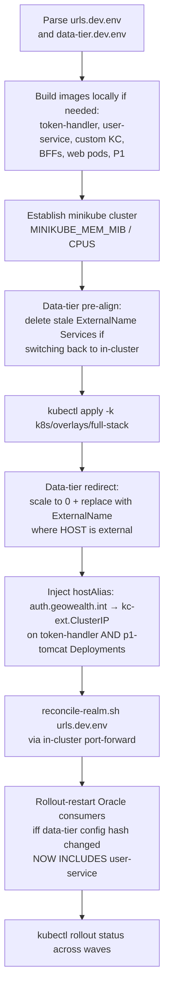

# 05 — Kubernetes Deployment

The Kubernetes layout runs every component documented in
[`02-component-inventory.md`](02-component-inventory.md) inside a single
namespace, `geowealth-demo`. A second namespace, `monitoring`, holds the
`kube-prometheus-stack` install introduced in v2. This file explains the
topology, the environment-specific configuration model, the deploy
orchestration, the ingress / forward-auth wiring, and the new monitoring
stack.

The local development cluster is `minikube`; the same manifests target
any upstream Kubernetes distribution that has an Ingress controller and a
ClusterIP-style Service mesh.

---

## 1. Repository layout

```
k8s/
├── base/                       # raw manifests (one file per component)
│   ├── namespace.yaml
│   ├── kc-postgres.yaml        # StatefulSet (1) + PVC + Service
│   ├── redis.yaml              # StatefulSet (1) + PVC + Service
│   ├── redis-alerts.yaml       # NEW in v2 — PrometheusRule with 11 Redis alerts
│   ├── oracle.yaml             # StatefulSet (1) + PVC + Service (data tier)
│   ├── elasticsearch.yaml      # StatefulSet (1) + PVC + Service
│   ├── keycloak.yaml           # StatefulSet (1) + Service — custom image
│   ├── user-service.yaml       # NEW in v2 — Deployment + Service
│   ├── token-handler.yaml      # Deployment + Service + HPA (2-12)
│   ├── token-handler-config.yaml  # ConfigMap (tenants) + Secret (OIDC client secret)
│   ├── web.yaml                # web-billing + web-trading Deployments + Services
│   ├── bff-billing.yaml        # Deployment + Service
│   ├── bff-trading.yaml        # Deployment + Service
│   ├── p1.yaml                 # p1-tomcat Deployment + p1-coordinator + 8 agent Deployments
│   ├── ingress.yaml            # per-domain Ingress (legacy shape)
│   ├── ingress-app.yaml        # consolidated Ingress with auth-url annotation
│   └── kustomization.yaml
├── overlays/
│   ├── dev/                    # auth-tier only
│   ├── full-stack/             # everything in base, plus environment patches
│   └── minikube-auth-tier/     # minikube-specific tweaks
├── env/
│   ├── urls.dev.env            # browser-facing and in-cluster URLs (one per env)
│   ├── urls.qa.env
│   ├── urls.prod.env
│   ├── data-tier.dev.env       # ORACLE / ES host overrides
│   ├── data-tier.qa.env
│   └── data-tier.prod.env
├── images/                     # local image build helpers
├── up.sh                       # one-shot deploy orchestrator
├── monitoring.sh               # NEW in v2 — helm install of kube-prometheus-stack
├── monitoring-values.yaml      # NEW in v2 — helm chart values
├── portforward.sh              # NEW in v2 — idempotent port-forward manager
├── README-multitenant-k8s-plan.md
├── README-pods.md              # the verbatim pod inventory
├── README-scale.md
└── README-ubuntu-bringup.md
```

---

## 2. Environment-specific URLs — `k8s/env/urls.<env>.env`

Every URL or port that differs between dev, QA, and prod lives in
exactly one file: `k8s/env/urls.<env>.env`. Two consumers read it;
nothing else should ever reach into another source for environment URLs.

### Consumers

1. **The Token Handler and data BFFs**, via an `app-urls` ConfigMap. The
   overlay's kustomization generates this ConfigMap from the env file.
   The Token Handler pod's env is configured with
   `valueFrom: configMapKeyRef: name=app-urls key=KEYCLOAK_ISSUER` (and
   similar for other keys).
2. **The Keycloak realm**, via `scripts/reconcile-realm.sh <env-file>`.
   The script PATCHes the live realm via the admin API. **It does NOT
   touch any `identityProviders` block now** — there are none. What it
   does patch:
   - Every active client's `redirectUris` / `webOrigins` /
     `post.logout.redirect.uris` / `backchannel.logout.url` from the
     `SPA_HOSTS`, `P1_CALLBACK_HOSTS`, and `TH_BACKCHANNEL_URL` entries.
   - The realm's SMTP configuration if `KC_SMTP_*` entries are present.

### Why both

Same as v1: `--import-realm` is `IGNORE_EXISTING`, so it only seeds an
empty Postgres. To apply realm config edits on a running cluster, the
only non-destructive option is admin-API PATCH. The auth-extraction
refactor reduced the realm reconciliation surface (no more IdP SAML URL
patches) but the same mechanism still applies to per-client URL lists.

### Keys in the dev file

```
# Browser-facing KC issuer (redirects + iss claim)
KEYCLOAK_ISSUER=https://auth.geowealth.int:5180/realms/demo-realm

# In-cluster JWKS endpoint (server-side OIDC discovery)
KEYCLOAK_AUTH_SERVER_URL=http://keycloak:8080/realms/demo-realm

# In-cluster P1 (Token Handler → P1 for Tier-2 authz; never browser-facing)
P1_AUTHZ_URL=http://p1-tomcat:8080

# Browser-facing P1 OIDC RP-initiated logout target the /auth/logout 303 sends the user to
APP_P1_INITIATE_SLO_URL=http://localhost:8080/oidc/logout.do

# Realm reconciliation block
KC_ADMIN_BASE=https://auth.geowealth.int:5180
KC_REALM=demo-realm
P1_INCLUSTER_BASE=http://p1-tomcat:8080
SPA_HOSTS=https://billing.geowealth.int:5184 https://trading.geowealth.int:5185 https://p1.geowealth.int http://localhost:*
P1_CALLBACK_HOSTS=https://p1.geowealth.int http://localhost:8080
TH_BACKCHANNEL_URL=http://token-handler:8080/backchannel-logout
```

The split-horizon design (separate keys for browser-facing vs in-cluster
URLs) is unchanged from v1.

**The key change**: `APP_P1_INITIATE_SLO_URL` is now an OIDC logout URL
(`/oidc/logout.do`), not a SAML SLO URL. The `P1_IDP_KEYSTORE_*` envs are
gone.

---

## 3. Data-tier endpoints — `k8s/env/data-tier.<env>.env`

A separate env file controls **where each in-cluster consumer reaches
Oracle and Elasticsearch**. Same model as v1, with one new consumer:
`user-service`.

| Mode | `*_HOST` setting | What `up.sh` does |
|---|---|---|
| In-cluster default | Equals the Service name (`oracle`, `elasticsearch`) | Leaves the kustomize-applied ClusterIP Service + StatefulSet/Deployment alone |
| External | Resolves elsewhere (`192.168.1.42`, `dev-elastic.geowealth.com`) | Scales the in-cluster workload to 0, deletes the freshly applied ClusterIP Service, re-applies it as `type: ExternalName, externalName: <HOST>` |

Consumers always use the bare Service name (`oracle:1521`,
`elasticsearch:9200`). Only what that name resolves to in cluster DNS
changes between modes.

### What's new versus v1

- **`user-service` is a new Oracle consumer.** It reads from the same
  PDB as P1 (`ENTITY_TBL`, `ENTITY_ROLE_TBL`, `ROLE_TBL`, plus the MFA
  columns). On an external-Oracle switch, `up.sh`'s rollout-restart of
  Oracle consumers now includes the `user-service` Deployment.
- **Memcached is gone.** The data-tier env file no longer carries a
  `MEMCACHED_*` block.

### Constraints inherited from v1

- **External services are assumed populated.** No seeding job runs against
  an external Oracle or Elasticsearch.
- **Oracle JDBC coordinates beyond `_HOST`.** `ORACLE_PDB` and
  `ORACLE_USER` come from this file; `ORACLE_PASSWORD` is a credential
  and **never** lives in the env file.
- **Agent heap when swapping to a real DB.** `p1-devcommonagents`
  pre-loads `COST_BASIS_ACCOUNT_TBL` at boot; the 1.5 GB heap that fits
  the baked PDB OOMs against a real table, so the manifest sets `-Xmx4G`
  with `limits.memory: 5Gi`.

---

## 4. Deploy orchestration — `k8s/up.sh`



Two things changed in `up.sh` versus v1:

1. **Custom Keycloak image build.** Stage 2 builds `keycloak-demo-keycloak:latest`
   from `Dockerfile.keycloak` (4-stage: spa-builder → java-builder →
   kc-builder → runtime), then loads it into the minikube docker daemon.
   The image change is the price of moving the User Storage SPI + the
   Email-OTP Authenticator + the `geowealth` theme into KC.
2. **Per-replica P1 hostAlias.** The same `auth.geowealth.int → kc-ext`
   patch that v1 applied to the Token Handler is now also applied to the
   `p1-tomcat` Deployment, because P1 is now an OIDC client and needs
   the same in-cluster TLS path to KC for its `JwtVerifier` JWKS fetch.

---

## 5. The `kc-ext` issuer trick (unchanged from v1)

Both the Token Handler and (now) P1's `OidcConfig.serverIssuer()` resolve
the **public** issuer URL
(`https://auth.geowealth.int:5180/realms/demo-realm`) from inside the
cluster. That URL must be reachable from inside the cluster, with a TLS
certificate the JVM trusts, or `iss` matching fails in JWT validation.

Solution:

- **`kc-ext`** is a 16 Mi nginx pod serving the mkcert-signed wildcard
  cert for `*.geowealth.int`, reverse-proxying to `keycloak:8080`.
- **`up.sh`** adds a `hostAliases` entry on both the Token Handler and
  P1 Tomcat Deployments mapping `auth.geowealth.int` to the `kc-ext`
  ClusterIP. CoreDNS would not resolve `auth.geowealth.int` otherwise.

A future production deployment with a real CA-signed cert can drop
`kc-ext` and route `auth.geowealth.int` straight through the ingress
controller. The OIDC flows stay the same.

---

## 6. Ingress and forward-auth

Two Ingress objects are in scope; the contract is identical to v1.

### `ingress.yaml` — per-domain hosts (older shape)

Defines one `Ingress` per host (`billing-api`, `trading-api`,
`billing-auth`, `trading-auth`). The API Ingress uses the nginx
`external-auth` annotation pointing at the Token Handler.

### `ingress-app.yaml` — consolidated Ingress (newer shape)

| Host | Path | Backend | Auth annotation |
|---|---|---|---|
| `billing.geowealth.int` | `/api/billing/*` | `bff-billing:8080` | `nginx.ingress.kubernetes.io/auth-url: http://token-handler.geowealth-demo.svc.cluster.local:8080/auth/verify` |
| `billing.geowealth.int` | `/*` | `web-billing:5184` | (SPA bundle and `/oauth/*` / `/auth/*` reverse-proxy) |
| `trading.geowealth.int` | same shape | `bff-trading:8080` / `web-trading:5185` | same |
| `auth.geowealth.int` | `/*` | `kc-ext:5180` → `keycloak:8080` | n/a |
| `p1.geowealth.int` | `/*` | `p1-tomcat:8080` | n/a |

The `auth-url` annotation tells `ingress-nginx` to issue a subrequest to
the Token Handler's `/auth/verify` before letting traffic reach the data
BFF. On `200`, ingress copies the `X-Auth-*` response headers onto the
upstream request, strips the session cookie, and proxies on. On `401` or
`403`, the subrequest's status is returned to the SPA.

---

## 7. Monitoring stack — `monitoring` namespace (new in v2)

The auth-extraction refactor pulled monitoring into scope because Redis
now carries **three** classes of state (Token Handler sessions, P1 Tomcat
sessions, L2 cache) and an eviction or a slow command surface as user-visible
failures. `k8s/monitoring.sh` installs `kube-prometheus-stack` via helm
into a separate `monitoring` namespace.

### Components

- **Prometheus.** 7-day retention, 10 Gi PV, scrapes the cluster and any
  `ServiceMonitor` / `PrometheusRule` in any namespace (the helm values
  set `serviceMonitorSelectorNilUsesHelmValues=false`).
- **Grafana.** Admin/admin (override via env), 2 Gi PV; the
  `k8s/portforward.sh` script forwards port 3000.
- **Alertmanager.** 2 Gi PV; receives alerts; `k8s/portforward.sh`
  forwards 9093.
- **node-exporter** DaemonSet, **kube-state-metrics** Deployment, and the
  Prometheus Operator itself.

minikube-specific overrides (in `monitoring-values.yaml`): disable
scraping of `kubeControllerManager`, `kubeScheduler`, `kubeEtcd`, and
`kubeProxy` (those metrics aren't exposed in minikube).

### Demo-side rules — `k8s/base/redis-alerts.yaml`

A `PrometheusRule` with eleven Redis-specific alerts:

| Alert | Severity | Condition |
|---|---|---|
| `RedisDown` | critical | redis_up == 0 for 2 min |
| `RedisMemoryHigh` | warning | used_memory / maxmemory > 80% |
| `RedisMemoryNearMax` | critical | > 95% |
| `RedisEvictedKeys` | critical | any eviction — `maxmemory-policy=noeviction` means an eviction is a bug |
| `RedisRejectedConnections` | critical | `rejected_connections > 0` |
| `RedisTooManyConnections` | warning | clients > 80% of `maxclients` |
| `RedisLastSaveFailed` | warning | last RDB save > 24 h |
| `RedisAOFRewriteStuck` | warning | AOF rewrite > 5 min |
| `RedisReplicationBroken` | info | single-replica in dev, kept for completeness |
| `RedisSlowCommands` | warning | slowlog entries appearing |
| `RedisHighLatency` | warning | event-loop latency spike > 100 ms |

### Operator scripts

- `k8s/monitoring.sh` — `install`, `upgrade`, `uninstall`, `status`,
  `open` (start a port-forward).
- `k8s/portforward.sh` — idempotent persistent port-forwards (nohup,
  PIDs in `/tmp/k8s-pf/`):

  | Local port | Target | Purpose |
  |---|---|---|
  | 3000 | `kps-grafana:80` | Grafana UI |
  | 9090 | `kps-prometheus:9090` | Prometheus UI |
  | 9093 | `kps-alertmanager:9093` | Alertmanager UI |
  | 9121 | `redis-exporter:9121` | Redis metrics |
  | 9187 | `postgres-exporter:9187` | Postgres metrics |
  | 8080 | `p1-tomcat:8080` | P1 web UI |
  | 5180 | `kc-ext:5180` | Keycloak admin |
  | 6379 | `redis:6379` | redis-cli |
  | 1521 | `oracle:1521` | sqlplus / DBeaver |
  | 9200 | `elasticsearch:9200` | ES REST |
  | 5184 / 5185 | `web-billing` / `web-trading` | Demo SPAs |

---

## 8. NetworkPolicy and pod-to-pod scope

Today the namespace has no `NetworkPolicy` objects. That is acceptable for
a development cluster but is a deliberate gap for production. The intended
shape grew by one policy versus v1, to cover the **KC → user-service**
hop:

| Direction | From | To | Purpose |
|---|---|---|---|
| Ingress | `ingress-nginx-controller` | `web-*`, `kc-ext`, `p1-tomcat` | Restrict edge to the three browser-facing destinations |
| In-cluster | `token-handler` | `keycloak`, `redis`, `p1-tomcat` | Restrict the Token Handler to the three back-ends it actually needs |
| In-cluster | `keycloak` | `user-service`, `kc-postgres` | **New in v2**: KC reads users via SPI from user-service, writes realm to Postgres |
| In-cluster | `user-service` | `oracle` | Read-only JDBC |
| In-cluster | `p1-tomcat` | `keycloak`, `redis`, `oracle`, `elasticsearch`, agents | Akka + OIDC RP traffic + data |
| In-cluster | `bff-*` | `p1-tomcat` | Tier-3 refine only |
| In-cluster | `web-*` | `token-handler`, `bff-*` (same domain) | Forward-auth subrequest + data BFF |

These are policy-as-code add-ons; no application code changes.

---

## 9. Scaling

The platform has two horizontal scaling axes worth highlighting.

### Horizontally scaled

| Workload | Scaling | Bounds |
|---|---|---|
| `token-handler` | HPA on CPU | min 2, max 12 |
| `user-service` | Fixed replicas | 2 (HPA candidate; CPU-bound is unlikely, JDBC pool is the cap) |
| `p1-tomcat` | HPA on CPU | min 1, max 5 — **new in v2** |

`p1-tomcat`'s horizontal scaling was unlocked by:

- **Phase 6**: Tomcat `HttpSession` externalised to Redis via Redisson.
  See `WebContent/META-INF/context.xml`. Killing any single replica no
  longer drops the user's session — Redisson persists everything under
  `p1-tomcat:redisson:tomcat_session:<id>`.
- **`P1RedisKcSubIndex`**: the `kc_sub → sessionId` index is in Redis,
  so a back-channel logout received on replica A invalidates a session
  living on replica B.

Phase 7 of the auth-extraction plan flipped `replicas: 1` → an HPA with
`minReplicas: 1, maxReplicas: 5, target CPU 70%`. Akka multi-replica
issues for the agents are explicitly out of scope (they remain
single-seed); only `p1-tomcat` scales, because it is an Akka *client*,
not a cluster member.

### Not horizontally scaled today

| Workload | Why |
|---|---|
| `keycloak-0` | Stateful; horizontal scale supported in production but requires Infinispan tuning |
| `kc-postgres-0` | Single-writer |
| `redis-0` | Single-writer; production uses Redis Cluster or managed cache |
| `p1-coordinator-0` | Akka seed must have a stable address |
| `p1-agent-*` | Akka cluster, single-seed today; each agent owns a fixed Manager set |
| Data BFFs | Stateless; nothing prevents horizontal scale, just not configured today |

A production sizing plan lives in
[`k8s/README-scale.md`](../../k8s/README-scale.md); the Solution-Architect
discussion in this document focuses on the design, not the numbers.

---

## 10. Observability hooks

What is and is not wired up today:

- **Liveness / readiness probes.** Token Handler, user-service,
  Keycloak, and `p1-tomcat` all have probes. user-service exposes
  `/health` (Micronaut management endpoint) with an `oracle` sub-check
  that does `SELECT 1 FROM DUAL`.
- **Metrics.** Micronaut Management is bundled in the Token Handler and
  user-service images; `/prometheus` is exposed; a `ServiceMonitor` (in
  a follow-up) would let `kps-prometheus` scrape them automatically.
- **Logging.** Stdout / stderr, captured by the cluster's log driver.
- **Audit.** P1's SAML audit lines are gone with the SAML code path; the
  OIDC RP package emits `SECURITY_EVENT: OIDC_LOGIN_OK`,
  `OIDC_CALLBACK_REJECT`, `OIDC_LOGOUT_OK`, and
  `OIDC_LOGOUT_TOKEN_REJECT` lines covering the same events. The Token
  Handler still emits no parallel `SECURITY_EVENT:` stream — see
  [`07-security-and-trust-model.md`](07-security-and-trust-model.md) §10.

---

## 11. Adding a new domain in Kubernetes

The compose recipe in `CLAUDE.md` (under *Adding a new domain*) is
sufficient for the per-domain pair; the Kubernetes-specific extra steps
are:

1. Add the new host to `SPA_HOSTS` in `k8s/env/urls.<env>.env`.
2. Add the new host as a key on `demo-shared-client`'s `redirectUris`,
   `webOrigins`, and `post.logout.redirect.uris` in
   `keycloak/realm-export.json`. Then either re-run `up.sh` (which runs
   `reconcile-realm.sh`), or patch the live realm by hand on an existing
   cluster.
3. Add an `app.tenants.<slug>` entry to `token-handler/application.yml`
   with the new host and the new ObjectType/Permission codes.
4. Add new Deployment + Service definitions for `web-<name>` and
   `bff-<name>` in `k8s/base/`. The cleanest pattern today is `k apply -f
   k8s/base/web-<name>.yaml` and append a kustomization entry.
5. Add an Ingress host for `<name>.geowealth.int` in
   `k8s/base/ingress-app.yaml` (one rule for `/api/<name>/*` with the
   forward-auth annotation, one rule for `/*`).
6. Rebuild + redeploy the Token Handler so it picks up the new
   `app.tenants.<slug>` entry.

No new OIDC client is needed. No new SAML mapper is needed (there are
none in the realm). The new domain inherits every existing realm role
from the realm. The new domain's users are still loaded by KC from
user-service via the same SPI, so no user-store changes are needed
either.
