# 06 — Communication Diagrams

This file collects the diagrams referenced from other documents in one
place, plus a few that did not fit cleanly inside the flow descriptions.
Confluence renders Mermaid inline; if a target space does not, the
text-source versions below can be rendered with any Mermaid CLI.

The diagrams follow a loose C4-style hierarchy:

- **Level 1 — System context.** Who interacts with the platform.
- **Level 2 — Containers.** Which processes are involved.
- **Level 3 — Component interactions.** Specific runtime flows.

---

## 1. Level 1 — System context

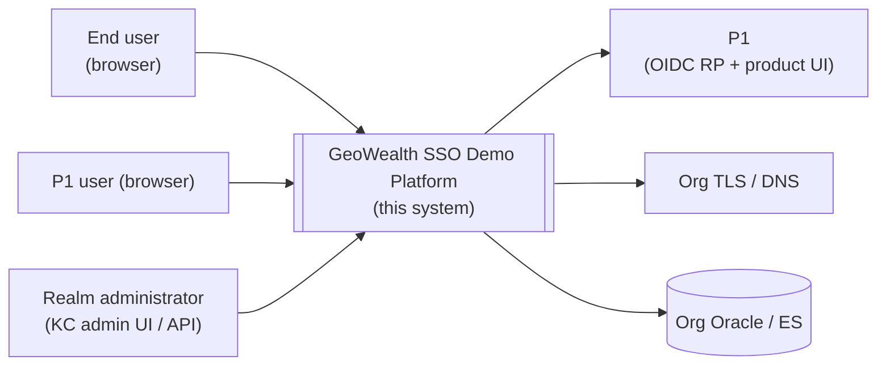

External actors:

| Actor | Why it matters here |
|---|---|
| End user (browser) | Carries `GWSESSION` per host; the only place untrusted input enters the system |
| P1 user (browser) | Same browser; lands directly on the P1 UI and authenticates through OIDC (no separate SSO entry needed — the sidebar deep-link from v1 still exists but is now just an OIDC redirect, no `kc_idp_hint`) |
| Realm administrator | Operates Keycloak through its admin UI or the admin API; touched by `scripts/reconcile-realm.sh` during deploy |

External systems:

| System | Boundary it crosses |
|---|---|
| Platform 1 (OIDC RP + product) | Same organisation but a separate runtime; consumes KC issued tokens |
| Org TLS / DNS | Owns the wildcard cert for `*.geowealth.int` in production and the DNS records the demo hosts hang off |
| Org Oracle / Elasticsearch | The real customer-data store. Both `user-service` and `p1-tomcat` read from Oracle; the demo points its in-cluster names at it via `data-tier.<env>.env` |

---

## 2. Level 2 — Containers (runtime)

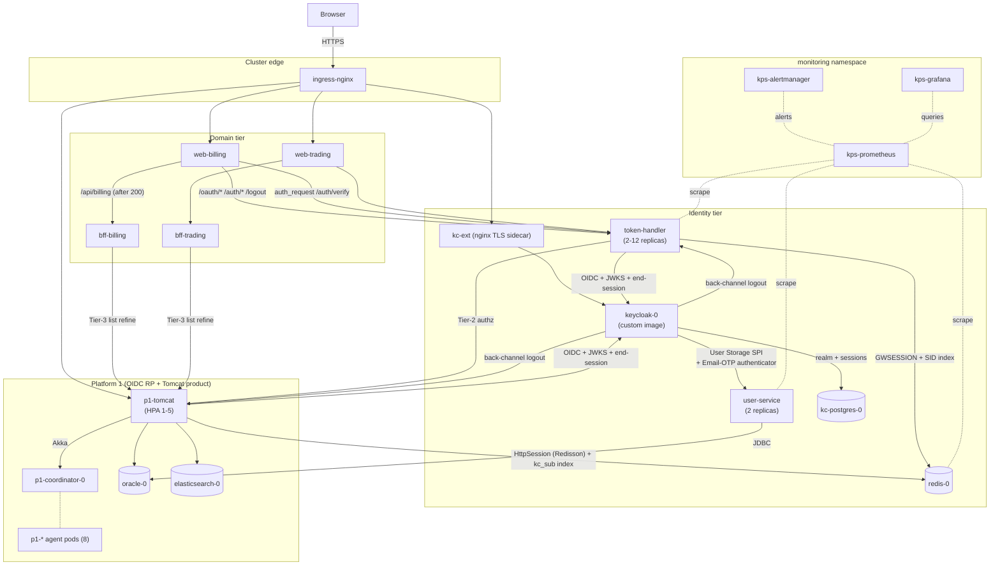

---

## 3. Cold authentication — sequence (canonical)

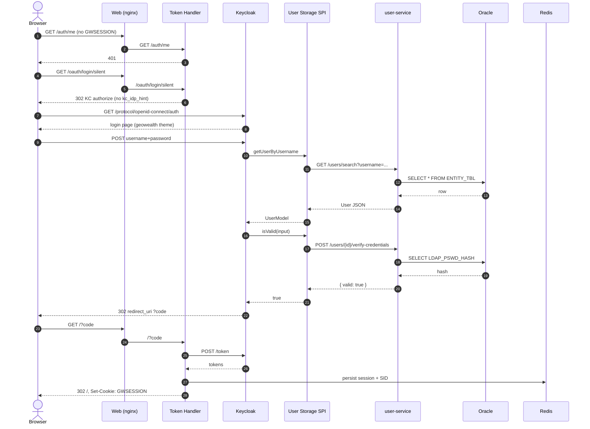

---

## 4. Forward-auth — request-level interaction (unchanged from v1)

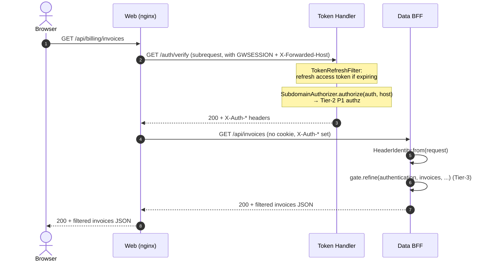

Note the difference between Tier-2 and Tier-3 is unchanged from v1:

| Tier | Where it runs | Subject | Cost |
|---|---|---|---|
| Tier-2 | Token Handler `/auth/verify` | "Can this user reach `/api/billing` on this host?" | One P1 call per cache-miss (60 s TTL) |
| Tier-3 | Data BFF row-list endpoint | "Which IDs in this list may this user see?" | One P1 call per list response |

---

## 5. P1 OIDC RP — login sequence

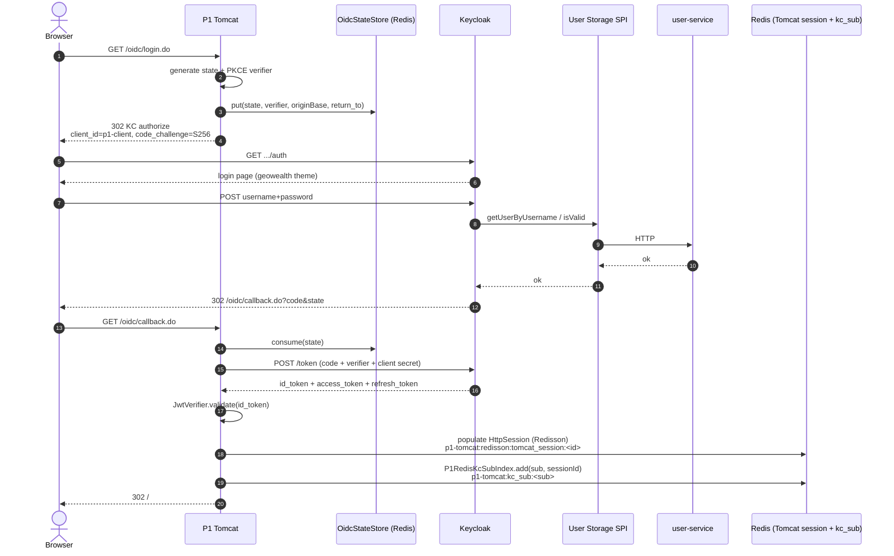

---

## 6. RP-initiated logout — sequence

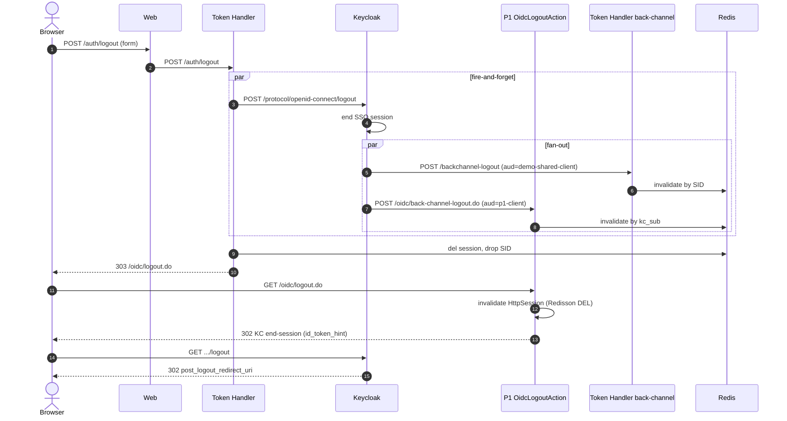

---

## 7. Back-channel logout — sequence (KC → both clients in parallel)

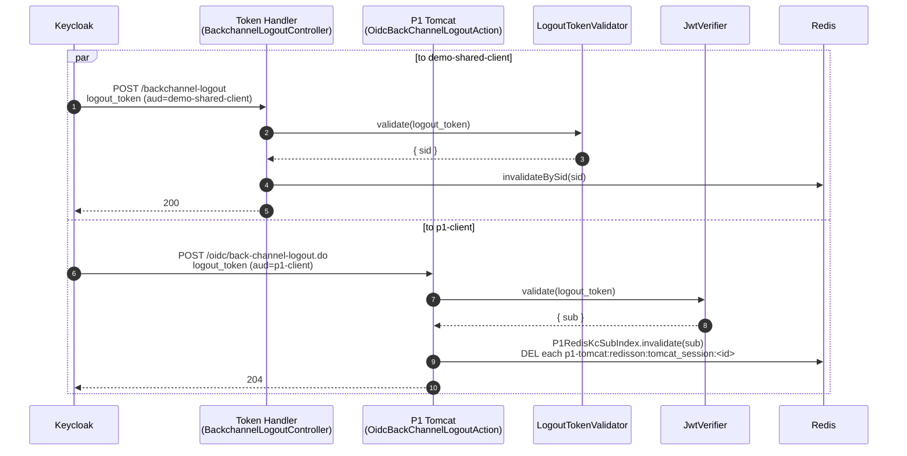

---

## 8. Token refresh — sequence (unchanged from v1)

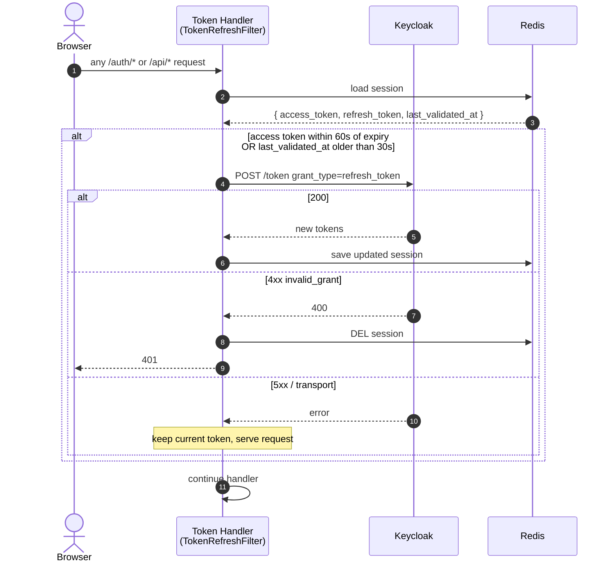

The 30 s `VALIDATE_INTERVAL_SECONDS` is the headline number an architect
should remember — it is the upper bound on how long an out-of-band
admin-side KC logout takes to surface as a 401 to the SPA.

---

## 9. Sidebar deep-link (warm browser)

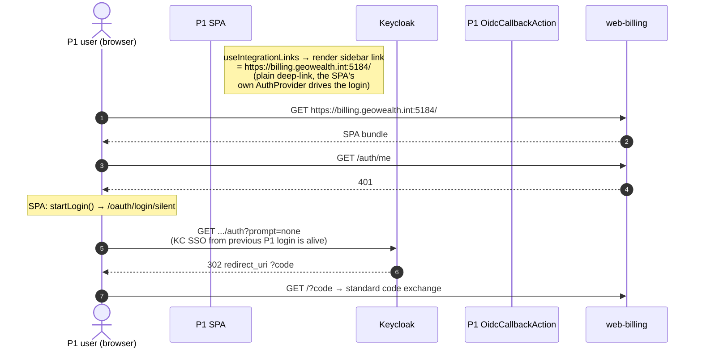

Compared to v1, the sidebar link no longer carries `kc_idp_hint=p1` —
there is no IdP to hint at. The link is now a plain deep-link to the
billing host; the SPA itself drives the login. If KC's SSO session is
already alive on `auth.geowealth.int` (because the user just logged into
P1), the silent-SSO probe succeeds and no UI flashes.

---

## 10. K8s ingress + auth-request (unchanged from v1)

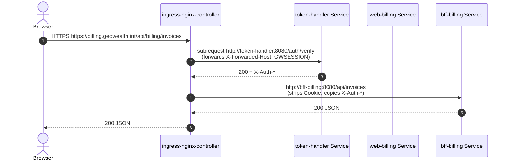

---

## 11. P1 Akka cluster topology

The Akka cluster diagram is conceptual; runtime membership depends on
which agents are scheduled. **Memcached is retired** — the agent count
dropped from v1's nine to eight.

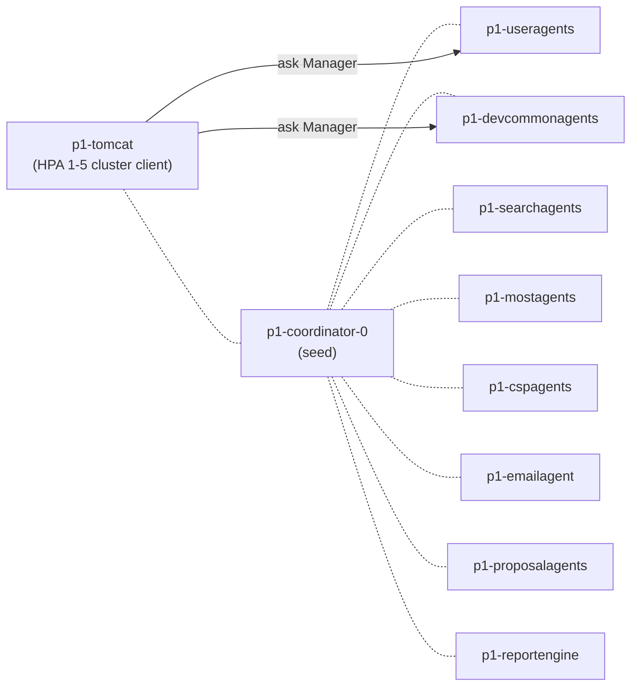

The load-bearing agent for SSO is now only `p1-devcommonagents` (still
hosts `AuthorizationManager` for the Tier-2 / Tier-3 P1 authz calls). The
v1 `p1-samlmanager` is no longer in the auth path — it may be retained
for unrelated SAML helpers used elsewhere, or removed in a follow-up.

---

## 12. Failure scenarios summarised

```mermaid
flowchart TB
    A[KC pod down] -.-> A1[New logins fail<br/>existing GWSESSION still valid<br/>until next refresh / validate]
    B[Token Handler all replicas down] -.-> B1[Every /api/* call 502<br/>existing sessions in Redis intact;<br/>resume on TH back]
    C[Redis down] -.-> C1[New logins cannot persist<br/>P1 sessions also broken<br/>full re-auth across the platform]
    D[P1 Tomcat any replica down] -.-> D1[Logins continue (other replicas)<br/>sessions in Redis survive<br/>HPA replaces the lost replica]
    E[user-service down] -.-> E1[Cold logins fail at SPI lookup<br/>existing sessions keep working<br/>token refresh keeps working]
    F[Oracle down] -.-> F1[user-service health 503<br/>P1 unable to load firm context<br/>Tier-2 / Tier-3 P1 authz fails]
    G[ingress-nginx down] -.-> G1[Browser can't reach anything in<br/>geowealth-demo namespace]
    H[p1-devcommonagents OOM] -.-> H1[Tier-2 / Tier-3 P1 authz fails<br/>see CLAUDE.md gotcha]
```

Recovery for every one of these is automatic once the failing pod is
back, because the persistent state is in Postgres, Redis, and Oracle —
not in any of the pods that failed. The new failure mode versus v1 is
**`user-service` down**, which is a fail-closed for **new** logins (and
admin lookups in the KC UI) but **not** for active sessions — KC's SPI
cache (`EVICT_DAILY`) keeps user metadata for the lifetime of the SSO
session, and credential validation is only re-run on a fresh login.
