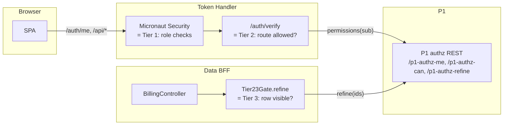

# 07 — Security and Trust Model

This file documents the security properties of the platform: what is
trusted, what is verified, where keys live, what classes of attack the
design defends against today, and what is left for production hardening.

The biggest shift versus v1: the SAML federation is gone. The SAML signing
key (`/tmp/p1-idp-dev.p12`), the LogoutRequest signature validation, the
SP-cert pinning for inbound SAML, and the `B5` mtime-aware credential
cache are all retired. What replaces them is OIDC RP-style validation
(PKCE, state, JWKS-based JWT verification) and a new in-cluster trust
boundary between Keycloak and `user-service`.

## 1. Threat model summary

The platform is a direct-auth IdP fronted by a Token Handler BFF; the
threat model is the standard OIDC RP + BFF list plus the extra constraint
of an out-of-process user store:

| Threat | Defence in this design | Source |
|---|---|---|
| Session hijacking via stolen cookie | Cookies are HttpOnly, Secure, SameSite=Lax, host-scoped. Server-side session in Redis, not a JWT in localStorage. | `token-handler/application.yml` session block |
| Session fixation | Pre-auth session destroyed on login, fresh session id minted | `RotatingSessionLoginHandler.java:22–77` |
| Cross-site request forgery on logout | `/auth/logout` is `POST` only, `Content-Type` constrained to form-urlencoded or empty, no GET log-out | `AuthController.java:289–296` |
| Replay of OIDC back-channel logout | Bounded LRU on `jti` in both the Token Handler validator and the P1 `JwtVerifier` | `LogoutTokenValidator.java`, `nodejs/geowealth/.../oidc/rp/JwtVerifier.java` |
| `id_token` substitution / replay | `aud` pinned to client_id, `iss` pinned, `nonce` validated when present, `azp` pinned where present | `JwtVerifier` |
| Authorization-code injection in P1 OIDC RP | PKCE S256 verifier, `state` correlation via Redis-backed `OidcStateStore` | `OidcLoginAction`, `OidcCallbackAction`, `OidcStateStore` |
| Refresh-token theft → infinite session | KC `ssoSessionMaxLifespan` (10 h) is a hard ceiling; refresh fails 4xx after KC SSO ends; admin-side force logout surfaces via 30 s validate interval | `realm-export.json`, `TokenRefreshFilter.java` |
| Token in URL / referrer leak | Tokens never leave the Token Handler or P1's Tomcat session; the browser only carries the session cookie | architecture choice — Token Handler + OIDC RP server-side |
| Cross-tenant data exposure | Per-host Tier-2 authz at `/auth/verify`; Tier-3 row refine inside the data BFF using the same access token | `SubdomainAuthorizer.java`, `Tier23Gate.java` |
| Untrusted realm config drift | `--import-realm` is `IGNORE_EXISTING`; live realm is reconciled idempotently from `urls.<env>.env` | `scripts/reconcile-realm.sh` |
| Credentials on the wire (KC → user-service) | Today: plaintext HTTP inside the cluster; mitigated by NetworkPolicy + future mTLS overlay. Passwords are POSTed in the JSON body, never logged. | known production gap, §10 |
| Forged back-channel logout | Both clients validate the `logout_token` JWT (iss, aud, events, jti, no nonce, RS256) before invalidating any session | `LogoutTokenValidator`, `JwtVerifier` |

## 2. Cookie inventory

| Cookie | Issued by | Scope | Flags | Lifespan |
|---|---|---|---|---|
| `GWSESSION` | Token Handler | Host (e.g. `billing.geowealth.int`), no `Domain` attribute | HttpOnly, Secure, SameSite=Lax | Session-id rotation on login; Redis TTL 12 h |
| `KEYCLOAK_IDENTITY` | Keycloak | `auth.geowealth.int` | HttpOnly, Secure, SameSite | KC SSO max-lifespan (10 h) |
| `KEYCLOAK_SESSION` | Keycloak | `auth.geowealth.int` | HttpOnly, Secure, SameSite | Same |
| `JSESSIONID` | P1 Tomcat | P1 hosts | HttpOnly | Tomcat `session-timeout` (7 h dev). **Note**: now backs a Redisson session in Redis, not an in-memory session. |
| `SILENT_ATTEMPT_COOKIE` | Token Handler | Host | HttpOnly, Secure, SameSite=Lax | Cleared on next interactive login |

The host scoping of `GWSESSION` is what makes the multi-tenant Token
Handler safe: the browser never sends a billing cookie to trading, so a
trading-side compromise cannot expose billing's session.

---

## 3. Authorization model — Tier 1, Tier 2, Tier 3

The three-tier model is unchanged in *shape* from v1; only the **source**
of Tier-1 role data changed.



### Tier 1 — coarse roles (changed)

In v1, realm roles were populated by **eight `saml-role-idp-mapper`
entries** in the realm, each value-mapped from the SAML `roles` attribute.
In v2 the realm has **no IdP mappers**. Realm roles now come **straight
from the database** via the User Storage SPI:

- `user-service` `GET /users/{id}/roles` runs the SQL
  `SELECT R.NAME FROM ENTITY_ROLE_TBL ER JOIN ROLE_TBL R ON R.ROLE_CD = ER.ROLE_CD WHERE ER.ENTITY_ID = ?`
  and returns the list of role names.
- The SPI's `UserServiceUser.getRealmRoleMappings()` wraps each name as a
  `RoleModel` and Keycloak's protocol mapper emits the resulting set as a
  `realm_access.roles` claim on the access token.

Net effect: a role added at P1 (i.e. a row inserted in `ENTITY_ROLE_TBL`)
is visible to KC at the next user-cache miss (or immediately on a fresh
login). No realm-mapper edit, no `syncMode=FORCE` ceremony.

### Tier 2 — route / object-type permission (unchanged)

Lives in the Token Handler's `/auth/verify`, which the nginx forward-auth
calls before every `/api/*`. The per-host requirement is configured under
`app.tenants.<slug>` in `token-handler/application.yml`:

```yaml
app:
  tenants:
    billing:
      host: billing.geowealth.int
      type: resource
      object-type: 59   # BILLING_CENTER
      permission: 5     # EXECUTE
    trading:
      host: trading.geowealth.int
      type: resource
      object-type: 5    # TRADE
      permission: 5     # EXECUTE
```

`SubdomainAuthorizer.authorize(auth, host)` looks up the tenant by host,
then calls `Tier23Gate.require(auth, objectType, permission)` which asks
P1 via `P1AuthzClient.hasPermission(...)`. Results are cached per `sub`
for `app.authz.cache-ttl-millis` (60 s default). Failure throws 403 and
nginx returns 403 to the SPA.

### Tier 3 — row-level refine (unchanged)

Lives **inside each data BFF**, intentionally not in the Token Handler,
because Tier 3 operates on row IDs that only the data layer knows. The
domain controller calls `gate.refine(auth, items, idOf, objectType,
permission)`, which calls `P1AuthzClient.refine(authHeader, objectType,
permission, ids)`. The `authHeader` is the access token forwarded from
the Token Handler via the `X-Auth-Access-Token` header.

---

## 4. Cryptography and key material

### 4.1 What is gone versus v1

- **SAML signing key (P1 side).** `/tmp/p1-idp-dev.p12` is no longer
  used by the SSO flow. The mtime-aware credential cache (`B5`) is dead
  code; `scripts/sso-dev-keystore.sh` is gone.
- **Keycloak's SAML SP cert** (`P1_IDP_KC_SP_CERT`) is no longer needed
  for inbound SAML LogoutRequest validation, because there are no
  LogoutRequests inbound.
- **`B6` LogoutRequest signature hardening** (Redirect-binding detached
  signature, POST-binding XMLDSig) is retired with the SAML code path.

### 4.2 What is new

#### 4.2.1 OIDC client secret for `p1-client`

P1 is a confidential OIDC client. It authenticates to KC's `/token`
endpoint with `client_id=p1-client&client_secret=<…>`. The secret is
**not** in the realm export verbatim — it is set via the admin API on
first install and stored in a K8s Secret on the P1 side.

| Property | Value |
|---|---|
| Env var | `OIDC_CLIENT_SECRET` |
| Source | K8s Secret `p1-oidc-secret` (populated by `up.sh` from shell env or generated on first install) |
| Rotation | Admin-API call: `PUT /admin/realms/demo-realm/clients/<id>/client-secret`; update the K8s Secret; rolling restart `p1-tomcat`. Sessions in Redis survive. |

#### 4.2.2 PKCE verifier storage (`OidcStateStore`)

PKCE S256 with a 43-byte verifier per login attempt. The verifier is
written to Redis under `p1-oidc:state:<state>` with a 10-minute TTL and a
single-use semantic (`getDelete`). Two reasons it lives in Redis:

- **Cross-pod safety.** `p1-tomcat` is now horizontally scaled. Replica
  A may receive `/oidc/login`; replica B may receive the callback. The
  in-pod ConcurrentHashMap that worked on the single-replica deployment
  no longer suffices.
- **Tamper resistance.** Encoding the verifier into a cookie or query
  parameter would let an attacker substitute their own verifier. Keeping
  it server-side with a random `state` lookup keeps the verifier out of
  the browser entirely.

#### 4.2.3 Bridge ticket store (`OidcBridgeStore`)

Single-use 30-second ticket used by the `OidcEstablishAction` to carry
session context across P1 hosts when the post-login target is on a
different host than the OIDC callback. Same Redis instance, key prefix
`p1-oidc:bridge:`.

#### 4.2.4 SHA1 password hash (legacy)

`user-service` reads `ENTITY_TBL.LDAP_PSWD_HASH` and verifies via the
`SHAPassword` algorithm (SHA1 + optional Base64-encoded salt + `{SHA}`
or `{SSHA}` label). This is the same legacy algorithm P1's
`com.netfolio.util.SHAPassword` has always used. The algorithm has
known weaknesses (SHA1 is unsuitable for new password storage), but the
migration is out of scope for the auth-extraction refactor — it is
listed as a follow-up MD (`2026-XX-XX-bcrypt-migration.md`). Phase 1's
verify-only port preserves bit-exact compatibility so the migration is
purely a rehash-on-login operation, not a flag-day password reset.

### 4.3 Keycloak's signing key for OIDC

Standard Keycloak key store, managed entirely by Keycloak. The realm
contains a default RSA key for OIDC signing; rotation is a Keycloak admin
operation. Both the Token Handler and P1 fetch JWKS at startup and cache
with a TTL. A key rotation at KC propagates within seconds to both.

### 4.4 mkcert root CA (development)

Unchanged from v1. The Dockerfile imports `/certs/mkcert-rootCA.pem` into
the JVM truststore at build time when present, so the Token Handler and
P1 can verify `https://auth.geowealth.int:5180`'s certificate during
OIDC discovery. Production replaces this with the org CA bundle.

---

## 5. Trust boundaries

| Boundary | Inside | Outside | Crossing mechanism |
|---|---|---|---|
| **Public TLS** | The `geowealth-demo` namespace | Browser | TLS at ingress-nginx; per-host certificate |
| **OIDC trust — Token Handler ↔ KC** | The cluster network | Keycloak | OIDC RP authentication via `client_id` + `client_secret` (confidential client); JWT signatures verified against KC JWKS |
| **OIDC trust — P1 ↔ KC** | Same | Same | Same shape; PKCE + state correlation |
| **User-store trust — KC ↔ user-service** | The cluster network | user-service | HTTP POST (passwords in JSON body) — **production should add mTLS + NetworkPolicy** |
| **Tier-2 authz** | Token Handler | P1 authz REST | Bearer access token forwarded; P1 verifies via its own auth filter |
| **Tier-3 authz** | Data BFF | P1 authz REST | Same bearer flow |
| **Pod-to-pod** | Workloads in the namespace | Other workloads | Plain HTTP today; future mTLS via service mesh |

The forward-auth pattern means a compromised data BFF cannot impersonate
the Token Handler — the Token Handler's session cookie never reaches the
data BFF. A compromised data BFF can only act with the user's access
token for the duration of the current request (it does not persist).

The **new** sensitive in-cluster hop is **KC → user-service**: this is
the hop that carries passwords. It is plain HTTP today inside the cluster.
A production deployment must add a NetworkPolicy + mTLS overlay on this
hop; the policy is listed in
[`05-kubernetes-deployment.md`](05-kubernetes-deployment.md) §8.

---

## 6. The "shared OIDC client" choice (unchanged from v1)

A single client (`demo-shared-client`) is registered for every demo
domain. The alternative would be one client per domain. The trade-offs
in v1 still apply unchanged; P1 is registered as a separate client
(`p1-client`) because its `redirectUris` and back-channel-logout URL
live on a different host and its session model is different.

---

## 7. Where firmCd lives in the claim flow

`firmCd` is no longer a SAML attribute — it is a user attribute on the
SPI-provided `UserModel`. The chain in v2 is:

1. `user-service` reads `ENTITY_TBL.FIRM_CD` for the matched user.
2. `UserServiceUser.getAttributes()` (in the SPI provider) surfaces it as
   the KC user attribute `firmCd`.
3. KC's `firmCd-claim` protocol mapper (one per client:
   `demo-shared-client`, `p1-client`, etc.) emits it as a top-level OIDC
   claim on the `id_token` and `access_token`.
4. The Token Handler's `KeycloakAuthenticationMapper.firmCd` extracts the
   claim into `Authentication.attributes`.
5. `/auth/verify` writes it to `X-Auth-Firm-Cd` and nginx forwards it.
6. The data BFF reads `auth.getAttributes().get("firmCd")` via
   `HeaderIdentity.from(request)`.

Treating `firmCd` as a user attribute (not a role) still means:

- Adding a new firm does not require an admin-API role POST.
- A user switching firm is one column update on `ENTITY_TBL`.
- Per-firm queries can index on `firmCd` directly without role parsing.

The mechanism is the same as v1, only the upstream changed from SAML
attribute → User-attribute mapper to SPI attribute → User-attribute
mapper.

---

## 8. Secrets and how they reach pods

| Secret | Source | Mounting |
|---|---|---|
| `oauth.client-secret` for `demo-shared-client` | `k8s/base/token-handler-config.yaml` Secret | `envFrom: secretRef` on the Token Handler Deployment |
| `OIDC_CLIENT_SECRET` for `p1-client` | K8s Secret `p1-oidc-secret` | `envFrom: secretRef` on `p1-tomcat` |
| `oracle-creds` (`ORACLE_PASSWORD`) | Shell env on `up.sh` invocation | `envFrom: secretRef` on all P1 workloads **and** on `user-service` (only created if `ORACLE_PASSWORD` set) |
| Realm admin password | Keycloak `KEYCLOAK_ADMIN_PASSWORD` env | Set during `kustomize` apply; rotated via Keycloak admin UI |
| (v1) `p1-saml-keystore` | **Gone in v2** — the SAML signing keystore is no longer mounted | n/a |

A production deployment routes all of these through the organisation's
standard secret store (Vault, AWS Secrets Manager, Sealed Secrets, ...);
the Kustomize layering already accepts overlay-injected Secrets without
manifest changes.

---

## 9. Audit and security events

P1's SAML actions used to emit `SECURITY_EVENT: SAML_ISSUED`,
`SAML_REPLAY_REJECT`, `SAML_LOGOUT_SIG_REJECT`, and `SAML_LOGOUT_UNSIGNED`
log lines. With SAML retired, those are gone. The OIDC RP package emits
the same shape under different event names:

| Event | Source | Line shape |
|---|---|---|
| Login OK | `OidcCallbackAction` | `SECURITY_EVENT: OIDC_LOGIN_OK user=<personId> firm=<cd> remote=<ip> kc_sub=<sub>` |
| Callback rejected | `OidcCallbackAction` | `SECURITY_EVENT: OIDC_CALLBACK_REJECT reason=<state_mismatch\|verifier_consumed\|token_4xx\|id_token_invalid> remote=<ip>` |
| Logout OK | `OidcLogoutAction` | `SECURITY_EVENT: OIDC_LOGOUT_OK user=<personId> remote=<ip> kc_sub=<sub>` |
| Logout-token rejected | `OidcBackChannelLogoutAction` | `SECURITY_EVENT: OIDC_LOGOUT_TOKEN_REJECT reason=<iss\|aud\|events\|jti\|sig> remote=<ip>` |

The Token Handler still does **not** emit a parallel `SECURITY_EVENT:`
stream; that is a known gap (§10).

---

## 10. Known gaps before production

The repository's own production-readiness audit lives in
`sso-production-readiness-gap-analysis.md` and
`production-risk-report.md` at the keycloak-demo repo root. The
Solution-Architect-relevant subset, **updated for v2**:

| Gap | Impact | Where it surfaces |
|---|---|---|
| **KC → user-service hop is plain HTTP** | Passwords in cleartext on the in-cluster wire | Add NetworkPolicy + mTLS overlay; see §5 |
| **SHA1 password algorithm is legacy** | A leaked `ENTITY_TBL` dump is offline-crackable on commodity GPUs | Bcrypt rehash-on-login migration follow-up MD |
| Token Handler does not emit a parallel `SECURITY_EVENT:` audit stream | Login / logout / back-channel logout activity is only visible via Micronaut access logs | Audit pipeline |
| Realm admin password is the bootstrap default | Anyone with admin-API access can mint a token | Rotate before exposure |
| mkcert CA bundled in JVM truststore | Trusts a private CA in addition to the org CA | Replace at build time in prod |
| No `NetworkPolicy` | Lateral movement inside the namespace is unconstrained | Add the seven policies in §8 of `05-kubernetes-deployment.md` |
| Single IdP (`demo-realm` only) | A KC outage on the realm blocks all logins | Pair with a fall-through emergency-access auth path (out of scope for the demo) |
| Realm `accessTokenLifespan = 300 s` is short for back-end batch | Long-running back-end jobs that piggy-back on a user session need their own client / service account, not a forwarded user token | Surface in service-design docs |
| user-service has no rate limiting on `/users/{id}/verify-credentials` | A compromised KC pod could brute-force passwords via direct calls | Add KC-side rate limiting + user-service `loginAttempts` counter follow-up |

---

## 11. What is intentionally not implemented

Choices that an architect might expect to see and are deliberately absent:

- **Self-registration / signup against `user-service`.** The
  `realm-export.json` keeps `registrationAllowed: false`. All accounts
  are provisioned outside this stack (in `ENTITY_TBL`).
- **Direct-grant token issuance.** `directAccessGrantsEnabled: false` on
  `demo-shared-client` and `p1-client`. No backend or CLI may exchange
  username/password for a token — every token comes through the OIDC
  code flow.
- **Implicit flow / token-in-fragment.** `implicitFlowEnabled: false`.
  Tokens never appear in the URL fragment.
- **JWT in browser storage.** Refresh and access tokens stay server-side
  (Redis for the Token Handler, Tomcat HttpSession for P1). The browser
  holds only opaque session cookies.
- **Front-channel SLO via iframes.** Back-channel logout is the supported
  replacement.
- **TOTP MFA.** The email-OTP path preserves the legacy P1 contract;
  TOTP would require an enrolment migration listed as a follow-up.
- **SAML federation back-INTO Keycloak.** If some external IdP (Okta,
  Azure AD) wants to federate INTO KC, that is a separate
  `identityProvider` block, not affected by this design. None is
  registered today.
