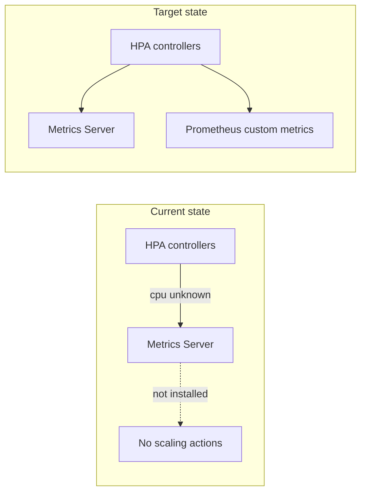
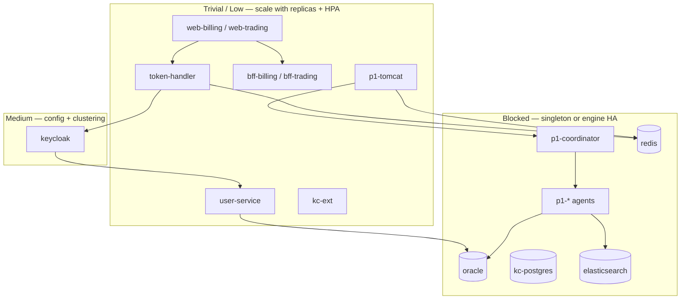

# Horizontal scaling report — live cluster audit

> **Audience.** Solution Architect review (v2 doc set).
> **Cluster.** `geowealth` (minikube, single control-plane node `geowealth`, Kubernetes v1.35.1).
> **Snapshot date.** 2026-06-29.
> **Scope.** Every runnable workload in `geowealth-demo`, plus ingress and monitoring
> namespaces where they affect demo capacity. Akka agent internals are summarised at
> the trait level; deep refactor paths live in [`k8s/README-scale.md`](../../../k8s/README-scale.md).

This report complements [`05-kubernetes-deployment.md`](05-kubernetes-deployment.md) §9
(scaling design summary) and [`02-component-inventory.md`](02-component-inventory.md)
(what each pod does). It adds a **live inventory**, a **scalability rating per workload**,
and **manifest vs cluster drift** observed on the audit date.

---

## 1. Executive summary

| Finding | Detail |
|---|---|
| **Primary bottleneck** | P1 application tier (Akka role-singleton agents + single coordinator seed), not edge/auth |
| **Already multi-replica** | `bff-billing`, `bff-trading`, `user-service`, `p1-tomcat` (2 each) |
| **Auth tier ready to scale** | `token-handler` (Redis sessions), `user-service` (stateless + Oracle JDBC pool cap) |
| **Easy wins unused** | `web-billing`, `web-trading`, `kc-ext`, BFF HPAs — stateless, no code change |
| **Blocked without engine work** | `oracle-0`, `redis-0`, `kc-postgres-0`, `elasticsearch-0`, all `p1-*agents`, `p1-coordinator-0` |
| **HPA health** | Three HPAs exist; **Metrics API unavailable** → all show `cpu: <unknown>/70%` → autoscaling inactive |
| **PDB coverage** | Only `token-handler` has a PodDisruptionBudget |
| **Cluster shape** | Single node — horizontal scale adds pod count, not fault isolation, until node pool grows |

**Bottom line:** The v2 auth-extraction work unlocked horizontal scale for **`p1-tomcat`**
(Redis-backed sessions + `kc_sub` index). The identity edge (`token-handler`, BFFs, SPAs)
can scale with manifest-only changes. Production throughput is capped by **P1 Akka
singletons** and **single-instance data tier** until those tiers are refactored or replaced
with managed services.

---

## 2. Methodology

### 2.1 Complexity scale

| Rating | Meaning | Typical effort |
|---|---|---|
| **Trivial** | Stateless Deployment; increase `replicas` or add HPA | Hours |
| **Low** | Stateless but needs PDB, probes, or resource requests for HPA | Hours–1 day |
| **Medium** | Shared external state already centralised (Redis/Postgres); needs config or minor code | Days |
| **High** | Distributed system setup (Infinispan, ES cluster, Redis Sentinel) or Akka HA patterns | Weeks |
| **Blocked** | Architectural singleton (Akka seed, JDBC single-writer, RWO PVC) | Refactor or managed service |

### 2.2 “Horizontally scalable today?”

- **Yes** — safe to run N>1 replicas behind a Service without session or consistency bugs.
- **Conditional** — possible with documented prerequisites (e.g. Keycloak Infinispan).
- **No** — more replicas would break correctness or waste resources (standby-only at best).

### 2.3 Data sources

- Live cluster: `kubectl get pods/deploy/sts/hpa/pdb -A`
- Manifests: `k8s/base/*.yaml`, `k8s/overlays/full-stack/`
- Engineering plan: [`k8s/README-scale.md`](../../../k8s/README-scale.md)

---

## 3. Cluster snapshot

### 3.1 Node capacity

| Node | Role | Status | Notes |
|---|---|---|---|
| `geowealth` | control-plane | Ready | Only node; all demo + monitoring pods co-located |

Single-node minikube means “horizontal scale” here validates **workload correctness**
(replica-safe state), not **blast-radius isolation**. Production needs a multi-node pool
before PDBs and topology spread constraints deliver real value.

### 3.2 Pod counts by namespace

| Namespace | Running pods (approx.) | Purpose |
|---|---:|---|
| `geowealth-demo` | 27 | Full demo stack |
| `monitoring` | 8 | kube-prometheus-stack + exporters |
| `ingress-nginx` | 1 | Ingress controller |
| `kube-system` | 7 | Cluster control plane |

---

## 4. Full workload inventory — `geowealth-demo`

### 4.1 Summary table

| Workload | Kind | Desired / ready | HPA | PDB | Scalable today? | Complexity |
|---|---|---:|---|---|---|---|
| `web-billing` | Deployment | 1 / 1 | — | — | **Yes** | Trivial |
| `web-trading` | Deployment | 1 / 1 | — | — | **Yes** | Trivial |
| `token-handler` | Deployment | 1 / 1 † | 1–3 †† | yes | **Yes** | Low |
| `user-service` | Deployment | 2 / 2 | 2–6 | — | **Yes** ‡ | Low |
| `bff-billing` | Deployment | 2 / 2 | — | — | **Yes** | Trivial |
| `bff-trading` | Deployment | 2 / 2 | — | — | **Yes** | Trivial |
| `kc-ext` | Deployment | 1 / 1 | — | — | **Yes** | Trivial |
| `keycloak-0` | StatefulSet | 1 / 1 | — | — | Conditional | Medium |
| `kc-postgres-0` | StatefulSet | 1 / 1 | — | — | No (single writer) | High |
| `redis-0` | StatefulSet | 1 / 1 | — | — | Conditional | High |
| `oracle-0` | StatefulSet | 1 / 1 | — | — | No | Blocked § |
| `elasticsearch-0` | StatefulSet | 1 / 1 | — | — | Conditional | High |
| `p1-tomcat` | Deployment | 2 / 2 | 2–5 | — | **Yes** | Low (done in v2) |
| `p1-coordinator-0` | StatefulSet | 1 / 1 | — | — | No | Blocked |
| `p1-crm` | Deployment | 1 / 1 | — | — | No | Blocked |
| `p1-cspagents` | Deployment | 1 / 1 | — | — | No | Blocked |
| `p1-devcommonagents` | Deployment | 1 / 1 | — | — | No | Blocked |
| `p1-emailagent` | Deployment | 1 / 1 | — | — | No | Blocked |
| `p1-mostagents` | Deployment | 1 / 1 | — | — | No | Blocked |
| `p1-proposalagents` | Deployment | 1 / 1 | — | — | No | Blocked |
| `p1-reportengine` | Deployment | 1 / 1 | — | — | No | Blocked |
| `p1-samlmanager` | Deployment | 1 / 1 | — | — | No | Blocked |
| `p1-searchagents` | Deployment | 1 / 1 | — | — | No | Blocked |
| `p1-useragents` | Deployment | 1 / 1 | — | — | No | Blocked |

† Manifest specifies `replicas: 2`; cluster runs **1** (HPA/controller drift — see §6).
†† Manifest HPA `minReplicas: 2, maxReplicas: 12`; live HPA **min 1, max 3**.
‡ JDBC connection pool and Oracle read capacity cap effective throughput before CPU.
§ External Oracle (via `data-tier.*.env`) shifts ops to DBA/RAC; in-cluster `oracle-0` stays single-pod.

### 4.2 Supporting namespaces

| Workload | Namespace | Replicas | Scalable? | Complexity | Notes |
|---|---|---:|---|---|---|
| `ingress-nginx-controller` | `ingress-nginx` | 1 | Yes | Low | Scale for ingress throughput; demo uses one |
| `kps-grafana` | `monitoring` | 1 | Yes | Trivial | Observability UI |
| `prometheus-kps-prometheus-0` | `monitoring` | 1 | Conditional | Medium | HA Prometheus = Thanos/long-term store |
| `alertmanager-kps-alertmanager-0` | `monitoring` | 1 | Conditional | Medium | Clustered Alertmanager for HA |
| Exporters (`redis`, `postgres`, node) | `monitoring` | 1 each | Yes | Trivial | Sidecar pattern if needed |

---

## 5. Per-tier analysis

### 5.1 Edge — domain SPAs (`web-billing`, `web-trading`)

**Role.** Static React build + nginx: TLS termination, `auth_request` to `token-handler`,
proxy to domain BFF.

**State.** None in-pod. Session cookie is host-scoped; any replica can serve any request.

**Scale path.**

1. Set `replicas: 2` (or 3) in `k8s/base/web.yaml`.
2. Optional HPA on CPU (requests already set: `50m` CPU, `64Mi` memory).
3. Add PDB `minAvailable: 1`.

**Complexity:** Trivial. **Risk:** None for SSO correctness.

---

### 5.2 Auth — `token-handler`

**Role.** Multi-tenant login, callback, `/auth/me`, `/auth/logout`, `/auth/verify`
(forward-auth), Redis-backed `GWSESSION`.

**State.** Sessions and SID registry in **`redis-0`**. Pods are interchangeable.

**Scale path.**

1. Align live HPA with manifest (`minReplicas: 2`, `maxReplicas: 12`) — see §6.
2. Install **metrics-server** (or equivalent) so CPU-based HPA works.
3. Ensure `resources.requests.cpu` is set (manifest: `250m`) — required for `%` targets.
4. PDB already present (`minAvailable: 1`).
5. `topologySpreadConstraints` in manifest assume multi-node; harmless on single node.

**Complexity:** Low (operational). **Risk:** Redis SPOF until Redis HA (§5.8).

Cross-ref: [`05-kubernetes-deployment.md`](05-kubernetes-deployment.md) §9,
[`07-security-and-trust-model.md`](07-security-and-trust-model.md) (session trust).

---

### 5.3 Identity API — `user-service`

**Role.** HTTP facade over Oracle (`ENTITY_TBL`, credentials, roles, MFA tokens) for
Keycloak User Storage SPI.

**State.** Stateless pods; **Oracle** is the shared back end.

**Scale path.**

1. HPA already defined (`minReplicas: 2`, `maxReplicas: 6`, CPU 70%).
2. Cap scale at Oracle connection pool size and query latency — CPU may stay flat under load.
3. Add PDB before production drain scenarios.

**Complexity:** Low. **Risk:** Oracle connection exhaustion before pod count becomes useful.

Cross-ref: [`10-user-service-schema-contract.md`](10-user-service-schema-contract.md).

---

### 5.4 Identity — Keycloak (`keycloak-0`)

**Role.** OIDC IdP, custom SPI, themes, broker to user-service.

**State.** JVM Infinispan caches (sessions, auth sessions) + **`kc-postgres-0`** persistence.

**Scale path (production pattern).**

1. `KC_CACHE_STACK=kubernetes` + headless Service for JGroups discovery.
2. Distributed Infinispan caches for `sessions`, `clientSessions`, `authenticationSessions`.
3. Fixed ingress hostname (`auth.geowealth.int`) — unchanged from v1/v2 design.

**Complexity:** Medium. **Risk:** Without distributed cache, logout on pod A leaves stale
session on pod B.

**Today:** Single replica — correct for demo; not a throughput bottleneck relative to P1 agents.

---

### 5.5 TLS front — `kc-ext`

**Role.** nginx TLS proxy to in-cluster Keycloak Service.

**State.** None.

**Scale path.** `replicas: 2`, PDB. **Complexity:** Trivial.

---

### 5.6 Data BFFs (`bff-billing`, `bff-trading`)

**Role.** Forward-auth data APIs; identity from `X-Auth-*` headers only.

**State.** None.

**Scale path.**

1. Already at 2 replicas.
2. Add HPA (`minReplicas: 2`, `maxReplicas: 10`, CPU 70%) — Tier 1 in README-scale.
3. Add PDB.

**Complexity:** Trivial. **Risk:** None.

---

### 5.7 Application — `p1-tomcat`

**Role.** P1 Tomcat UI; OIDC RP (v2); Akka client to agents.

**State (v2).** **`HttpSession` in Redis** (Redisson); **`kc_sub → sessionId`** index in Redis
(`P1RedisKcSubIndex`) for OIDC back-channel logout across replicas.

**Scale path.**

1. HPA live: `minReplicas: 2`, `maxReplicas: 5` — **active config matches intent**.
2. Ingress cookie affinity (`P1AFFINITY`) is optional safety net; sessions are not sticky-required.
3. Verify serialisable session attributes after any Tomcat change.

**Complexity:** Low — **already delivered in auth-extraction Phase 6–7**.

Cross-ref: [`04-logout-flows.md`](04-logout-flows.md) (back-channel fan-out).

---

### 5.8 Data tier — Redis, Postgres, Oracle, Elasticsearch

| Store | Workload | Scale model | Complexity | Demo note |
|---|---|---|---|---|
| Session + cache | `redis-0` | Redis Sentinel / Cluster / ElastiCache | High | SPOF for token-handler + p1-tomcat sessions |
| KC DB | `kc-postgres-0` | Patroni, Cloud SQL, read replicas (read-only) | High | Single writer |
| App DB | `oracle-0` | RAC / managed Oracle | Blocked in-cluster | Often externalised via `data-tier.dev.env` |
| Search | `elasticsearch-0` | Native ES cluster | High | Single-node demo index |

Horizontal pod scale **does not** apply to StatefulSets with RWO PVCs without
sharding/replication at the **engine** level. `k8s/up.sh` external-name redirect scales
**connections**, not **pods**.

---

### 5.9 P1 Akka tier — coordinator + agents

| Workload | Why single replica | Scale options |
|---|---|---|
| `p1-coordinator-0` | Akka cluster **seed**; stable network identity | Second seed + cluster bootstrap; never “just scale Deployment” |
| `p1-devcommonagents` | Hosts `AuthorizationManager` and other **cluster singletons** | Cluster Singleton with standby (HA) or trait sharding (throughput) |
| `p1-searchagents`, `p1-proposalagents`, … | One JVM owns fixed Manager set per role | Same as above; each trait audited separately in README-scale |
| `p1-crm`, `p1-reportengine`, … | Role-specific singleton assumptions | Per-trait refactor |

**Complexity:** Blocked for throughput; **High** for HA-only standby.

**Symptom if naively scaled:** duplicate singleton actors, split-brain, duplicate side
effects (emails, reports, cache loaders).

Cross-ref: [`02-component-inventory.md`](02-component-inventory.md) (agent roles),
[`k8s/README-scale.md`](../../../k8s/README-scale.md) Tier 3–4.

---

## 6. Manifest vs cluster drift (2026-06-29)

| Object | Manifest (`k8s/base`) | Live cluster | Impact |
|---|---|---|---|
| `token-handler` Deployment | `replicas: 2` | **1** ready | Below intended HA floor |
| `token-handler` HPA | `min: 2`, `max: 12` | **min: 1**, **max: 3** | Capped auth burst capacity |
| All HPAs | CPU target 70% | `cpu: <unknown>/70%` | **No autoscaling** — Metrics API missing |
| `p1-tomcat` HPA | `min: 2`, `max: 5` | matches | OK |
| `user-service` HPA | `min: 2`, `max: 6` | matches | OK but metrics dead |
| PDBs | `token-handler` only | matches | Other multi-replica workloads unprotected |

**Recommended ops fixes (no application code):**

1. `minikube addons enable metrics-server` (or install metrics-server manifest).
2. Re-apply `k8s/base/token-handler.yaml` HPA + scale Deployment to 2:
   `kubectl -n geowealth-demo scale deploy/token-handler --replicas=2`
3. Add PDBs for `bff-*`, `user-service`, `p1-tomcat`, `web-*` when replicas > 1.

---

## 7. HPA and observability gaps

| Gap | Workloads affected | Remediation |
|---|---|---|
| Metrics Server absent | `token-handler`, `user-service`, `p1-tomcat` HPAs | Enable metrics-server on minikube |
| No custom metrics | JDBC-saturated `user-service` | Prometheus adapter + pool/ latency metric |
| No PDB except token-handler | All multi-replica Deployments | Add `policy/v1` PDB manifests |
| Single node | All | Add worker nodes; verify topology spread |

Monitoring stack (`monitoring` namespace) scrapes Redis/Postgres exporters but does not
yet drive HPAs for application tiers.

---

## 8. Sequenced roadmap

Aligned with [`k8s/README-scale.md`](../../../k8s/README-scale.md):

| Phase | Items | Outcome |
|---|---|---|
| **0 — Ops** | metrics-server, fix token-handler replica/HPA drift, PDBs | HPAs functional; auth HA floor restored |
| **1 — Easy wins** | web ×3, BFF HPAs, kc-ext ×2 | ~3× edge throughput, no code |
| **2 — Medium** | Keycloak Infinispan KUBE_PING | KC replica-safe |
| **3 — Done (v2)** | p1-tomcat Redis sessions + HPA | Tomcat horizontally scaled |
| **4 — Hard** | Redis/Postgres/ES HA or managed | Remove session/DB SPOFs |
| **5 — P1 deep** | Akka Cluster Sharding / singleton standby | Application tier throughput |

---

## 9. Architecture diagram — scale boundaries

---

## 10. References

| Document | Relevance |
|---|---|
| [`05-kubernetes-deployment.md`](05-kubernetes-deployment.md) §9 | Design-level scaling summary |
| [`02-component-inventory.md`](02-component-inventory.md) | Pod roles |
| [`k8s/README-scale.md`](../../../k8s/README-scale.md) | Engineering tier plan |
| [`k8s/base/token-handler.yaml`](../../../k8s/base/token-handler.yaml) | HPA, PDB, topology spread |
| [`k8s/base/p1.yaml`](../../../k8s/base/p1.yaml) | p1-tomcat HPA |
| [`k8s/base/user-service.yaml`](../../../k8s/base/user-service.yaml) | user-service HPA |

---

## Appendix A — Raw pod list (`geowealth-demo`)

Captured 2026-06-29; use for diff on next audit.

| Pod | Status | CPU request | Memory request |
|---|---|---|---|
| `bff-billing-86969f97b8-h7k4s` | Running | 200m | 384Mi |
| `bff-billing-86969f97b8-t7b9m` | Running | 200m | 384Mi |
| `bff-trading-db6478659-hl7hs` | Running | 200m | 384Mi |
| `bff-trading-db6478659-mtzlx` | Running | 200m | 384Mi |
| `elasticsearch-0` | Running | 250m | 1536Mi |
| `kc-ext-559599dc78-rmnkx` | Running | 10m | 16Mi |
| `kc-postgres-0` | Running | 100m | 192Mi |
| `keycloak-0` | Running | 250m | 512Mi |
| `oracle-0` | Running | 1 | 2Gi |
| `p1-coordinator-0` | Running | 250m | 1Gi |
| `p1-crm-5c4b858559-frv24` | Running | 250m | 1Gi |
| `p1-cspagents-645c8fffb-gn44j` | Running | 100m | 512Mi |
| `p1-devcommonagents-68f55656bf-dvm9c` | Running | 200m | 2Gi |
| `p1-emailagent-6fcfcc55f6-nglkr` | Running | 100m | 512Mi |
| `p1-mostagents-bb49c5fd8-m6bxd` | Running | 100m | 512Mi |
| `p1-proposalagents-84d87d8687-fhxc4` | Running | 250m | 1Gi |
| `p1-reportengine-fc67f4f9c-shsxl` | Running | 250m | 1Gi |
| `p1-samlmanager-c65d9f98c-sbfjh` | Running | 250m | 1Gi |
| `p1-searchagents-6d8bf9df64-b28sr` | Running | 100m | 2Gi |
| `p1-tomcat-57c94df8d9-jrmmd` | Running | 500m | 2Gi |
| `p1-tomcat-57c94df8d9-v8qgj` | Running | 500m | 2Gi |
| `p1-useragents-7d7c495d4d-g299g` | Running | 100m | 512Mi |
| `redis-0` | Running | 100m | 512Mi |
| `token-handler-774478db79-jl64s` | Running | 250m | 384Mi |
| `user-service-5fbf8b76c4-26ngj` | Running | 100m | 256Mi |
| `user-service-5fbf8b76c4-lsp2z` | Running | 100m | 256Mi |
| `web-billing-6d4ffccb48-swrbz` | Running | 50m | 64Mi |
| `web-trading-6b754cdd6c-6ljs2` | Running | 50m | 64Mi |
